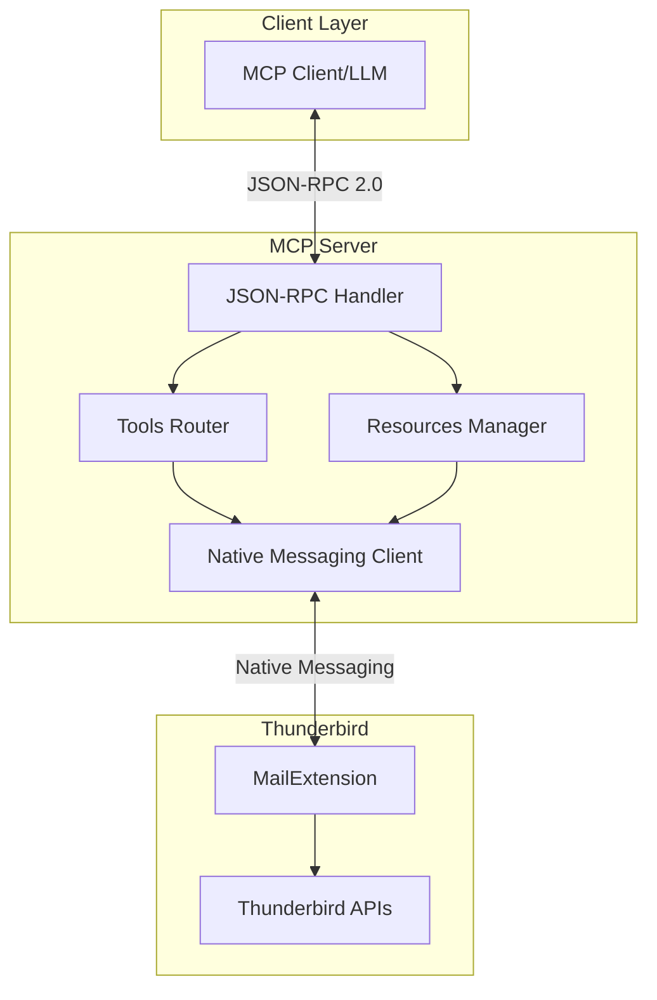
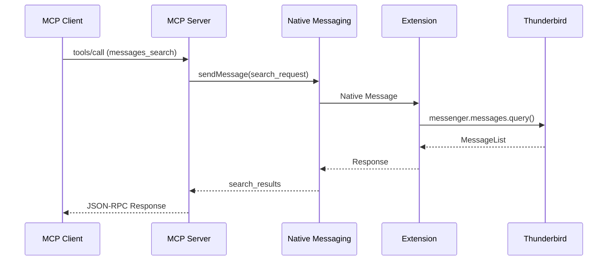

# Workflow Documentation Generator - Thunderbird MCP

## Objectif
Generer toute la documentation du projet de maniere exhaustive en utilisant des sub-agents specialises. Produire cahier des charges, specs API, architecture, guides utilisateur et developpeur.

---

## Variables de Configuration

```
USER_PROMPT: $ARGUMENTS

DOC_TYPE: [all|specs|api|architecture|guides|readme]
  - all: Toute la documentation (defaut)
  - specs: Cahier des charges et specifications techniques
  - api: Documentation API uniquement
  - architecture: Diagrammes et specs architecture
  - guides: Guides utilisateur et developpeur
  - readme: README et CONTRIBUTING

DOC_DEPTH: [minimal|standard|comprehensive]
  - minimal: Essentiel uniquement
  - standard: Documentation complete standard
  - comprehensive: Documentation exhaustive avec exemples

OUTPUT_DIR: './docs'
SPECS_DIR: './docs/specs'
API_DIR: './docs/api'
ARCH_DIR: './docs/architecture'
GUIDES_DIR: './docs/guides'
```

---

## Matrice de Dependances Documentation

```
┌─────────────────────────────────────────────────────────────┐
│ Document              │ Depend de          │ Mode          │
├───────────────────────┼────────────────────┼───────────────┤
│ Discovery Report      │ -                  │ PARALLEL      │
│ CAHIER_DES_CHARGES    │ Discovery          │ SEQUENTIAL    │
│ API Messages          │ Discovery          │ PARALLEL*     │
│ API Folders           │ Discovery          │ PARALLEL*     │
│ API Contacts          │ Discovery          │ PARALLEL*     │
│ API Calendar          │ Discovery          │ PARALLEL*     │
│ API MCP Protocol      │ Discovery          │ PARALLEL*     │
│ Architecture Overview │ Cahier des charges │ PARALLEL**    │
│ Architecture Extension│ Cahier des charges │ PARALLEL**    │
│ Architecture Server   │ Cahier des charges │ PARALLEL**    │
│ Data Flow Diagrams    │ Architecture*      │ SEQUENTIAL    │
│ README                │ All above          │ SEQUENTIAL    │
│ CONTRIBUTING          │ README             │ SEQUENTIAL    │
│ User Guide            │ All above          │ SEQUENTIAL    │
│ Developer Guide       │ All above          │ SEQUENTIAL    │
└─────────────────────────────────────────────────────────────┘
* APIs peuvent etre generees en parallele
** Architecture docs peuvent etre paralleles apres specs
```

---

## Workflow d'Execution

### Phase 1: Discovery (PARALLEL)

```
LANCER EN PARALLELE:

Agent 1: Project Structure Analyzer
Task(subagent_type="Explore", prompt="""
Analyser structure complete du projet Thunderbird-MCP.

OBJECTIF: Comprendre l'etat actuel pour documenter

SCAN:
1. Arborescence fichiers/dossiers
2. README existant
3. Documentation existante dans /docs
4. Code source (extension/, server/)
5. Configuration (package.json, manifest.json, tsconfig)
6. Tests existants

OUTPUT FORMAT:
{
  "structure": {...},
  "existing_docs": [...],
  "code_modules": [...],
  "config_files": [...],
  "doc_gaps": [...]
}
""")

Agent 2: Thunderbird API Researcher
Task(subagent_type="Explore", prompt="""
Rechercher toute la documentation Thunderbird WebExtension.

SOURCES:
- webextension-api.thunderbird.net
- developer.thunderbird.net
- github.com/thunderbird/webext-experiments

COLLECTER:
1. Messages API - toutes methodes
2. Folders API - toutes methodes
3. Contacts/AddressBooks API - toutes methodes
4. Accounts API - toutes methodes
5. Calendar API (experimental) - methodes disponibles
6. Tags API - toutes methodes
7. Permissions requises pour chaque API

OUTPUT: Documentation API structuree
""")

Agent 3: MCP Protocol Researcher
Task(subagent_type="Explore", prompt="""
Rechercher specification MCP complete.

SOURCES:
- modelcontextprotocol.io/specification
- JSON-RPC 2.0 spec
- MCP SDK documentation

COLLECTER:
1. Format messages JSON-RPC 2.0
2. Lifecycle MCP (initialize, tools/list, tools/call)
3. Format Tools et Resources
4. Capabilities negotiation
5. Error codes standards
6. Best practices implementation

OUTPUT: Specification MCP structuree
""")

WAIT: Tous agents termines
MERGE: Creer discovery_context
```

### Phase 2: Core Specifications (SEQUENTIAL)

```
DEPENDS_ON: Phase 1

Agent 4: Specification Writer
Task(subagent_type="technical-writer", prompt="""
Generer le Cahier des Charges complet.

CONTEXT: {discovery_context}

REFERENCE: Structure @CAHIER_DES_CHARGES.md existant

FICHIER: CAHIER_DES_CHARGES.md (racine projet)

CONTENU REQUIS:

# Cahier des Charges - Thunderbird MCP Server

**Projet**: thunderbird-mcp
**Entreprise**: Assistance Micro Design
**Repository**: https://github.com/assistance-micro-design/thunderbird-mcp

## 1. Contexte et Objectifs
- Vision du projet
- Objectifs principaux
- Cas d'usage cibles

## 2. Architecture Technique
- Vue d'ensemble (diagramme Mermaid)
- Composants (Extension, Server, Native Messaging)
- Communication inter-processus

## 3. Specifications Fonctionnelles
- Module Messages (tableau outils MCP)
- Module Dossiers
- Module Tags
- Module Contacts
- Module Calendrier (experimental)
- Module Taches
- Module Comptes

## 4. Ressources MCP
- URIs et formats

## 5. Protocole JSON-RPC 2.0
- Format messages
- Lifecycle
- Capabilities

## 6. Stack Technique
- Extension (Manifest V3, permissions)
- Server (Node.js, TypeScript, deps)
- Native Messaging config

## 7. Securite
- Principes
- Permissions
- Donnees sensibles

## 8. Gestion des Erreurs
- Codes erreur
- Timeouts

## 9. Tests
- Unitaires, Integration, E2E

## 10. Phases de Developpement
- Phase 1: MVP
- Phase 2: Contacts
- Phase 3: Calendrier
- Phase 4: Production

## 11. References
- Liens documentation

STYLE:
- Pas d'emojis
- Tableaux pour listes structurees
- Diagrammes Mermaid pour architecture
- Exemples JSON pour protocole

OUTPUT: Fichier complet pret a commit
""")

WAIT: Cahier des charges genere
CHECKPOINT: Valider structure et completude
```

### Phase 3: API Documentation (PARALLEL)

```
DEPENDS_ON: Phase 2 (specs definies)

LANCER EN PARALLELE (5 agents):

Agent 5: Messages API Documenter
Task(subagent_type="technical-writer", prompt="""
Documenter l'API Messages complete.

CONTEXT: {discovery_context.thunderbird_apis.messages}

FICHIER: docs/api/messages-api.md

STRUCTURE:
# Messages API

## Overview
Description du module messages

## Permissions
- messagesRead
- messagesMove
- messagesUpdate

## Tools MCP

### thunderbird_messages_search
**Description**: Recherche avancee d'emails
**Parametres**:
| Param | Type | Required | Description |
|-------|------|----------|-------------|
| subject | string | No | ... |
...

**Request Example**:
```json
{...}
```

**Response Example**:
```json
{...}
```

**Errors**:
| Code | Message | Cause |
|------|---------|-------|
...

### thunderbird_messages_list
[Meme structure]

### thunderbird_messages_get
...

[Tous les 9 outils messages]

OUTPUT: Documentation complete API Messages
""")

Agent 6: Folders API Documenter
Task(subagent_type="technical-writer", prompt="""
Documenter l'API Folders complete.

FICHIER: docs/api/folders-api.md

[Meme structure que Messages]
- thunderbird_folders_list
- thunderbird_folders_get
- thunderbird_folders_create
- thunderbird_folders_rename
- thunderbird_folders_delete
- thunderbird_folders_move
- thunderbird_folders_mark_read

OUTPUT: Documentation complete API Folders
""")

Agent 7: Contacts API Documenter
Task(subagent_type="technical-writer", prompt="""
Documenter l'API Contacts complete.

FICHIER: docs/api/contacts-api.md

[Meme structure]
- thunderbird_contacts_search
- thunderbird_contacts_list
- thunderbird_contacts_get
- thunderbird_contacts_create
- thunderbird_contacts_update
- thunderbird_contacts_delete
- thunderbird_addressbooks_list
- thunderbird_addressbooks_create
- thunderbird_addressbooks_delete

OUTPUT: Documentation complete API Contacts
""")

Agent 8: Calendar API Documenter
Task(subagent_type="technical-writer", prompt="""
Documenter l'API Calendar (experimentale).

FICHIER: docs/api/calendar-api.md

NOTE: API experimentale via webext-experiments

[Structure avec avertissement experimental]
- thunderbird_calendars_list
- thunderbird_calendars_get
- thunderbird_events_search
- thunderbird_events_list
- thunderbird_events_get
- thunderbird_events_create
- thunderbird_events_update
- thunderbird_events_move
- thunderbird_events_delete
- thunderbird_tasks_* (6 outils)

OUTPUT: Documentation complete API Calendar
""")

Agent 9: MCP Protocol Documenter
Task(subagent_type="technical-writer", prompt="""
Documenter le protocole MCP JSON-RPC.

FICHIER: docs/api/mcp-protocol.md

CONTENU:
# MCP Protocol Reference

## JSON-RPC 2.0 Basics
- Request format
- Response format
- Error format
- Notification format

## MCP Lifecycle
1. Initialize handshake
2. Capability negotiation
3. tools/list
4. resources/list
5. tools/call
6. Shutdown

## Message Examples
[Exemples complets pour chaque type]

## Error Codes
[Tableau codes standard + custom]

## Best Practices
[Recommendations implementation]

OUTPUT: Documentation complete protocole MCP
""")

WAIT: Tous les 5 agents termines
MERGE: Valider coherence entre docs API
```

### Phase 4: Architecture Documentation (PARALLEL)

```
DEPENDS_ON: Phase 2 et 3

LANCER EN PARALLELE:

Agent 10: Architecture Overview
Task(subagent_type="system-architect", prompt="""
Documenter architecture globale.

FICHIER: docs/architecture/overview.md

CONTENU:
# Architecture Overview

## System Diagram


## Components
[Description chaque composant]

## Communication Flow
[Diagramme sequence]

## Technology Stack
[Tableau technologies]

OUTPUT: Vue architecture complete
""")

Agent 11: Extension Architecture
Task(subagent_type="system-architect", prompt="""
Documenter architecture extension.

FICHIER: docs/architecture/extension.md

CONTENU:
# Thunderbird Extension Architecture

## Manifest V3 Structure
[Details manifest]

## Background Service Worker
[Lifecycle, event handling]

## API Wrappers
[Structure modules api/]

## Native Messaging Handler
[Protocol communication]

## Experiments (Calendar)
[Integration API experimentale]

## Permissions Model
[Tableau permissions]

OUTPUT: Architecture extension complete
""")

Agent 12: Server Architecture
Task(subagent_type="system-architect", prompt="""
Documenter architecture serveur.

FICHIER: docs/architecture/server.md

CONTENU:
# MCP Server Architecture

## Entry Point
[index.ts structure]

## Server Configuration
[@modelcontextprotocol/sdk usage]

## Tools Implementation
[Pattern handlers]

## Resources Implementation
[Pattern resources]

## Native Messaging Client
[Protocol, serialization]

## Error Handling
[Strategy errors]

## Logging
[Winston configuration]

OUTPUT: Architecture serveur complete
""")

WAIT: Tous agents termines
```

### Phase 5: Data Flow & Diagrams (SEQUENTIAL)

```
DEPENDS_ON: Phase 4

Agent 13: Data Flow Designer
Task(subagent_type="system-architect", prompt="""
Creer tous les diagrammes de flux.

FICHIER: docs/architecture/data-flow.md

DIAGRAMMES MERMAID REQUIS:

1. Message Search Flow


2. Contact CRUD Flow
[Diagramme similaire]

3. Calendar Event Flow
[Diagramme similaire]

4. Error Handling Flow
[Diagramme erreurs]

5. Initialize Handshake
[Diagramme lifecycle]

OUTPUT: Document avec tous diagrammes
""")

WAIT: Diagrammes generes
```

### Phase 6: README & Guides (SEQUENTIAL)

```
DEPENDS_ON: Toutes phases precedentes

Agent 14: README Generator
Task(subagent_type="technical-writer", prompt="""
Generer README.md professionnel.

FICHIER: README.md (racine)

STRUCTURE:
# Thunderbird MCP Server

[](link)
[](link)

> Serveur MCP pour integrer Thunderbird avec les LLMs

## Features
- [Liste features principales]

## Quick Start
```bash
# Installation
npm install thunderbird-mcp

# Configuration
[Instructions]

# Usage
[Exemples]
```

## Documentation
- [Cahier des Charges](./CAHIER_DES_CHARGES.md)
- [API Reference](./docs/api/)
- [Architecture](./docs/architecture/)

## Requirements
- Thunderbird 128+
- Node.js 20+

## Installation
[Instructions detaillees]

## Configuration
[Native Messaging setup]

## Usage Examples
[Exemples concrets]

## Development
[Instructions dev]

## Testing
[Instructions tests]

## Contributing
[Lien CONTRIBUTING.md]

## License
MIT - Assistance Micro Design

## Links
- [GitHub](https://github.com/assistance-micro-design/thunderbird-mcp)
- [Documentation](./docs/)

OUTPUT: README professionnel
""")

WAIT: README genere

Agent 15: Contributing Guide
Task(subagent_type="technical-writer", prompt="""
Generer CONTRIBUTING.md.

FICHIER: CONTRIBUTING.md

CONTENU:
# Contributing to Thunderbird MCP

## Code of Conduct
[Standards]

## How to Contribute
1. Fork repository
2. Create feature branch
3. Make changes
4. Run tests
5. Submit PR

## Development Setup
[Instructions]

## Coding Standards
[TypeScript, linting]

## Commit Messages
[Convention]

## Pull Request Process
[Checklist]

## Reporting Issues
[Template]

OUTPUT: Guide contribution
""")

WAIT: CONTRIBUTING genere

Agent 16: User Guide (si DOC_DEPTH >= standard)
Task(subagent_type="technical-writer", prompt="""
Generer guide utilisateur.

FICHIER: docs/guides/user-guide.md

CONTENU:
# User Guide - Thunderbird MCP

## Introduction
[Qu'est-ce que Thunderbird MCP]

## Installation
### Prerequisites
### Installing the Extension
### Installing the Server
### Configuration

## Getting Started
### First Connection
### Basic Operations

## Features
### Email Management
### Contact Management
### Calendar Management

## Troubleshooting
[Problems communs]

## FAQ
[Questions frequentes]

OUTPUT: Guide utilisateur complet
""")

Agent 17: Developer Guide (si DOC_DEPTH >= standard)
Task(subagent_type="technical-writer", prompt="""
Generer guide developpeur.

FICHIER: docs/guides/developer-guide.md

CONTENU:
# Developer Guide - Thunderbird MCP

## Architecture Overview
[Resume architecture]

## Setting Up Development Environment
[Instructions completes]

## Project Structure
[Explication structure]

## Adding New Tools
[Tutorial step-by-step]

## Adding New Resources
[Tutorial]

## Testing
### Unit Tests
### Integration Tests
### E2E Tests

## Debugging
[Tips debugging]

## Publishing
[Process release]

OUTPUT: Guide developpeur complet
""")

WAIT: Tous guides generes
```

### Phase 7: Index & Navigation (SEQUENTIAL)

```
DEPENDS_ON: Phase 6

Agent 18: Documentation Index
Task(subagent_type="technical-writer", prompt="""
Creer index documentation.

FICHIER: docs/README.md

CONTENU:
# Thunderbird MCP Documentation

## Quick Navigation

### Core Documents
- [Cahier des Charges](../CAHIER_DES_CHARGES.md)
- [README](../README.md)

### API Reference
- [Messages API](./api/messages-api.md)
- [Folders API](./api/folders-api.md)
- [Contacts API](./api/contacts-api.md)
- [Calendar API](./api/calendar-api.md)
- [MCP Protocol](./api/mcp-protocol.md)

### Architecture
- [Overview](./architecture/overview.md)
- [Extension](./architecture/extension.md)
- [Server](./architecture/server.md)
- [Data Flow](./architecture/data-flow.md)

### Guides
- [User Guide](./guides/user-guide.md)
- [Developer Guide](./guides/developer-guide.md)

### Contributing
- [Contributing Guide](../CONTRIBUTING.md)

## Document Status
| Document | Status | Last Updated |
|----------|--------|--------------|
[Tableau statuts]

OUTPUT: Index navigation
""")

FINAL: Documentation complete
```

---

## Rapport Generation

```markdown
# Documentation Generation Report

## Summary
- **Documents Generated**: XX
- **Total Lines**: XX,XXX
- **Diagrams**: XX Mermaid diagrams
- **Execution Time**: Xm Xs

## Generated Files

### Root
- [x] README.md
- [x] CONTRIBUTING.md
- [x] CAHIER_DES_CHARGES.md

### docs/
- [x] docs/README.md (index)

### docs/api/
- [x] messages-api.md
- [x] folders-api.md
- [x] contacts-api.md
- [x] calendar-api.md
- [x] mcp-protocol.md

### docs/architecture/
- [x] overview.md
- [x] extension.md
- [x] server.md
- [x] data-flow.md

### docs/guides/
- [x] user-guide.md
- [x] developer-guide.md

## Agent Execution
- Phase 1 (Discovery): 3 agents PARALLEL
- Phase 2 (Specs): 1 agent SEQUENTIAL
- Phase 3 (API Docs): 5 agents PARALLEL
- Phase 4 (Architecture): 3 agents PARALLEL
- Phase 5 (Data Flow): 1 agent SEQUENTIAL
- Phase 6 (Guides): 4 agents SEQUENTIAL
- Phase 7 (Index): 1 agent SEQUENTIAL

## Next Steps
1. Review generated documentation
2. Commit changes
3. Consider /build for implementation
```

---

## Usage

```bash
# Toute la documentation
/docs

# Documentation specifique
/docs specs
/docs api
/docs architecture
/docs guides

# Avec profondeur
/docs all --comprehensive
/docs api --minimal
```
