# Data Flow Architecture

## Overview

This document details the data flows through the Thunderbird MCP system, illustrating how requests travel from MCP clients through the server, Native Messaging bridge, and Thunderbird extension to access email data.

## MCP Lifecycle Flow

### Initialize Connection

The initialization sequence establishes the MCP server connection and negotiates capabilities.

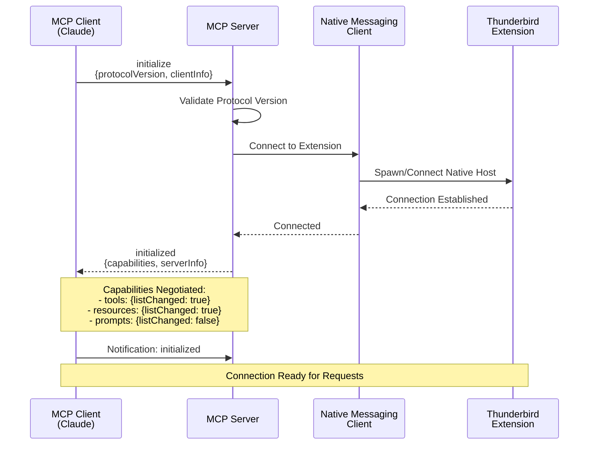

**Steps**:
1. **Client Initialize**: Client sends `initialize` with protocol version and client info
2. **Server Validation**: Server validates protocol compatibility
3. **Native Messaging Connection**: Server connects to extension via Native Messaging
4. **Capability Negotiation**: Server responds with supported capabilities
5. **Client Confirmation**: Client sends `initialized` notification
6. **Ready State**: System ready to handle tool and resource requests

**Capabilities Exchanged**:
```json
{
  "capabilities": {
    "tools": {
      "listChanged": true
    },
    "resources": {
      "listChanged": true
    },
    "prompts": {
      "listChanged": false
    }
  },
  "serverInfo": {
    "name": "thunderbird-mcp",
    "version": "1.0.0"
  }
}
```

## Tool Call Flow

### Standard Tool Execution

This is the primary data flow for tool invocations like searching messages or creating contacts.

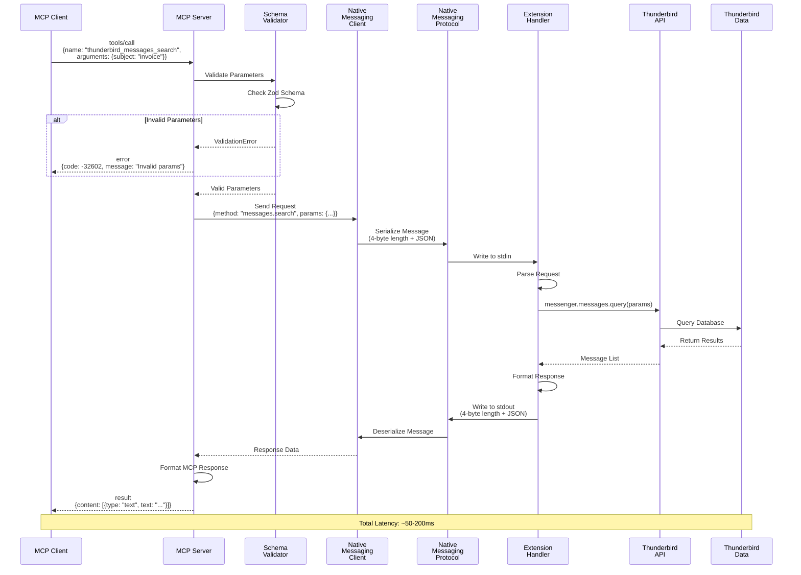

**Detailed Steps**:

1. **Client Request**:
   - Client sends `tools/call` with tool name and arguments
   - Request includes unique ID for correlation

2. **Server Validation**:
   - Server routes to appropriate tool handler
   - Zod schema validates all parameters
   - Returns validation error if invalid

3. **Native Messaging Request**:
   - Server sends request to Native Messaging client
   - Client serializes message with length prefix
   - Message written to extension's stdin

4. **Extension Processing**:
   - Extension parses incoming message
   - Routes to appropriate API wrapper
   - Calls Thunderbird WebExtension API

5. **Thunderbird API**:
   - API accesses local data stores
   - Performs query/operation
   - Returns results

6. **Response Pipeline**:
   - Extension formats response
   - Serializes and writes to stdout
   - Server deserializes response
   - Formats as MCP content
   - Returns to client

**Error Handling**:
- Validation errors: Return immediately with code -32602
- Permission errors: Return code -32002
- Not found errors: Return code -32003
- Timeout errors: Return code -32004 after 10-30s
- Internal errors: Return code -32603

### Tool Call with Timeout

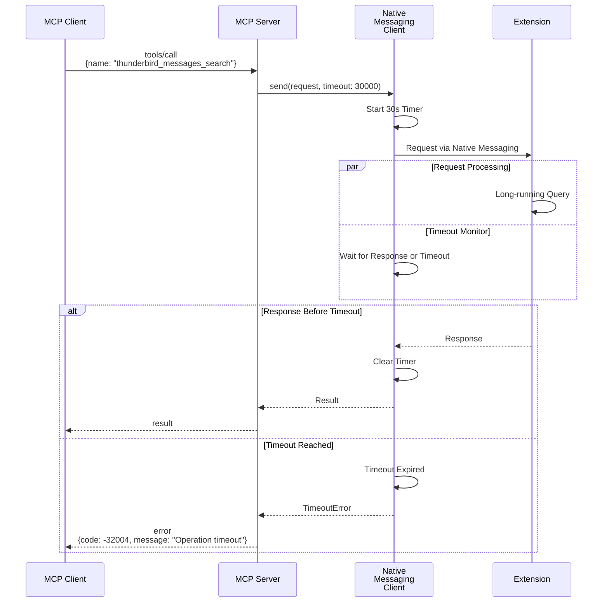

**Timeout Values**:
- Message search: 30 seconds
- CRUD operations: 10 seconds
- Resource reads: 15 seconds
- Calendar operations: 10 seconds

## Resource Access Flow

### Resource Read

Resources provide contextual data to AI clients without requiring explicit parameters.

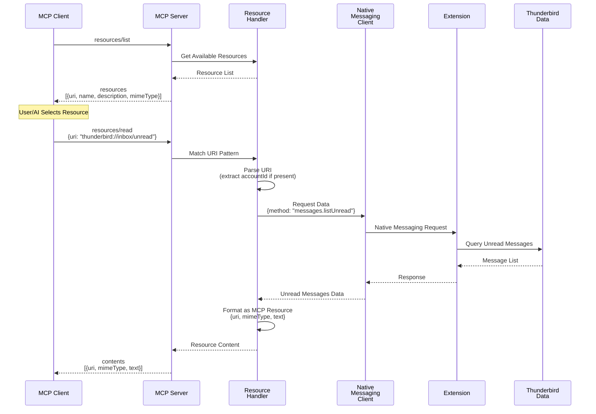

**Resource URI Examples**:

| URI | Data Returned |
|-----|---------------|
| `thunderbird://accounts` | All configured accounts |
| `thunderbird://folders/{accountId}` | Folder tree for account |
| `thunderbird://inbox/unread` | All unread messages |
| `thunderbird://inbox/unread/{accountId}` | Unread for specific account |
| `thunderbird://contacts/recent` | Recently used contacts |
| `thunderbird://calendar/today` | Today's calendar events |
| `thunderbird://calendar/upcoming` | Next 7 days events |
| `thunderbird://tasks/pending` | Incomplete tasks |

**Resource Content Format**:
```json
{
  "contents": [
    {
      "uri": "thunderbird://inbox/unread",
      "mimeType": "application/json",
      "text": "[{\"id\":\"msg-1\",\"subject\":\"...\"}]"
    }
  ]
}
```

## Error Handling Flow

### Error Propagation

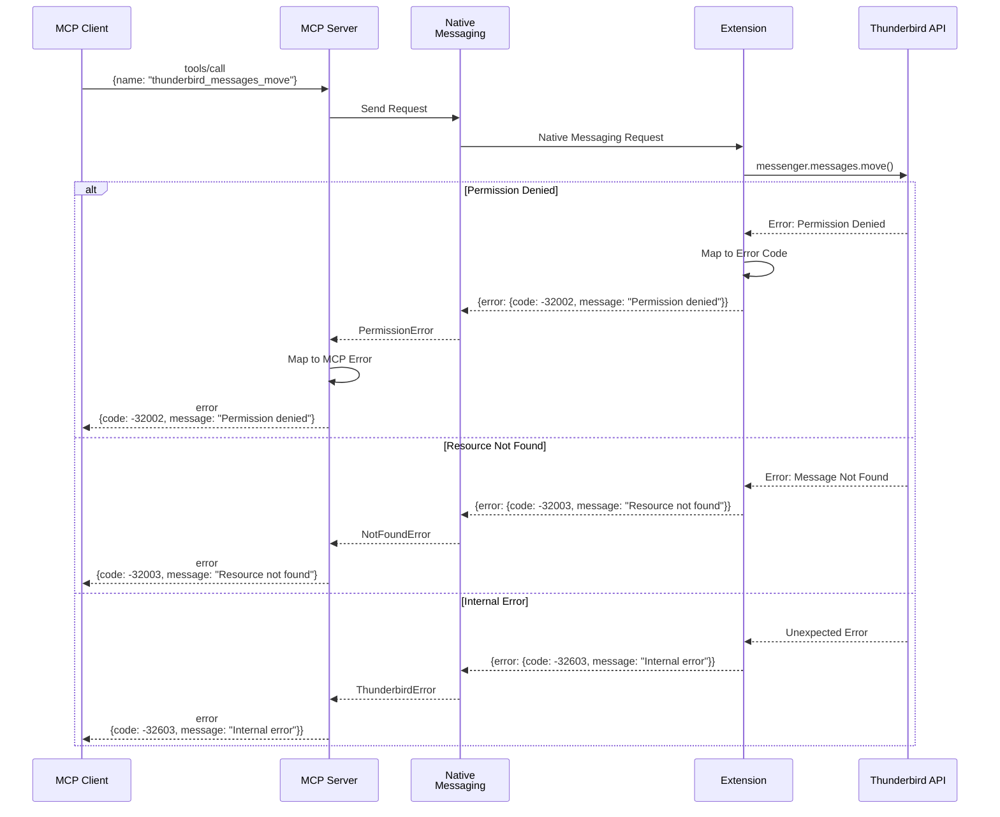

**Error Code Mapping**:

| Error Type | JSON-RPC Code | Description |
|-----------|---------------|-------------|
| Parse Error | -32700 | Invalid JSON |
| Invalid Request | -32600 | Malformed request |
| Method Not Found | -32601 | Unknown tool/method |
| Invalid Params | -32602 | Schema validation failed |
| Internal Error | -32603 | Unexpected error |
| Thunderbird Not Running | -32000 | Extension unreachable |
| Extension Not Installed | -32001 | Extension missing |
| Permission Denied | -32002 | Insufficient permissions |
| Resource Not Found | -32003 | Entity doesn't exist |
| Operation Timeout | -32004 | Request exceeded timeout |

### Validation Error Flow

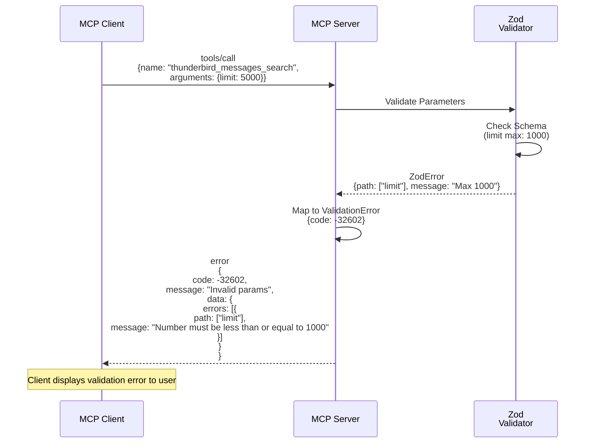

## Native Messaging Protocol Flow

### Message Serialization

The Native Messaging protocol uses length-prefixed JSON messages for bidirectional communication.

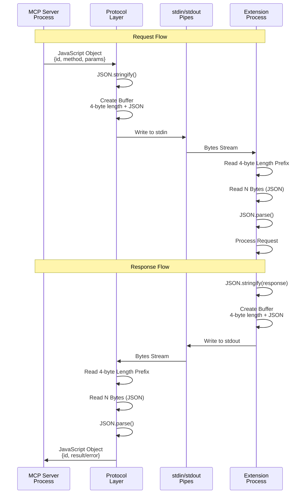

**Message Format**:
```
┌─────────────┬──────────────────────────────────┐
│   4 bytes   │         N bytes                  │
│   Length    │       JSON Payload               │
│ (UInt32LE)  │                                  │
└─────────────┴──────────────────────────────────┘
```

**Example Serialization**:
```javascript
// Request object
const request = {
  id: "req-001",
  method: "messages.search",
  params: { subject: "invoice" }
};

// Serialized
// Length: 4 bytes = 0x3E000000 (62 in little-endian)
// JSON: {"id":"req-001","method":"messages.search","params":{"subject":"invoice"}}
```

### Connection Lifecycle

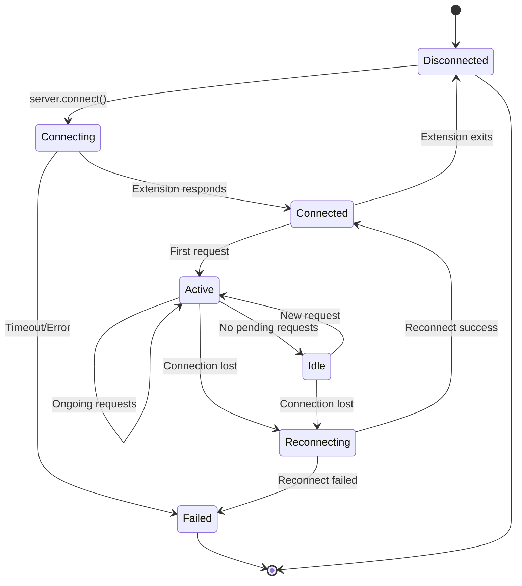

**States**:
- **Disconnected**: No connection to extension
- **Connecting**: Spawning/connecting to native host
- **Connected**: Connection established, idle
- **Active**: Processing requests
- **Idle**: Connected but no active requests
- **Reconnecting**: Attempting to restore connection
- **Failed**: Connection permanently failed

## Batch Operations Flow

### Multiple Message Operations

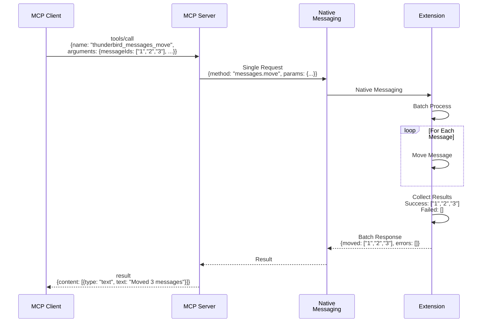

**Batch Operation Benefits**:
- Single round-trip for multiple items
- Atomic semantics (all or partial success)
- Detailed error reporting per item
- Better performance than sequential calls

## Real-Time Event Flow (Future)

### Resource Subscription (Planned)

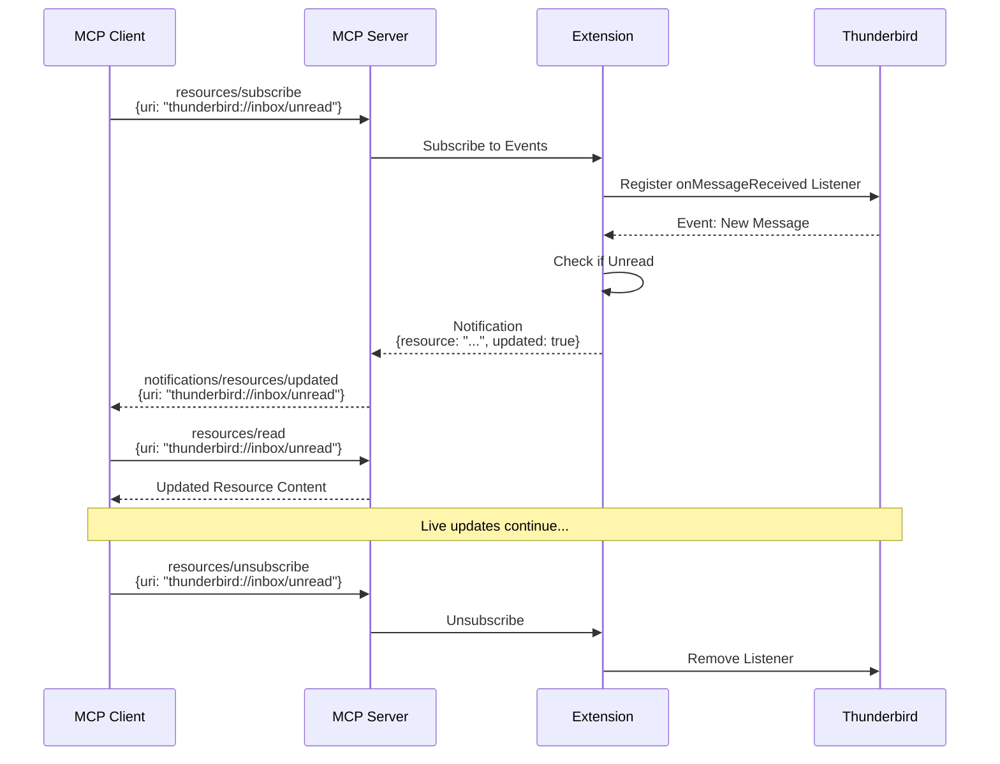

**Planned Event Types**:
- New message received
- Message marked as read/unread
- Message moved/deleted
- Contact updated
- Calendar event created/modified
- Task status changed

## Performance Characteristics

### Latency Breakdown

```mermaid
gantt
    title Tool Call Latency (thunderbird_messages_search)
    dateFormat X
    axisFormat %L ms

    section MCP Layer
    Schema Validation      :a1, 0, 5

    section Native Messaging
    Serialization         :a2, 5, 10
    IPC Transfer          :a3, 10, 20

    section Extension
    Deserialization       :a4, 20, 25
    API Routing           :a5, 25, 30

    section Thunderbird API
    Database Query        :a6, 30, 180

    section Response
    Result Formatting     :a7, 180, 185
    IPC Transfer Back     :a8, 185, 195
    MCP Formatting        :a9, 195, 200
```

**Typical Latencies**:
- Schema validation: 1-5ms
- Serialization: 1-5ms
- IPC transfer: 5-10ms each way
- Extension routing: 5-10ms
- Thunderbird API: 20-150ms (varies by operation)
- Total: 50-200ms typical

### Throughput Considerations

**Bottlenecks**:
1. **Native Messaging Bandwidth**: ~1MB/s theoretical limit
2. **Single-threaded Extension**: Sequential request processing
3. **Thunderbird API**: Database lock contention
4. **IPC Overhead**: Fixed cost per message

**Optimization Strategies**:
- Use pagination for large result sets
- Batch operations where possible
- Cache folder structures
- Minimize full message body retrieval
- Consider parallel connections (future)

## Data Flow Summary

### Request Types Comparison

| Flow Type | Latency | Caching | Real-time | Use Case |
|-----------|---------|---------|-----------|----------|
| Tool Call | 50-200ms | No | No | Action execution |
| Resource Read | 30-100ms | Optional | No | Context retrieval |
| Resource Subscribe | N/A | No | Yes | Live updates (future) |
| Batch Operation | 100-500ms | No | No | Bulk actions |

### Key Takeaways

1. **Validation Happens Early**: Client-side and server-side validation before expensive operations
2. **Error Codes Are Consistent**: Standardized JSON-RPC codes across all layers
3. **Protocol Is Stateless**: Each request is independent (except subscriptions in future)
4. **Timeouts Protect Resources**: All operations have reasonable timeout limits
5. **Batching Improves Performance**: Single request for multiple items reduces overhead
