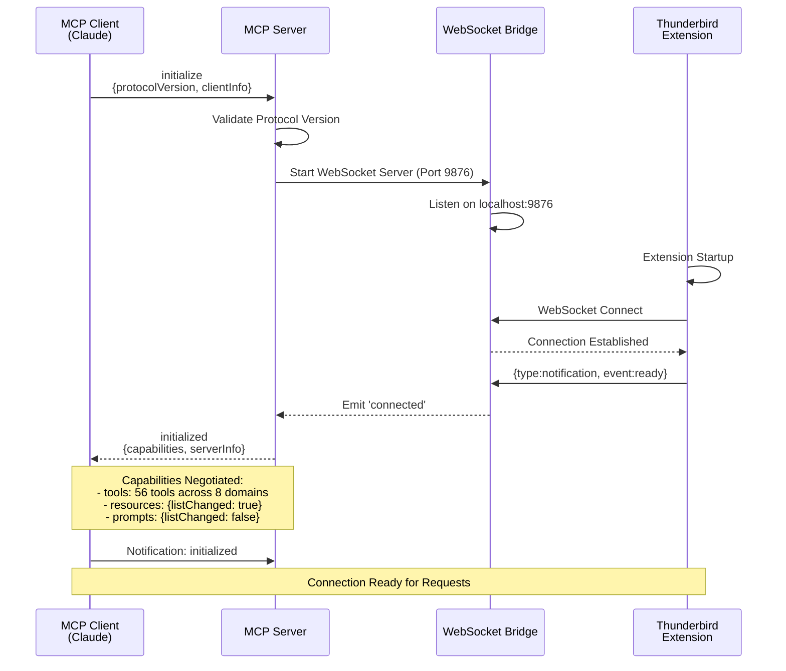
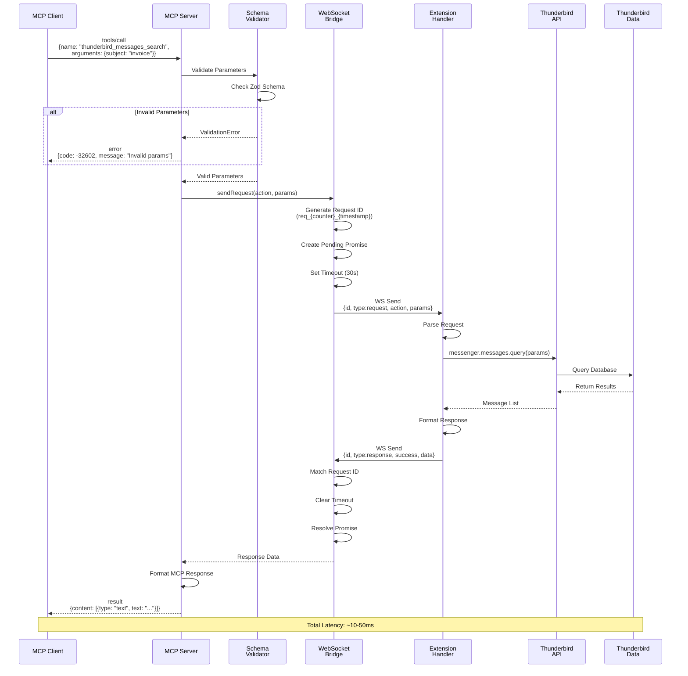
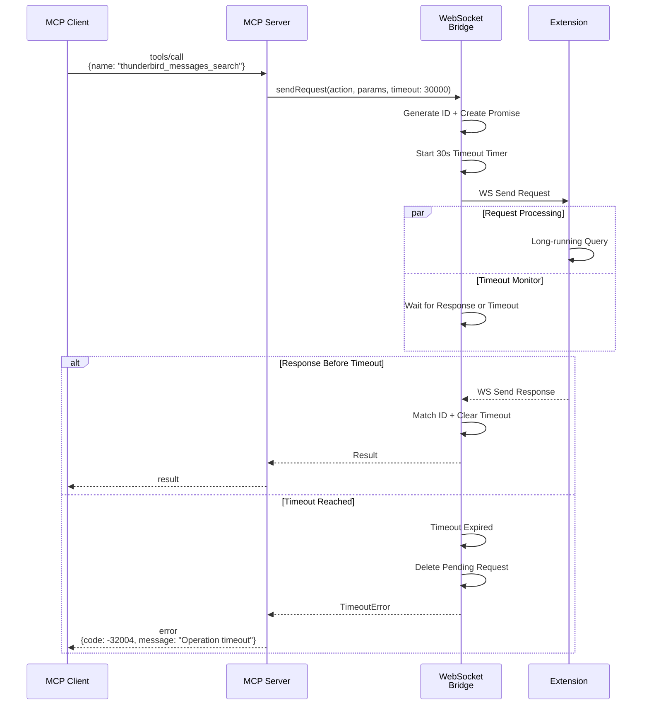
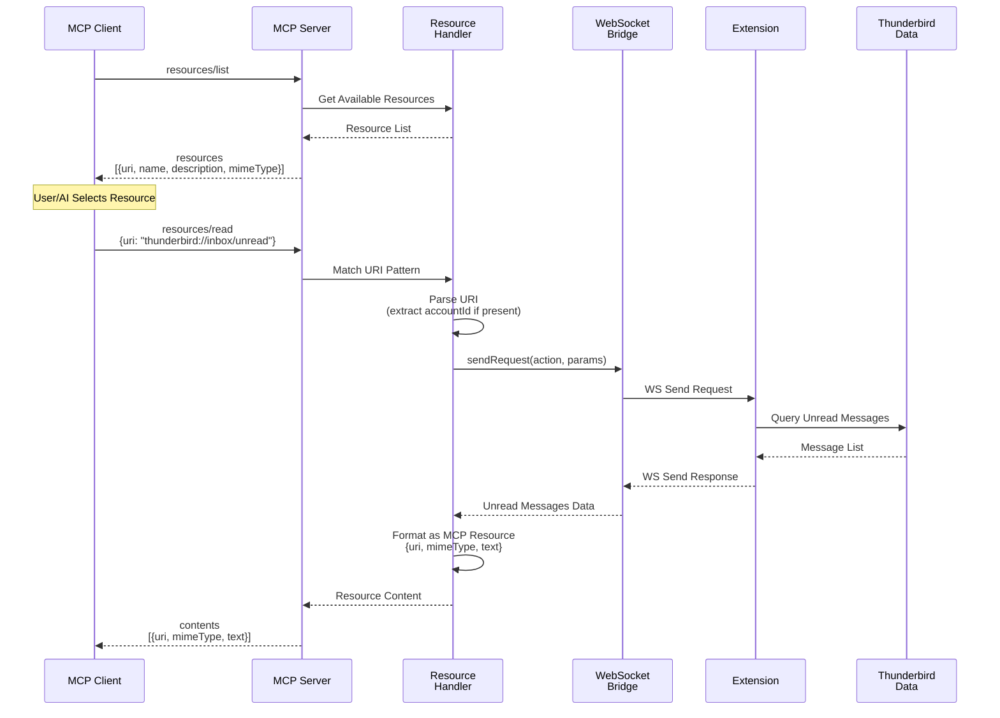
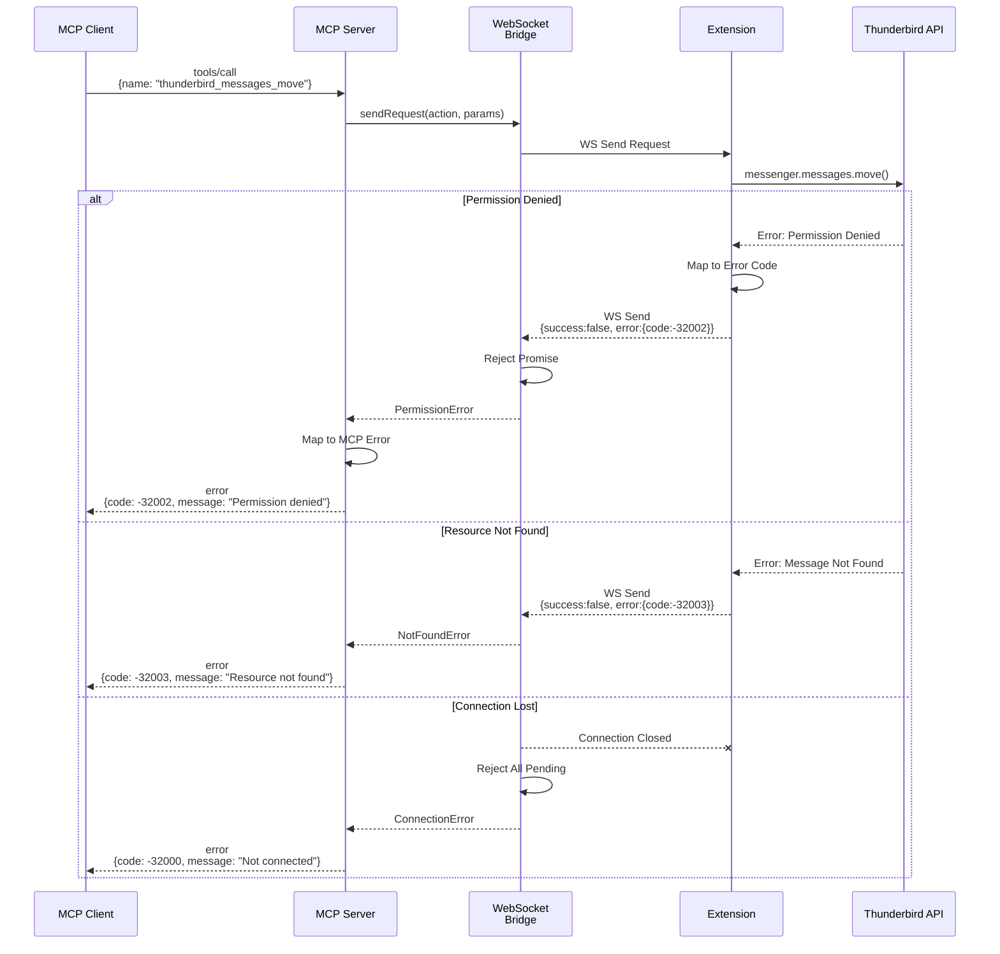
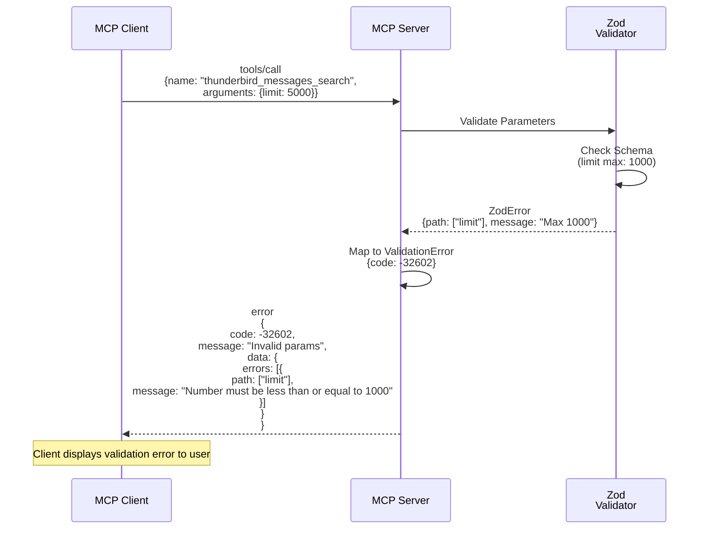
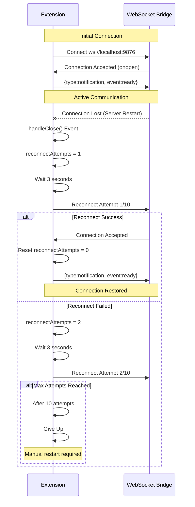
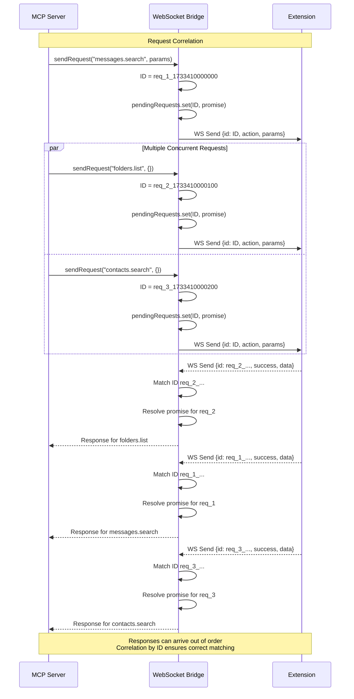
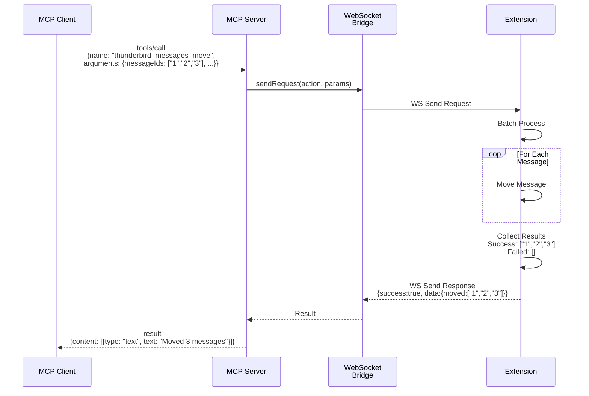

# Data Flow Architecture

## Overview

This document details the data flows through the Thunderbird MCP system, illustrating how requests travel from MCP clients through the server, WebSocket bridge, and Thunderbird extension to access email data.

## MCP Lifecycle Flow

### Initialize Connection

The initialization sequence establishes the MCP server connection and negotiates capabilities.



**Steps**:

1. **Client Initialize**: Client sends `initialize` with protocol version and client info
2. **Server Validation**: Server validates protocol compatibility
3. **WebSocket Bridge Start**: Server starts WebSocket server on port 9876
4. **Extension Connect**: Extension connects to WebSocket on startup
5. **Ready Notification**: Extension sends ready notification with capabilities
6. **Capability Negotiation**: Server responds with supported capabilities
7. **Client Confirmation**: Client sends `initialized` notification
8. **Ready State**: System ready to handle tool and resource requests

**Capabilities Exchanged**:

```json
{
  "capabilities": {
    "tools": {
      "listChanged": true
    },
    "resources": {
      "listChanged": true
    }
  },
  "serverInfo": {
    "name": "thunderbird-mcp",
    "version": "1.3.1"
  },
  "tools": 56,
  "domains": [
    "messages",
    "folders",
    "contacts",
    "tags",
    "accounts",
    "compose",
    "calendar",
    "tasks"
  ]
}
```

## Tool Call Flow

### Standard Tool Execution

This is the primary data flow for tool invocations like searching messages or creating contacts.



**Detailed Steps**:

1. **Client Request**:
   - Client sends `tools/call` with tool name and arguments
   - Request includes unique ID for correlation

2. **Server Validation**:
   - Server routes to appropriate tool handler
   - Zod schema validates all parameters
   - Returns validation error if invalid

3. **WebSocket Request**:
   - Server sends request to WebSocket bridge
   - Bridge generates unique request ID (format: `req_{counter}_{timestamp}`)
   - Creates pending promise for response tracking
   - Sets timeout (default: 30s)
   - Sends JSON message over WebSocket

4. **Extension Processing**:
   - Extension parses incoming WebSocket message
   - Routes to appropriate API wrapper
   - Calls Thunderbird WebExtension API

5. **Thunderbird API**:
   - API accesses local data stores
   - Performs query/operation
   - Returns results

6. **Response Pipeline**:
   - Extension formats response
   - Sends JSON message over WebSocket with matching request ID
   - Bridge correlates response by ID
   - Clears timeout
   - Resolves pending promise
   - Server formats as MCP content
   - Returns to client

**Error Handling**:

- Validation errors: Return immediately with code -32602
- Permission errors: Return code -32002
- Not found errors: Return code -32003
- Timeout errors: Return code -32004 after 30s
- Internal errors: Return code -32603

### Tool Call with Timeout



**Timeout Values**:

- Message search: 30 seconds
- CRUD operations: 10 seconds
- Resource reads: 15 seconds
- Calendar operations: 10 seconds

## Resource Access Flow

### Resource Read

Resources provide contextual data to AI clients without requiring explicit parameters.



**Resource URI Examples**:

| URI                                      | Data Returned               |
| ---------------------------------------- | --------------------------- |
| `thunderbird://accounts`                 | All configured accounts     |
| `thunderbird://folders/{accountId}`      | Folder tree for account     |
| `thunderbird://inbox/unread`             | All unread messages         |
| `thunderbird://inbox/unread/{accountId}` | Unread for specific account |
| `thunderbird://contacts/recent`          | Recently used contacts      |
| `thunderbird://calendar/today`           | Today's calendar events     |
| `thunderbird://calendar/upcoming`        | Next 7 days events          |
| `thunderbird://tasks/pending`            | Incomplete tasks            |

**Resource Content Format**:

```json
{
  "contents": [
    {
      "uri": "thunderbird://inbox/unread",
      "mimeType": "application/json",
      "text": "[{\"id\":\"msg-1\",\"subject\":\"...\"}]"
    }
  ]
}
```

## Error Handling Flow

### Error Propagation



**Error Code Mapping**:

| Error Type              | JSON-RPC Code | Description              |
| ----------------------- | ------------- | ------------------------ |
| Parse Error             | -32700        | Invalid JSON             |
| Invalid Request         | -32600        | Malformed request        |
| Method Not Found        | -32601        | Unknown tool/method      |
| Invalid Params          | -32602        | Schema validation failed |
| Internal Error          | -32603        | Unexpected error         |
| Extension Not Connected | -32000        | WebSocket not connected  |
| Permission Denied       | -32002        | Insufficient permissions |
| Resource Not Found      | -32003        | Entity doesn't exist     |
| Operation Timeout       | -32004        | Request exceeded timeout |

### Validation Error Flow



## WebSocket Protocol Flow

### Connection and Reconnection



### Message Correlation



**Request ID Format**:

- Server-generated: `req_{counter}_{timestamp}`
- Extension-generated: `ext_{timestamp}_{random}`
- Unique per request
- Used for response correlation
- Prevents response mismatching

## Batch Operations Flow

### Multiple Message Operations



**Batch Operation Benefits**:

- Single WebSocket round-trip for multiple items
- Atomic semantics (all or partial success)
- Detailed error reporting per item
- Better performance than sequential calls

## Performance Characteristics

### Latency Breakdown

```mermaid
gantt
    title Tool Call Latency (thunderbird_messages_search)
    dateFormat X
    axisFormat %L ms

    section MCP Layer
    Schema Validation      :a1, 0, 5

    section WebSocket Bridge
    Generate ID & Promise  :a2, 5, 7
    Serialize JSON         :a3, 7, 9
    WS Send                :a4, 9, 11

    section Network
    Localhost Transfer     :a5, 11, 13

    section Extension
    Parse JSON             :a6, 13, 15
    Route to Handler       :a7, 15, 18

    section Thunderbird API
    Database Query         :a8, 18, 45

    section Response
    Format Response        :a9, 45, 47
    WS Send Back           :a10, 47, 49
    Match & Resolve        :a11, 49, 50
```



**Typical Latencies**:

- Schema validation: 1-5ms
- Request ID generation: 1-2ms
- JSON serialization: 1-2ms
- WebSocket transfer (localhost): 1-2ms each way
- Extension routing: 2-3ms
- Thunderbird API: 10-30ms (varies by operation)
- Total: 10-50ms typical

**Comparison to Native Messaging**:

- Native Messaging: 20-50ms overhead
- WebSocket: 10-20ms overhead
- Improvement: ~2x faster

### Throughput Considerations

**Bottlenecks**:

1. **Single WebSocket Connection**: Full-duplex, but single thread
2. **Extension Processing**: Sequential request handling
3. **Thunderbird API**: Database lock contention
4. **Pending Request Limit**: Max 100 concurrent requests

**Optimization Strategies**:

- Use pagination for large result sets
- Batch operations where possible
- Request correlation enables concurrent requests
- Timeout management prevents queue buildup

## Data Flow Summary

### Request Types Comparison

| Flow Type       | Latency  | Connection | Real-time | Use Case          |
| --------------- | -------- | ---------- | --------- | ----------------- |
| Tool Call       | 10-50ms  | WebSocket  | No        | Action execution  |
| Resource Read   | 15-40ms  | WebSocket  | No        | Context retrieval |
| Notification    | <5ms     | WebSocket  | Yes       | Status updates    |
| Batch Operation | 50-200ms | WebSocket  | No        | Bulk actions      |

### Key Takeaways

1. **WebSocket Provides Better Performance**: ~2x faster than Native Messaging
2. **Request Correlation Enables Concurrency**: Multiple requests in flight simultaneously
3. **Auto-Reconnect Improves Reliability**: Automatic recovery from connection loss
4. **Validation Happens Early**: Client-side and server-side validation before expensive operations
5. **Error Codes Are Consistent**: Standardized JSON-RPC codes across all layers
6. **Timeouts Protect Resources**: All operations have reasonable timeout limits
7. **Batching Improves Performance**: Single request for multiple items reduces overhead
