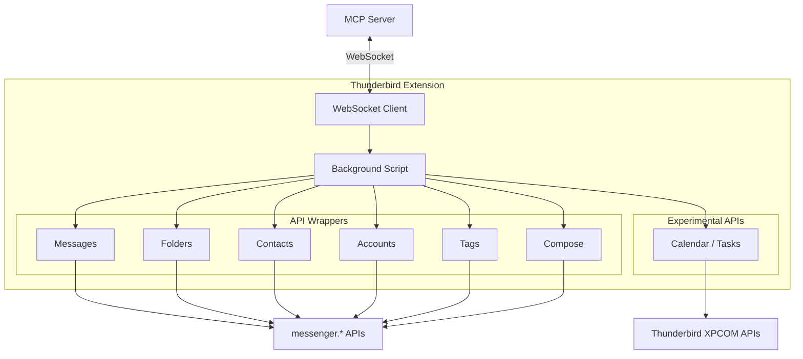

# Thunderbird Extension Architecture

## Overview

The Thunderbird extension is a Manifest V3 MailExtension that bridges the MCP server and Thunderbird's internal APIs. It receives requests via WebSocket and translates them into Thunderbird API calls.

## Extension Structure

```
extension/
├── manifest.json              # Manifest V3 configuration
├── background.html            # Background page (loads background.js as module)
├── background.js              # Main entry point
├── api/
│   ├── messages.js           # Message API wrapper
│   ├── folders.js            # Folder API wrapper
│   ├── contacts.js           # Contacts/AddressBooks API wrapper
│   ├── accounts.js           # Accounts API wrapper
│   ├── tags.js               # Tags API wrapper
│   └── compose.js            # Compose API wrapper
├── native-messaging/
│   └── handler.js            # Request routing handler
├── experiments/
│   └── calendar/             # Experimental Calendar API
│       ├── schema/           # API schema definitions
│       └── parent/           # Parent process implementations
├── options.html              # Options UI
├── icons/                    # Extension icons
└── _locales/
    ├── en/messages.json
    └── fr/messages.json
```

## Component Architecture



## Background Script

### Lifecycle (MV3 Event Page)

The background script is event-driven and can be suspended by Thunderbird after ~30-90 seconds of inactivity.

**Key responsibilities:**
1. WebSocket connection to MCP server (port 9876)
2. Request routing to API wrappers
3. Error handling and response formatting
4. Keep-alive via `browser.alarms` (survives suspension)

### WebSocket Connection

```javascript
async function connectWebSocket() {
  const token = await fetchAuthToken();
  ws = new WebSocket(`ws://localhost:${WS_PORT}?token=${token}`);

  ws.onopen = () => {
    reconnectAttempts = 0;
    sendReadyNotification();
  };
  ws.onmessage = (event) => processRequest(JSON.parse(event.data));
  ws.onclose = () => scheduleReconnect();
}
```

**Reconnect**: Fixed 3-second delay, max 10 attempts. Counter resets on success.

**Keep-alive**: 3 staggered `browser.alarms` fire every ~10 seconds, calling `ensureWebSocketConnected()` which detects stale connections (60s health timeout) and force-reconnects.

### Request Routing

Incoming WebSocket requests are dispatched by `action` field (e.g., `messages.search`) to the appropriate API wrapper. Responses include the original request `id` for correlation.

## API Wrappers

Each module wraps a Thunderbird `messenger.*` API domain:

| Module | Functions | Thunderbird APIs |
|--------|-----------|-----------------|
| messages.js | search, list, get, move, copy, delete, update, archive | `messenger.messages.*` |
| folders.js | list, get, create, rename, delete, move, markAllRead | `messenger.folders.*` |
| contacts.js | search, list, get, create, update, delete + address books | `messenger.addressBooks.*`, `messenger.contacts.*` |
| accounts.js | listAccounts, getAccount, listIdentities | `messenger.accounts.*`, `messenger.identities.*` |
| tags.js | list, create, update, delete | `messenger.messages.tags.*` |
| compose.js | beginNew, beginReply, beginForward, getDetails, setDetails, saveDraft, saveTemplate, send | `messenger.compose.*` |

**Pattern**: All wrappers use try/catch, handle pagination (`messenger.messages.continueList`), and use MailFolderId strings (not MailFolder objects).

## Experimental Calendar API

Uses Thunderbird's webext-experiments framework (XPCOM access) for calendar functionality not yet in standard WebExtension APIs.

**Operations**:
- Calendars: list, get
- Events: search, list, get, create, update, move, delete
- Tasks: list, get, create, update, delete, complete

**Structure**: JSON schema defines API surface, parent process script implements via `calICalendarManager` XPCOM interface.

## Permission Model

Permissions declared in `manifest.json`:

| Permission | Purpose |
|-----------|---------|
| `messagesRead` | Read message headers and content |
| `messagesMove` | Move, copy, delete messages |
| `messagesUpdate` | Update message properties (flags) |
| `messagesTags` | Create and manage tags |
| `messagesTagsList` | List available tags |
| `accountsRead` | Read account information |
| `accountsFolders` | Manage folder structure |
| `addressBooks` | Full contact management |
| `alarms` | Keep-alive mechanism |
| `compose` | Create and manage compose windows |
| `compose.save` | Save drafts and templates |
| `storage` | Extension state storage |

**Host permissions**: `ws://localhost:9876/*`, `http://localhost:9876/*`

## Localization

Supports English and French via `_locales/` directory. Usage: `browser.i18n.getMessage("key")`.

## Error Handling

All API wrapper errors are caught and returned as structured error responses:

| Code | Meaning |
|------|---------|
| -32002 | Permission denied |
| -32003 | Resource not found |
| -32004 | Operation timeout |
| -32603 | Internal error |
