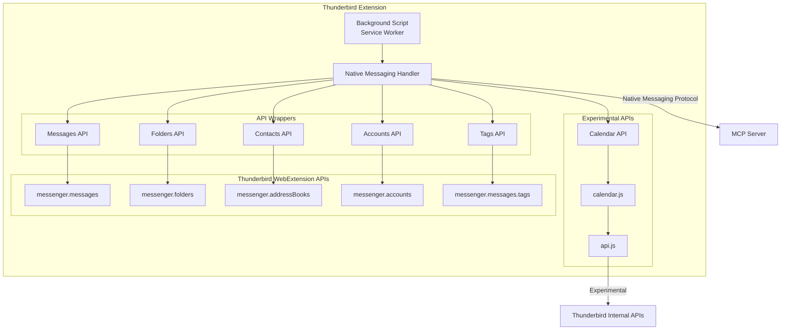
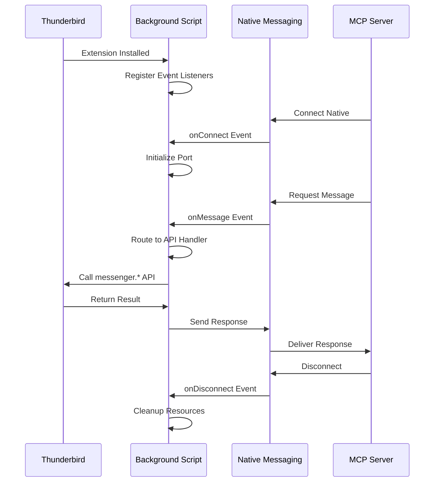
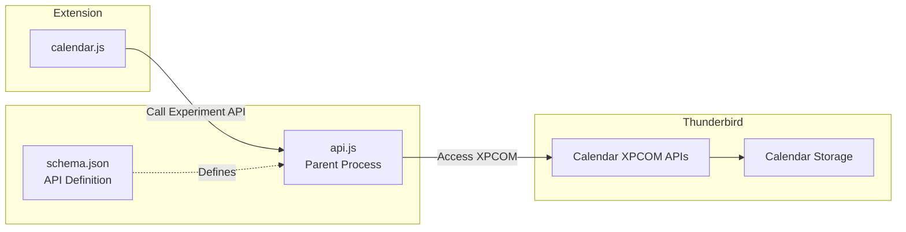
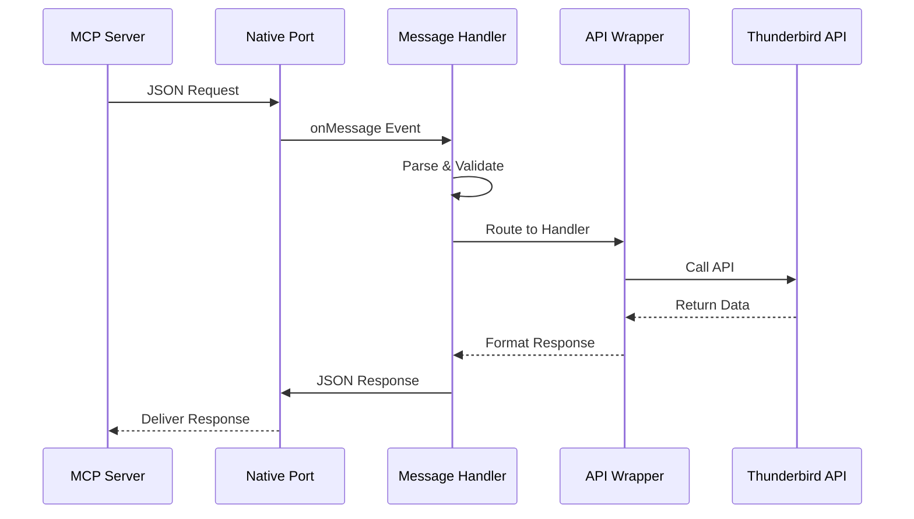

# Thunderbird Extension Architecture

## Overview

The Thunderbird extension is a Manifest V3 MailExtension that acts as a bridge between the MCP server and Thunderbird's internal APIs. It receives requests via Native Messaging and translates them into appropriate Thunderbird API calls.

## Extension Structure

```
extension/
├── manifest.json              # Manifest V3 configuration
├── background.js              # Service Worker (main entry point)
├── api/
│   ├── messages.js           # Message API wrapper
│   ├── folders.js            # Folder API wrapper
│   ├── contacts.js           # Contacts/AddressBooks API wrapper
│   ├── accounts.js           # Accounts API wrapper
│   └── tags.js               # Tags API wrapper
├── experiments/
│   └── calendar/             # Experimental Calendar API
│       ├── api.js            # Calendar API implementation
│       └── schema.json       # API schema definition
├── native-messaging/
│   └── handler.js            # Native Messaging protocol handler
└── _locales/
    ├── en/
    │   └── messages.json     # English translations
    └── fr/
        └── messages.json     # French translations
```

## Component Architecture



## Background Script (Service Worker)

### Purpose

The background script is the main entry point and coordinator for the extension. As a Manifest V3 service worker, it:

- Remains dormant until needed (event-driven)
- Manages Native Messaging port lifecycle
- Routes incoming requests to appropriate API wrappers
- Handles errors and timeouts
- Coordinates responses back to MCP server

### Lifecycle



### Key Responsibilities

1. **Connection Management**: Handle Native Messaging port lifecycle
2. **Request Routing**: Dispatch requests to correct API wrapper
3. **Error Handling**: Catch and format errors for MCP protocol
4. **Logging**: Log operations for debugging
5. **State Management**: Maintain minimal state for active operations

### Implementation Pattern

```javascript
// Background script structure
let nativePort = null;
let activeRequests = new Map();

// Initialize Native Messaging
browser.runtime.onConnectExternal.addListener((port) => {
  if (port.name === "thunderbird_mcp") {
    nativePort = port;
    setupPortHandlers(port);
  }
});

function setupPortHandlers(port) {
  port.onMessage.addListener(handleMessage);
  port.onDisconnect.addListener(handleDisconnect);
}

async function handleMessage(message) {
  const { id, method, params } = message;

  try {
    // Route to appropriate handler
    const result = await routeRequest(method, params);
    sendResponse(id, result);
  } catch (error) {
    sendError(id, error);
  }
}
```

## API Wrapper Modules

Each API wrapper module encapsulates operations for a specific Thunderbird API domain.

### Messages API Wrapper (`api/messages.js`)

**Purpose**: Handle all email message operations

**Functions**:

- `searchMessages(params)` - Advanced message search
- `listMessages(folderId, limit, offset)` - Paginated message listing
- `getMessage(messageId, format)` - Retrieve single message
- `moveMessages(messageIds, destinationFolderId)` - Move messages
- `copyMessages(messageIds, destinationFolderId)` - Copy messages
- `deleteMessages(messageIds, permanent)` - Delete messages
- `updateMessage(messageId, properties)` - Update message properties
- `archiveMessages(messageIds)` - Archive messages

**Thunderbird APIs Used**:

- `messenger.messages.list()`
- `messenger.messages.get()`
- `messenger.messages.query()`
- `messenger.messages.move()`
- `messenger.messages.copy()`
- `messenger.messages.delete()`
- `messenger.messages.update()`
- `messenger.messages.archive()`

### Folders API Wrapper (`api/folders.js`)

**Purpose**: Manage folder hierarchy and operations

**Functions**:

- `listFolders(accountId, includeSubFolders)` - List folder tree
- `getFolder(folderId)` - Get folder details
- `createFolder(parentFolderId, name)` - Create new folder
- `renameFolder(folderId, newName)` - Rename folder
- `deleteFolder(folderId)` - Delete folder
- `moveFolder(folderId, destinationFolderId)` - Move folder
- `markAllRead(folderId)` - Mark all messages as read

**Thunderbird APIs Used**:

- `messenger.folders.query()`
- `messenger.folders.get()`
- `messenger.folders.create()`
- `messenger.folders.rename()`
- `messenger.folders.delete()`
- `messenger.folders.move()`

### Contacts API Wrapper (`api/contacts.js`)

**Purpose**: Manage contacts and address books

**Functions**:

- `searchContacts(query, addressBookId, limit)` - Search contacts
- `listContacts(addressBookId, limit, offset)` - List contacts
- `getContact(contactId)` - Get contact details
- `createContact(addressBookId, properties)` - Create contact
- `updateContact(contactId, properties)` - Update contact
- `deleteContact(contactId)` - Delete contact
- `listAddressBooks()` - List all address books
- `createAddressBook(name)` - Create address book
- `deleteAddressBook(addressBookId)` - Delete address book

**Thunderbird APIs Used**:

- `messenger.addressBooks.list()`
- `messenger.addressBooks.get()`
- `messenger.addressBooks.create()`
- `messenger.addressBooks.delete()`
- `messenger.contacts.list()`
- `messenger.contacts.get()`
- `messenger.contacts.create()`
- `messenger.contacts.update()`
- `messenger.contacts.delete()`
- `messenger.contacts.query()`

### Accounts API Wrapper (`api/accounts.js`)

**Purpose**: Access account and identity information

**Functions**:

- `listAccounts()` - List all mail accounts
- `getAccount(accountId)` - Get account details
- `listIdentities(accountId)` - List account identities

**Thunderbird APIs Used**:

- `messenger.accounts.list()`
- `messenger.accounts.get()`
- `messenger.identities.list()`

### Tags API Wrapper (`api/tags.js`)

**Purpose**: Manage message tags/labels

**Functions**:

- `listTags()` - List all tags
- `createTag(key, tag, color)` - Create new tag
- `updateTag(key, tag, color)` - Update tag
- `deleteTag(key)` - Delete tag

**Thunderbird APIs Used**:

- `messenger.messages.tags.list()`
- `messenger.messages.tags.create()`
- `messenger.messages.tags.update()`
- `messenger.messages.tags.delete()`

### Compose API Wrapper (`api/compose.js`)

**Purpose**: Handle email composition operations

**Functions**:

- `beginNew(options)` - Open new compose window with optional pre-filled content
- `beginReply(messageId, replyType)` - Open reply compose window
- `beginForward(messageId, forwardType)` - Open forward compose window
- `getDetails(tabId)` - Get current compose window details
- `setDetails(tabId, details)` - Update compose window content
- `saveDraft(tabId)` - Save composition as draft
- `saveTemplate(tabId)` - Save composition as template
- `send(tabId, mode)` - Send the composed email

**Thunderbird APIs Used**:

- `messenger.compose.beginNew()`
- `messenger.compose.beginReply()`
- `messenger.compose.beginForward()`
- `messenger.compose.getComposeDetails()`
- `messenger.compose.setComposeDetails()`
- `messenger.compose.saveMessage()`
- `messenger.compose.sendMessage()`

## Experimental Calendar API

### Architecture

The Calendar API uses Thunderbird's webext-experiments framework to access calendar functionality not yet available in standard WebExtension APIs.



### Experiment Structure

**schema.json**: Defines the JavaScript API surface

```json
[
  {
    "namespace": "calendar",
    "types": [
      {
        "id": "CalendarItem",
        "type": "object",
        "properties": {
          "id": { "type": "string" },
          "calendarId": { "type": "string" },
          "title": { "type": "string" },
          "startDate": { "type": "string" },
          "endDate": { "type": "string" }
        }
      }
    ],
    "functions": [
      {
        "name": "listCalendars",
        "type": "function",
        "async": true,
        "parameters": []
      }
    ]
  }
]
```

**api.js**: Parent process implementation

```javascript
var { ExtensionCommon } = ChromeUtils.import(
  "resource://gre/modules/ExtensionCommon.jsm",
);

this.calendar = class extends ExtensionCommon.ExtensionAPI {
  getAPI(context) {
    return {
      calendar: {
        async listCalendars() {
          // Access Thunderbird calendar manager
          const calMgr = Cc["@mozilla.org/calendar/manager;1"].getService(
            Ci.calICalendarManager,
          );

          const calendars = calMgr.getCalendars();
          return calendars.map((cal) => ({
            id: cal.id,
            name: cal.name,
            type: cal.type,
            readOnly: cal.readOnly,
          }));
        },
      },
    };
  }
};
```

### Calendar Operations

**Events**:

- `calendar.listCalendars()` - List all calendars
- `calendar.listEvents(calendarId, startDate, endDate)` - List events
- `calendar.getEvent(eventId, calendarId)` - Get event details
- `calendar.createEvent(calendarId, event)` - Create event
- `calendar.updateEvent(eventId, calendarId, updates)` - Update event
- `calendar.deleteEvent(eventId, calendarId)` - Delete event

**Tasks**:

- `calendar.listTasks(calendarId, filter)` - List tasks
- `calendar.getTask(taskId, calendarId)` - Get task details
- `calendar.createTask(calendarId, task)` - Create task
- `calendar.updateTask(taskId, calendarId, updates)` - Update task
- `calendar.deleteTask(taskId, calendarId)` - Delete task
- `calendar.completeTask(taskId, calendarId)` - Mark task complete

## Native Messaging Handler

### Purpose

Manages bidirectional communication between extension and MCP server using Native Messaging protocol.

### Message Flow



### Protocol Implementation

**Message Format**:

```javascript
// Request
{
  "id": "unique-request-id",
  "method": "messages.search",
  "params": {
    "subject": "invoice",
    "unread": true
  }
}

// Success Response
{
  "id": "unique-request-id",
  "result": {
    "messages": [...]
  }
}

// Error Response
{
  "id": "unique-request-id",
  "error": {
    "code": -32002,
    "message": "Permission denied",
    "data": {}
  }
}
```

### Error Handling

**Error Categories**:

1. **Protocol Errors**: Invalid JSON, missing fields
2. **Permission Errors**: API access denied by Thunderbird
3. **Not Found Errors**: Resource doesn't exist
4. **Timeout Errors**: Operation exceeded time limit
5. **Internal Errors**: Unexpected extension errors

**Error Mapping**:

```javascript
function mapError(error) {
  if (error.message.includes("permission")) {
    return { code: -32002, message: "Permission denied" };
  }
  if (error.message.includes("not found")) {
    return { code: -32003, message: "Resource not found" };
  }
  return { code: -32603, message: "Internal error" };
}
```

## Permission Model

### Manifest Permissions

```json
{
  "permissions": [
    "messagesRead", // Read message headers and content
    "messagesMove", // Move, copy, delete messages
    "messagesUpdate", // Update message properties
    "messagesTags", // Create and manage tags
    "accountsRead", // Read account information
    "accountsFolders", // Manage folder structure
    "addressBooks", // Full contact management
    "nativeMessaging" // Communication with MCP server
  ]
}
```

### Permission Scopes

| Permission        | Scope                    | Risk Level |
| ----------------- | ------------------------ | ---------- |
| `messagesRead`    | Read all message content | Medium     |
| `messagesMove`    | Modify message location  | Low        |
| `messagesUpdate`  | Change message flags     | Low        |
| `messagesTags`    | Manage tags              | Low        |
| `accountsRead`    | View account details     | Low        |
| `accountsFolders` | Create/delete folders    | Medium     |
| `addressBooks`    | Full contact access      | Medium     |
| `nativeMessaging` | External communication   | High       |

### Security Considerations

**Data Minimization**:

- Extension requests minimum required permissions
- Headers-only access by default
- Full body content on explicit request only

**Sandboxing**:

- Extension runs in isolated context
- Native Messaging provides IPC sandbox
- No direct filesystem or network access

**User Consent**:

- All permissions shown at installation
- User can revoke extension at any time
- Operations logged for audit trail

## Localization

### Structure

```
_locales/
├── en/
│   └── messages.json
├── fr/
│   └── messages.json
└── de/
    └── messages.json
```

### Message Format

```json
{
  "extensionName": {
    "message": "Thunderbird MCP Server",
    "description": "Name of the extension"
  },
  "extensionDescription": {
    "message": "Bridge between MCP protocol and Thunderbird",
    "description": "Description of the extension"
  },
  "errorPermissionDenied": {
    "message": "Permission denied for this operation",
    "description": "Error message for permission issues"
  }
}
```

### Usage

```javascript
// In extension code
const message = browser.i18n.getMessage("errorPermissionDenied");
```

## Testing Strategy

### Unit Tests

- API wrapper function isolation
- Message format validation
- Error handling logic
- Permission checking

### Integration Tests

- Native Messaging communication
- End-to-end API call flow
- Error propagation
- Timeout handling

### Manual Tests

- Extension installation
- Permission approval
- Real Thunderbird data
- Cross-platform verification

## Performance Optimization

### Caching Strategy

- Cache folder structure (invalidate on change events)
- Cache account list (rarely changes)
- No caching of message content (privacy)

### Batch Operations

- Support batch message operations
- Reduce round-trips for bulk updates
- Paginate large result sets

### Lazy Loading

- Load message bodies on demand
- Defer contact photo loading
- Stream large calendar ranges

## Error Recovery

### Retry Logic

- Retry transient errors (3 attempts)
- Fixed 3-second delay between retry attempts
- Fail fast for permission errors

### Graceful Degradation

- Return partial results on timeout
- Continue on individual item errors
- Log errors for debugging

### State Consistency

- Rollback on failed batch operations
- Validate state after mutations
- Provide transaction-like semantics where possible
