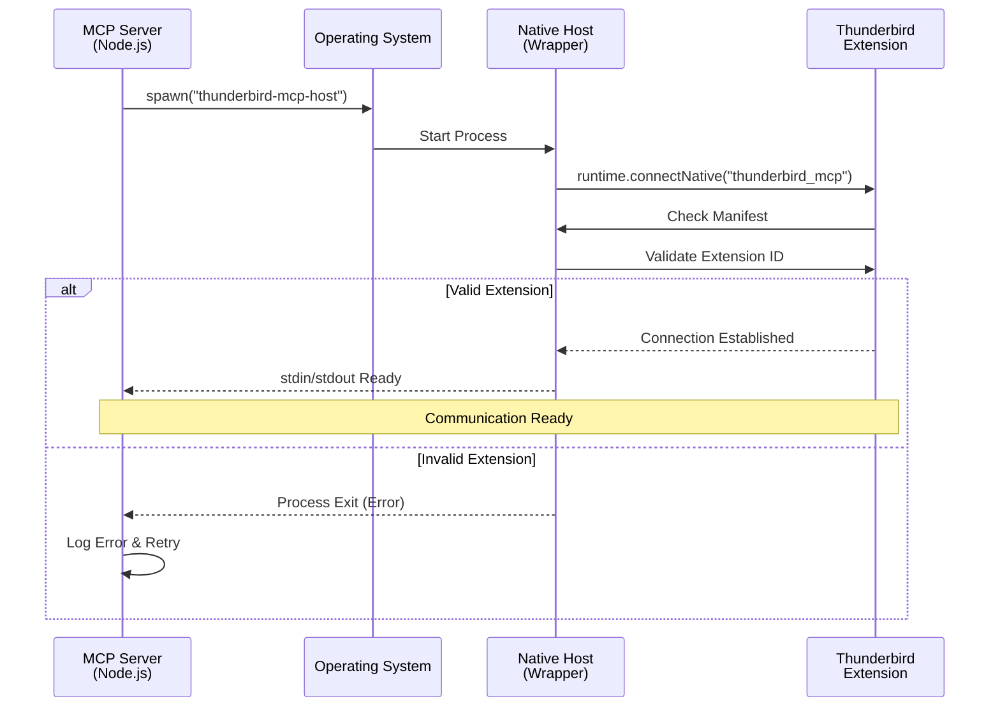
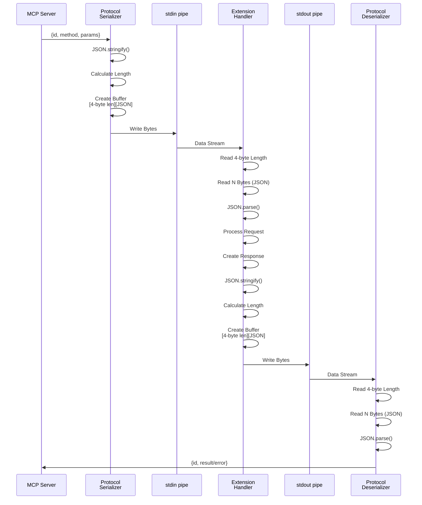
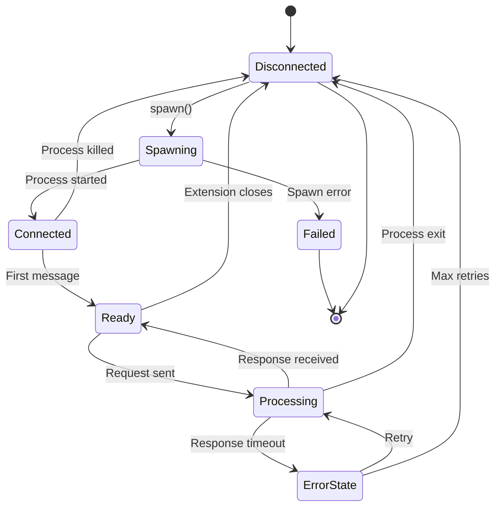

# Native Messaging Integration

## Overview

Native Messaging is the core communication mechanism that bridges the MCP server (Node.js process) and the Thunderbird extension (browser context). It provides a secure, sandboxed, bidirectional IPC channel using standard input/output streams.

## Why Native Messaging?

### Technical Rationale

**Problem**: Thunderbird doesn't expose HTTP APIs or external interfaces

- WebExtensions run in isolated browser context
- No direct access to Thunderbird internals from external processes
- Need secure communication between Node.js server and extension

**Solution**: Native Messaging protocol

- Browser-native IPC mechanism
- Secure sandboxed communication
- Platform-agnostic
- Standard across Firefox, Chrome, Edge

### Trade-offs

**Advantages**:

- ✅ Secure by design (sandboxed, permission-controlled)
- ✅ Platform-agnostic protocol
- ✅ Native browser integration
- ✅ Bidirectional communication
- ✅ No network overhead or firewall issues

**Limitations**:

- ⚠️ Requires native host installation
- ⚠️ Platform-specific manifest configuration
- ⚠️ ~1MB/s bandwidth theoretical limit
- ⚠️ Single connection per extension instance
- ⚠️ No built-in reconnection handling

## Protocol Specification

### Message Format

Native Messaging uses length-prefixed JSON messages for all communication.

**Binary Structure**:

```
┌─────────────────────┬────────────────────────────────────────┐
│    Length Prefix    │           JSON Payload                 │
│      4 bytes        │            N bytes                     │
│   UInt32 (LE)       │        UTF-8 encoded                   │
└─────────────────────┴────────────────────────────────────────┘
```

**Components**:

1. **Length Prefix**: 4-byte unsigned integer (little-endian)
   - Specifies the length of the JSON payload in bytes
   - Does NOT include the 4-byte prefix itself
   - Maximum: 2^32 - 1 bytes (~4GB theoretical)

2. **JSON Payload**: UTF-8 encoded JSON object
   - Must be valid JSON
   - Can be any JSON structure (object, array, etc.)
   - No null bytes allowed in JSON

### Message Direction

**Server → Extension (Request)**:

```json
{
  "id": "req-uuid-1234",
  "method": "messages.search",
  "params": {
    "subject": "invoice",
    "unread": true,
    "limit": 20
  }
}
```

**Extension → Server (Response)**:

```json
{
  "id": "req-uuid-1234",
  "result": {
    "messages": [
      {
        "id": "msg-1",
        "subject": "Invoice #12345",
        "from": "billing@example.com",
        "date": "2025-03-15T10:30:00Z"
      }
    ]
  }
}
```

**Extension → Server (Error Response)**:

```json
{
  "id": "req-uuid-1234",
  "error": {
    "code": -32002,
    "message": "Permission denied",
    "data": {
      "operation": "messages.move",
      "reason": "messagesMove permission not granted"
    }
  }
}
```

## Protocol Flow

### Connection Establishment



**Steps**:

1. **Server Spawns Host**: MCP server spawns native host process
2. **Extension Connects**: Extension calls `runtime.connectNative()`
3. **Manifest Validation**: Browser validates native host manifest
4. **Extension ID Check**: Host manifest restricts allowed extensions
5. **Pipe Setup**: stdin/stdout pipes established for bidirectional communication

### Request/Response Cycle



### Connection Lifecycle



## Implementation

### Server-Side Serialization (TypeScript)

**protocol.ts**:

```typescript
/**
 * Serialize a message for Native Messaging protocol
 * @param message - JavaScript object to serialize
 * @returns Buffer with length prefix + JSON
 */
export function serializeMessage(message: any): Buffer {
  // Convert to JSON string
  const json = JSON.stringify(message);
  const jsonBuffer = Buffer.from(json, "utf-8");
  const length = jsonBuffer.length;

  // Validate size (practical limit ~1MB)
  if (length > 1024 * 1024) {
    throw new Error(`Message too large: ${length} bytes`);
  }

  // Create buffer: 4-byte length + JSON
  const buffer = Buffer.allocUnsafe(4 + length);

  // Write length as 32-bit unsigned integer (little-endian)
  buffer.writeUInt32LE(length, 0);

  // Copy JSON bytes after length prefix
  jsonBuffer.copy(buffer, 4);

  return buffer;
}

/**
 * Deserialize a Native Messaging message from buffer
 * @param buffer - Accumulated buffer with incoming data
 * @returns Parsed message and bytes consumed, or null if incomplete
 */
export function deserializeMessage(
  buffer: Buffer,
): { data: any; consumed: number } | null {
  // Need at least 4 bytes for length prefix
  if (buffer.length < 4) {
    return null;
  }

  // Read length prefix (little-endian)
  const length = buffer.readUInt32LE(0);

  // Validate length
  if (length > 1024 * 1024) {
    throw new Error(`Invalid message length: ${length}`);
  }

  // Check if full message available
  if (buffer.length < 4 + length) {
    return null; // Incomplete message, need more data
  }

  // Extract JSON bytes
  const jsonBuffer = buffer.slice(4, 4 + length);
  const json = jsonBuffer.toString("utf-8");

  // Parse JSON
  let data;
  try {
    data = JSON.parse(json);
  } catch (error) {
    throw new Error(`Invalid JSON in message: ${error.message}`);
  }

  return {
    data,
    consumed: 4 + length,
  };
}
```

### Server-Side Client (TypeScript)

**client.ts**:

```typescript
import { spawn, ChildProcess } from "child_process";
import { EventEmitter } from "events";
import { serializeMessage, deserializeMessage } from "./protocol.js";
import { logger } from "../utils/logger.js";

interface PendingRequest {
  resolve: (result: any) => void;
  reject: (error: Error) => void;
  timeout: NodeJS.Timeout;
}

export class NativeMessagingClient extends EventEmitter {
  private process: ChildProcess | null = null;
  private pendingRequests: Map<string, PendingRequest> = new Map();
  private messageBuffer: Buffer = Buffer.alloc(0);
  private requestCounter: number = 0;

  /**
   * Connect to Thunderbird extension via Native Messaging
   */
  async connect(): Promise<void> {
    if (this.process) {
      throw new Error("Already connected");
    }

    logger.info("Connecting to Thunderbird extension");

    // Spawn native messaging host
    // This will be intercepted by the browser to launch the extension
    this.process = spawn("thunderbird-mcp-host", [], {
      stdio: ["pipe", "pipe", "pipe"],
    });

    this.setupHandlers();

    // Wait for process to be ready
    await this.waitForReady();

    logger.info("Connected to Thunderbird extension");
  }

  /**
   * Send a request and wait for response
   */
  async send(request: any, timeout: number = 10000): Promise<any> {
    if (!this.process) {
      throw new Error("Not connected");
    }

    // Generate unique request ID
    const id = `req-${++this.requestCounter}-${Date.now()}`;
    const message = { id, ...request };

    // Serialize and send
    const serialized = serializeMessage(message);
    this.process.stdin!.write(serialized);

    logger.debug("Sent request", { id, method: request.method });

    // Wait for response with timeout
    return new Promise((resolve, reject) => {
      const timeoutHandle = setTimeout(() => {
        this.pendingRequests.delete(id);
        reject(new Error(`Request timeout after ${timeout}ms`));
      }, timeout);

      this.pendingRequests.set(id, {
        resolve: (result) => {
          clearTimeout(timeoutHandle);
          resolve(result);
        },
        reject: (error) => {
          clearTimeout(timeoutHandle);
          reject(error);
        },
        timeout: timeoutHandle,
      });
    });
  }

  /**
   * Set up process event handlers
   */
  private setupHandlers(): void {
    if (!this.process) return;

    // Handle stdout (responses from extension)
    this.process.stdout!.on("data", (data: Buffer) => {
      this.handleIncomingData(data);
    });

    // Handle stderr (errors/logs from extension)
    this.process.stderr!.on("data", (data: Buffer) => {
      logger.error("Extension error", { message: data.toString() });
    });

    // Handle process exit
    this.process.on("exit", (code, signal) => {
      logger.warn("Extension process exited", { code, signal });
      this.handleDisconnect();
    });

    // Handle process errors
    this.process.on("error", (error) => {
      logger.error("Extension process error", { error });
      this.handleDisconnect();
    });
  }

  /**
   * Handle incoming data from stdout
   */
  private handleIncomingData(data: Buffer): void {
    // Append to buffer
    this.messageBuffer = Buffer.concat([this.messageBuffer, data]);

    // Try to parse complete messages
    while (this.messageBuffer.length >= 4) {
      const result = deserializeMessage(this.messageBuffer);

      if (!result) {
        // Incomplete message, wait for more data
        break;
      }

      // Process message
      this.handleMessage(result.data);

      // Remove consumed bytes from buffer
      this.messageBuffer = this.messageBuffer.slice(result.consumed);
    }
  }

  /**
   * Handle a complete message from extension
   */
  private handleMessage(message: any): void {
    const { id, result, error } = message;

    logger.debug("Received response", { id });

    const pending = this.pendingRequests.get(id);
    if (!pending) {
      logger.warn("Received response for unknown request", { id });
      return;
    }

    this.pendingRequests.delete(id);

    if (error) {
      pending.reject(new Error(error.message || "Unknown error"));
    } else {
      pending.resolve(result);
    }
  }

  /**
   * Handle disconnection
   */
  private handleDisconnect(): void {
    // Reject all pending requests
    for (const [id, pending] of this.pendingRequests) {
      pending.reject(new Error("Connection closed"));
    }
    this.pendingRequests.clear();

    this.process = null;
    this.emit("disconnect");
  }

  /**
   * Disconnect from extension
   */
  async disconnect(): Promise<void> {
    if (this.process) {
      this.process.kill("SIGTERM");
      this.process = null;
    }
  }

  private async waitForReady(): Promise<void> {
    // Wait for process to be spawned and pipes to be ready
    return new Promise((resolve) => {
      setTimeout(resolve, 100);
    });
  }
}
```

### Extension-Side Handler (JavaScript)

**native-messaging/handler.js**:

```javascript
/**
 * Native Messaging handler for Thunderbird extension
 */

let port = null;

/**
 * Initialize Native Messaging listener
 */
export function initNativeMessaging() {
  // Listen for connections from native hosts
  browser.runtime.onConnect.addListener((connectedPort) => {
    port = connectedPort;

    console.log("Native Messaging connection established");

    port.onMessage.addListener(handleMessage);

    port.onDisconnect.addListener(() => {
      console.log("Native Messaging disconnected");
      port = null;
    });
  });
}

/**
 * Handle incoming message from native host
 */
async function handleMessage(message) {
  const { id, method, params } = message;

  console.log("Received message:", { id, method });

  try {
    // Route to appropriate handler
    const result = await routeRequest(method, params);

    // Send success response
    sendResponse(id, result);
  } catch (error) {
    // Send error response
    sendError(id, error);
  }
}

/**
 * Route request to appropriate API handler
 */
async function routeRequest(method, params) {
  const [module, action] = method.split(".");

  switch (module) {
    case "messages":
      return await handleMessagesRequest(action, params);
    case "folders":
      return await handleFoldersRequest(action, params);
    case "contacts":
      return await handleContactsRequest(action, params);
    // ... other modules
    default:
      throw new Error(`Unknown module: ${module}`);
  }
}

/**
 * Send success response
 */
function sendResponse(id, result) {
  if (port) {
    port.postMessage({
      id,
      result,
    });
  }
}

/**
 * Send error response
 */
function sendError(id, error) {
  if (port) {
    port.postMessage({
      id,
      error: {
        code: error.code || -32603,
        message: error.message,
        data: error.data,
      },
    });
  }
}
```

## Manifest Configuration

### Native Messaging Manifest

The native host manifest tells the browser how to launch the native host and which extensions can connect.

**File Locations**:

- **Linux**: `~/.mozilla/native-messaging-hosts/thunderbird_mcp.json`
- **macOS**: `~/Library/Application Support/Mozilla/NativeMessagingHosts/thunderbird_mcp.json`
- **Windows**: Registry key + manifest file

### Manifest Structure

**thunderbird_mcp.json**:

```json
{
  "name": "thunderbird_mcp",
  "description": "Thunderbird MCP Server Native Messaging Host",
  "path": "/usr/local/bin/thunderbird-mcp-host",
  "type": "stdio",
  "allowed_extensions": ["thunderbird-mcp@assistance-micro-design.com"]
}
```

**Fields**:

- `name`: Unique identifier for the native host (must match extension connection name)
- `description`: Human-readable description
- `path`: Absolute path to native host executable
- `type`: Communication type (always "stdio" for Native Messaging)
- `allowed_extensions`: Array of extension IDs permitted to connect

### Platform-Specific Setup

#### Linux

**1. Create manifest file**:

```bash
mkdir -p ~/.mozilla/native-messaging-hosts
cat > ~/.mozilla/native-messaging-hosts/thunderbird_mcp.json << 'EOF'
{
  "name": "thunderbird_mcp",
  "description": "Thunderbird MCP Server Native Messaging Host",
  "path": "/usr/local/bin/thunderbird-mcp-host",
  "type": "stdio",
  "allowed_extensions": ["thunderbird-mcp@assistance-micro-design.com"]
}
EOF
```

**2. Create wrapper script**:

```bash
cat > /usr/local/bin/thunderbird-mcp-host << 'EOF'
#!/bin/bash
exec node /usr/local/lib/thunderbird-mcp/index.js
EOF
chmod +x /usr/local/bin/thunderbird-mcp-host
```

#### macOS

**1. Create manifest directory**:

```bash
mkdir -p ~/Library/Application\ Support/Mozilla/NativeMessagingHosts
```

**2. Create manifest**:

```bash
cat > ~/Library/Application\ Support/Mozilla/NativeMessagingHosts/thunderbird_mcp.json << 'EOF'
{
  "name": "thunderbird_mcp",
  "description": "Thunderbird MCP Server Native Messaging Host",
  "path": "/usr/local/bin/thunderbird-mcp-host",
  "type": "stdio",
  "allowed_extensions": ["thunderbird-mcp@assistance-micro-design.com"]
}
EOF
```

**3. Create wrapper**:

```bash
cat > /usr/local/bin/thunderbird-mcp-host << 'EOF'
#!/bin/bash
exec /usr/local/bin/node /usr/local/lib/thunderbird-mcp/index.js
EOF
chmod +x /usr/local/bin/thunderbird-mcp-host
```

#### Windows

**1. Create manifest file**:

```
C:\Users\<username>\AppData\Roaming\Mozilla\NativeMessagingHosts\thunderbird_mcp.json
```

**Content**:

```json
{
  "name": "thunderbird_mcp",
  "description": "Thunderbird MCP Server Native Messaging Host",
  "path": "C:\\Program Files\\ThunderbirdMCP\\thunderbird-mcp-host.bat",
  "type": "stdio",
  "allowed_extensions": ["thunderbird-mcp@assistance-micro-design.com"]
}
```

**2. Create Registry Key**:

```
HKEY_CURRENT_USER\Software\Mozilla\NativeMessagingHosts\thunderbird_mcp
Default = "C:\Users\<username>\AppData\Roaming\Mozilla\NativeMessagingHosts\thunderbird_mcp.json"
```

**3. Create batch wrapper** (`C:\Program Files\ThunderbirdMCP\thunderbird-mcp-host.bat`):

```batch
@echo off
"C:\Program Files\nodejs\node.exe" "C:\Program Files\ThunderbirdMCP\index.js"
```

## Extension Manifest Configuration

The Thunderbird extension must request Native Messaging permission.

**manifest.json**:

```json
{
  "manifest_version": 3,
  "name": "Thunderbird MCP Bridge",
  "version": "1.0.0",
  "applications": {
    "gecko": {
      "id": "thunderbird-mcp@assistance-micro-design.com",
      "strict_min_version": "115.0"
    }
  },
  "permissions": ["nativeMessaging", "messagesRead", "messagesMove"],
  "background": {
    "scripts": ["background.js"]
  }
}
```

**Key Points**:

- `nativeMessaging` permission required
- Extension ID must match manifest `allowed_extensions`
- Background script initiates connection

## Security Considerations

### Sandboxing

**Browser Enforcement**:

- Extension can only connect to explicitly allowed native hosts
- Native host manifest specifies allowed extension IDs
- Communication limited to stdio pipes (no network, filesystem)

**Process Isolation**:

- Native host runs as separate OS process
- Extension runs in browser sandbox
- No shared memory or direct IPC

### Permission Model

**Required Permissions**:

1. **Extension Side**: `nativeMessaging` permission
2. **Native Host**: Manifest must list extension ID
3. **User Consent**: Extension must be explicitly installed by user

### Data Validation

**Defense in Depth**:

1. **Native Host Manifest**: Validates extension ID
2. **Extension**: Validates message structure
3. **Server**: Validates parameters with Zod schemas
4. **Thunderbird API**: Enforces permission boundaries

### Attack Surface

**Potential Risks**:

- Malicious extension with same ID (mitigated by extension signing)
- Manifest file tampering (mitigated by file permissions)
- JSON injection (mitigated by proper parsing)
- Resource exhaustion (mitigated by timeouts and size limits)

**Mitigations**:

- Extension signed by Mozilla/AMO
- Manifest file restricted to user/root only
- Strict JSON parsing
- Message size limits (1MB practical)
- Request timeouts (10-30s)

## Troubleshooting

### Common Issues

**1. Connection Fails**:

- ✓ Check manifest file exists at correct path
- ✓ Verify extension ID matches manifest
- ✓ Check native host executable path is correct
- ✓ Ensure executable has execute permissions
- ✓ Check extension has `nativeMessaging` permission

**2. Messages Not Received**:

- ✓ Verify length prefix is little-endian
- ✓ Check JSON is valid UTF-8
- ✓ Ensure no null bytes in JSON
- ✓ Validate message structure

**3. Performance Issues**:

- ✓ Check message size (limit to <100KB for best performance)
- ✓ Use batch operations for multiple items
- ✓ Implement result pagination
- ✓ Profile serialization/deserialization

### Debugging

**Enable Logging**:

**Server Side**:

```typescript
// Set log level to debug
process.env.LOG_LEVEL = "debug";
```

**Extension Side**:

```javascript
// Open Browser Console in Thunderbird
// Tools → Developer Tools → Browser Console
console.log("Native Messaging debug info");
```

**Monitor Messages**:

```bash
# Linux/macOS: Monitor stdout/stderr
strace -e trace=read,write -p <pid>

# Windows: Use Process Monitor
```

## Performance Optimization

### Message Batching

**Instead of**:

```typescript
for (const id of messageIds) {
  await nmClient.send({ method: "messages.get", params: { id } });
}
```

**Use**:

```typescript
await nmClient.send({
  method: "messages.getBatch",
  params: { ids: messageIds },
});
```

### Compression (Future)

Consider adding optional compression for large payloads:

```typescript
const json = JSON.stringify(message);
const compressed = await gzip(json);
const buffer = Buffer.allocUnsafe(4 + compressed.length);
buffer.writeUInt32LE(compressed.length, 0);
compressed.copy(buffer, 4);
```

### Connection Pooling (Future)

For high throughput, consider multiple connections:

- Spawn multiple native host processes
- Round-robin or load-balance requests
- Manage connection pool lifecycle

## Future Enhancements

### WebSocket Alternative

**Advantages**:

- Better performance (no serialization overhead)
- Built-in reconnection
- Bidirectional streaming
- No platform-specific setup

**Challenges**:

- Requires HTTP server in extension
- Network firewall configuration
- Security considerations

### Shared Memory (Advanced)

**Advantages**:

- Zero-copy communication
- Maximum performance
- Supports large data transfers

**Challenges**:

- Platform-specific implementation
- Complex synchronization
- Security implications

## References

- [Native Messaging Documentation (Mozilla)](https://developer.mozilla.org/en-US/docs/Mozilla/Add-ons/WebExtensions/Native_messaging)
- [Chrome Native Messaging](https://developer.chrome.com/docs/extensions/develop/concepts/native-messaging)
- [Thunderbird WebExtension APIs](https://webextension-api.thunderbird.net/)
