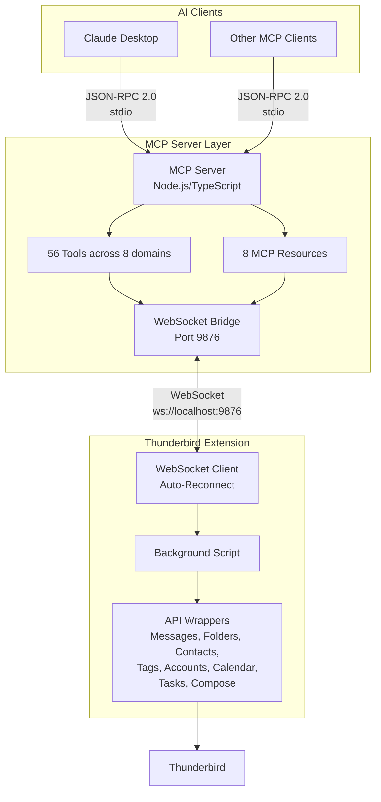
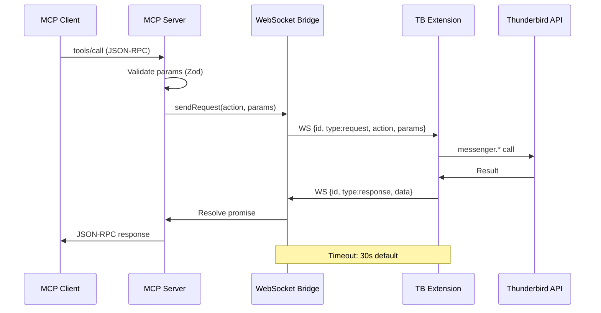

# Zileo MCP — Thunderbird — Architecture Overview

## System Overview

The Zileo MCP — Thunderbird exposes Thunderbird email client functionality to AI models through the Model Context Protocol (MCP). The architecture is a three-layer WebSocket-based design with clear separation between the MCP server, WebSocket bridge, and Thunderbird extension.

## High-Level Architecture



## Components

### 1. MCP Server (Node.js/TypeScript)

Protocol translation layer implementing JSON-RPC 2.0 over stdio.

- **56 tools** across 8 domains (Messages, Folders, Contacts, Tags, Accounts, Compose, Calendar*, Tasks*)
- **8 MCP resources** (accounts, folders, unread, contacts, calendar, tasks)
- Zod schema validation for all inputs
- Stack: Node.js 20+, TypeScript, @modelcontextprotocol/sdk, ws library

### 2. WebSocket Bridge (Port 9876)

Bidirectional communication between server and extension.

- JSON messages with request ID correlation (`req_{counter}_{timestamp}`)
- 30s default timeout per request, max 100 pending requests
- Single Thunderbird connection; multiple MCP clients via `/mcp` path
- Token-based authentication (SEC-WS-001) + origin validation (SEC-WS-003)

See [websocket.md](websocket.md) for full protocol specification.

### 3. Thunderbird Extension (MailExtension V3)

WebExtension bridging Thunderbird APIs via WebSocket.

- Auto-reconnect: 3-second fixed delay, 10 attempts max
- Keep-alive via `browser.alarms` (survives MV3 Event Page suspension)
- Experimental Calendar API via webext-experiments

### 4. Thunderbird

Email client with local storage (mbox/maildir, SQLite, ICS).

## Request Lifecycle



## Security Model

| Layer          | Mechanism                                                              |
| -------------- | ---------------------------------------------------------------------- |
| Network        | Localhost-only binding (127.0.0.1)                                     |
| Authentication | 32-byte random token on WebSocket upgrade (SEC-WS-001)                 |
| Origin         | Allowlist: localhost, moz-extension:// (SEC-WS-003)                    |
| Payload        | Max 5 MiB per message (SEC-WS-002)                                     |
| Validation     | Zod schemas on all tool inputs                                         |
| Permissions    | Extension manifest declares granular Thunderbird permissions           |
| Data           | Headers-only by default; full body on explicit request                 |
| Errors         | Stack traces never sent to clients; sensitive data at DEBUG level only |

## Key Architectural Decisions

| Decision                        | Rationale                                                              |
| ------------------------------- | ---------------------------------------------------------------------- |
| WebSocket over Native Messaging | Bidirectional, connection-aware, auto-reconnect, no platform manifests |
| Three-layer architecture        | Independent evolution, testability, transport flexibility              |
| TypeScript for server           | Type safety, Zod integration, better tooling                           |
| Experimental Calendar API       | Official calendar APIs not yet in stable Thunderbird WebExtensions     |

## Docker Architecture (Multi-Client)

```mermaid
graph TB
    subgraph "Docker Container"
        Bridge[bridge-standalone.ts<br/>Port 9876]
        PathTB[/thunderbird → 1 client]
        PathMCP[/mcp → multi-client]
        Health[/health → status JSON]
    end

    TB[Thunderbird Extension] -->|WebSocket| PathTB
    MCP1[MCP Client #1<br/>docker exec] -->|WebSocket| PathMCP
    MCP2[MCP Client #2<br/>docker exec] -->|WebSocket| PathMCP
```

Container runs only the bridge. MCP clients connect via `docker exec -i zileo-mcp-thunderbird-server node dist/index.js`. Auto-detection: if bridge exists on port, MCP server connects as client.

## Technology Stack

| Layer        | Technology                                   |
| ------------ | -------------------------------------------- |
| MCP Server   | Node.js 20+ / TypeScript                     |
| SDK          | @modelcontextprotocol/sdk                    |
| Validation   | Zod                                          |
| Logging      | Winston                                      |
| WebSocket    | ws library (server), Browser API (extension) |
| Extension    | Manifest V3 MailExtension, JavaScript ES6+   |
| Data Storage | SQLite, mbox, ICS (Thunderbird native)       |

## Extensibility

**Adding tools**: Define Zod schema in `schemas/`, implement handler in `tools/`, add API wrapper in `extension/api/`, register in `tools/index.ts`.

**Adding resources**: Define URI pattern, implement retrieval, register in `resources/index.ts`.

**Adding experimental APIs**: Create experiment in `extension/experiments/`, define JSON schema, implement parent API, register in manifest `experiment_apis`.
