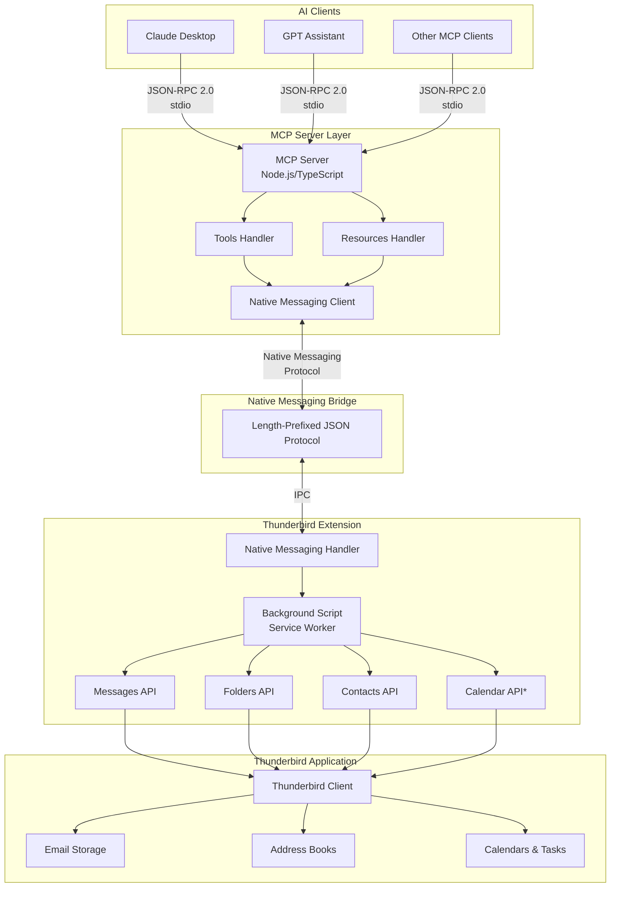

# Thunderbird MCP Server - Architecture Overview

## System Overview

The Thunderbird MCP Server is a bridge system that exposes Thunderbird email client functionality to AI models through the Model Context Protocol (MCP). The architecture follows a layered approach with clear separation of concerns between the MCP server, native messaging layer, and Thunderbird extension.

## High-Level Architecture

*Calendar API is experimental via webext-experiments

## Component Descriptions

### 1. MCP Client Layer
**Purpose**: AI assistants and applications that consume Thunderbird functionality

**Components**:
- **Claude Desktop**: Anthropic's desktop application with MCP support
- **GPT Assistants**: OpenAI assistants configured with MCP
- **Custom Clients**: Any application implementing the MCP client specification

**Communication**: JSON-RPC 2.0 over stdio (standard input/output)

### 2. MCP Server
**Purpose**: Protocol translation and orchestration layer

**Key Responsibilities**:
- Implement MCP server specification (JSON-RPC 2.0)
- Expose tools and resources to MCP clients
- Validate input parameters using Zod schemas
- Route requests to appropriate handlers
- Manage Native Messaging client lifecycle
- Handle errors and timeouts

**Technology Stack**:
- Runtime: Node.js 20+
- Language: TypeScript
- Framework: @modelcontextprotocol/sdk
- Transport: stdio (primary), HTTP+SSE (future)

### 3. Native Messaging Bridge
**Purpose**: Inter-process communication between Node.js server and Thunderbird extension

**Protocol**: Length-prefixed JSON messages
- Message structure: 4-byte length prefix (native byte order) + JSON payload
- Bidirectional communication over stdin/stdout
- Platform-specific manifest configuration

**Security**: Sandboxed communication enforced by browser runtime

### 4. Thunderbird Extension
**Purpose**: WebExtension that interfaces with Thunderbird APIs

**Key Responsibilities**:
- Receive requests from MCP server via Native Messaging
- Translate requests into Thunderbird API calls
- Handle Thunderbird API responses and errors
- Manage experimental Calendar API integration
- Return formatted responses to MCP server

**Technology**:
- Type: MailExtension (Manifest V3)
- Language: JavaScript (ES6+)
- APIs: messenger.* namespace

### 5. Thunderbird Application
**Purpose**: Email client with local data storage

**Data Stores**:
- Mail database (mbox or maildir)
- Address books (SQLite)
- Calendar storage (ICS files or database)
- Configuration and preferences

## Data Flow Overview

### Tool Execution Flow
1. **Client Request**: AI client sends `tools/call` request via JSON-RPC 2.0
2. **Server Validation**: MCP server validates parameters against Zod schemas
3. **Native Messaging**: Server sends request to extension via Native Messaging
4. **API Execution**: Extension calls appropriate Thunderbird API
5. **Response Pipeline**: Results flow back through extension → server → client

### Resource Access Flow
1. **Client Request**: AI client sends `resources/read` request
2. **Server Resolution**: Server identifies resource URI pattern
3. **Data Retrieval**: Server requests data via Native Messaging
4. **Format Response**: Server formats data as MCP resource content
5. **Client Delivery**: Formatted resource returned to client

## Technology Stack Summary

| Layer | Technology | Purpose |
|-------|-----------|---------|
| **MCP Client** | Various (Claude, GPT, etc.) | AI assistants consuming MCP |
| **MCP Server** | Node.js 20+ / TypeScript | Protocol implementation |
| **SDK** | @modelcontextprotocol/sdk | MCP server framework |
| **Validation** | Zod | Schema validation |
| **Logging** | Winston | Structured logging |
| **Native Messaging** | stdio IPC | Cross-process communication |
| **Extension** | Manifest V3 MailExtension | Thunderbird API access |
| **Extension Runtime** | JavaScript (ES6+) | Extension logic |
| **Data Storage** | SQLite, mbox, ICS | Thunderbird native storage |

## Key Architectural Decisions

### Why Native Messaging?
**Rationale**: Thunderbird doesn't expose HTTP APIs, requiring browser-native IPC mechanism

**Trade-offs**:
- ✅ Secure sandboxed communication
- ✅ Native browser integration
- ✅ Platform-agnostic protocol
- ⚠️ Requires extension installation
- ⚠️ Platform-specific manifest setup

### Why Separate Extension + Server?
**Rationale**: Clear separation between MCP protocol handling and Thunderbird API access

**Benefits**:
- Independent evolution of MCP server and extension
- Better testability and modularity
- MCP server can be reused for different transports
- Extension remains lightweight and focused

### Why TypeScript for Server?
**Rationale**: Type safety and better tooling for complex protocol implementation

**Benefits**:
- Compile-time type checking
- Better IDE support and refactoring
- Zod integration for runtime validation
- Strong ecosystem for Node.js development

### Why Experimental Calendar API?
**Rationale**: Official calendar APIs not yet available in stable Thunderbird WebExtensions

**Status**: Using webext-experiments from mozilla/thunderbird
- Experimental but functional
- May require adjustments when official API releases
- Documented as experimental in all interfaces

## Security Model

### Permission-Based Access
- Extension declares required permissions in manifest
- User must approve permissions at installation
- Granular permissions per API domain (messages, contacts, calendar)

### Data Minimization
- Headers-only responses by default
- Full message bodies only on explicit request
- No password or OAuth token exposure
- S/MIME keys never accessible

### Validation Layers
1. **Client-side**: MCP SDK validates JSON-RPC structure
2. **Server-side**: Zod schemas validate tool parameters
3. **Extension-side**: Thunderbird API validates operations
4. **Platform-side**: Thunderbird enforces permission boundaries

## Scalability Considerations

### Performance Characteristics
- **Latency**: ~50-200ms per operation (IPC overhead)
- **Throughput**: Limited by Native Messaging bandwidth (~1MB/s)
- **Concurrency**: Single-threaded extension, queue on server side
- **Large datasets**: Pagination required for queries returning >100 items

### Optimization Strategies
- Batch operations where possible
- Implement result pagination
- Cache folder structures
- Minimize full message body retrieval
- Use resource subscriptions for live updates

## Extensibility Points

### Adding New Tools
1. Define Zod schema in `/server/src/schemas/`
2. Implement handler in `/server/src/tools/`
3. Add API wrapper in `/extension/api/`
4. Register tool in server initialization

### Adding New Resources
1. Define URI pattern in resource handlers
2. Implement data retrieval logic
3. Format as MCP resource content
4. Register resource provider

### Custom Experimental APIs
1. Create experiment in `/extension/experiments/`
2. Define JSON schema for API
3. Implement parent API script
4. Register in manifest `experiment_apis`

## Monitoring and Observability

### Logging Strategy
- **Server**: Winston structured logging to file/console
- **Extension**: browser.console with log levels
- **Native Messaging**: Message tracing with request IDs

### Error Tracking
- JSON-RPC error codes for all failure modes
- Stack traces in development mode
- Sanitized errors in production
- Request correlation via unique IDs

### Metrics (Future)
- Tool call latency percentiles
- Native Messaging bandwidth
- Error rate by tool/resource
- Active connection count

## Deployment Model

### Installation Steps
1. Install Thunderbird extension (XPI or AMO)
2. Install MCP server (npm global or binary)
3. Configure Native Messaging manifest (platform-specific)
4. Add server to MCP client configuration

### Configuration Files
- **Extension**: `manifest.json` (bundled)
- **Native Messaging**: `~/.mozilla/native-messaging-hosts/thunderbird_mcp.json`
- **Server**: Environment variables or config file
- **MCP Client**: Client-specific configuration (e.g., Claude Desktop config)

## Future Architecture Considerations

### Potential Enhancements
- HTTP+SSE transport for remote access
- WebSocket transport for bidirectional subscriptions
- Multi-instance support (multiple Thunderbird profiles)
- Caching layer for frequently accessed data
- Event-driven resource subscriptions

### Migration Paths
- Experimental Calendar API → Official API when available
- Native Messaging → WebSocket for better performance
- Single-server → Multi-server for horizontal scaling
