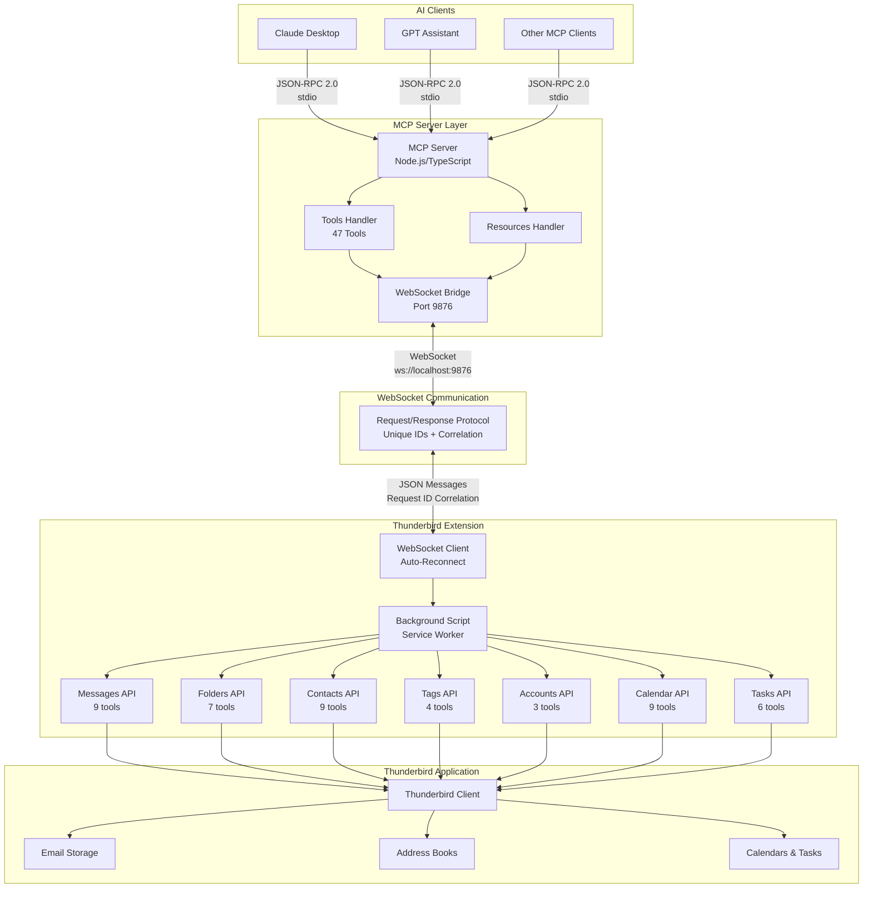
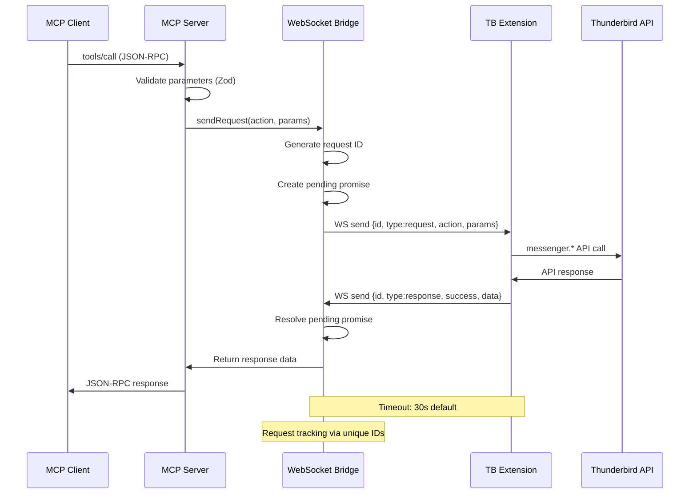
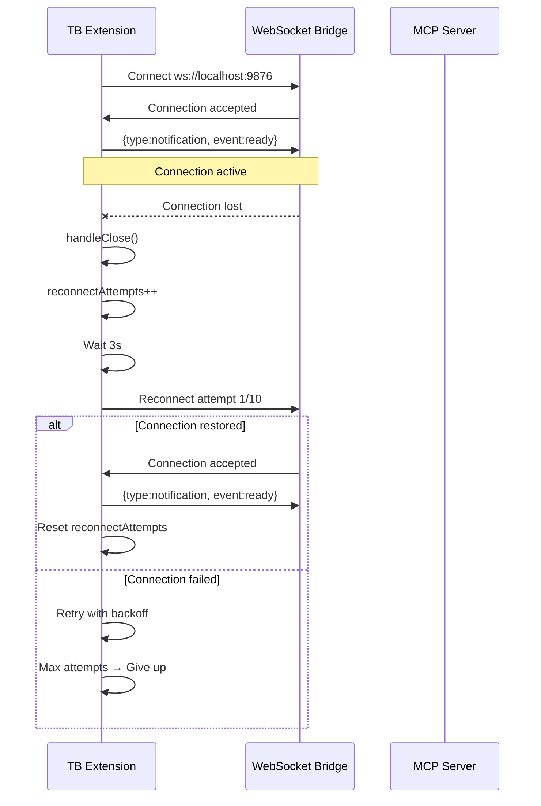
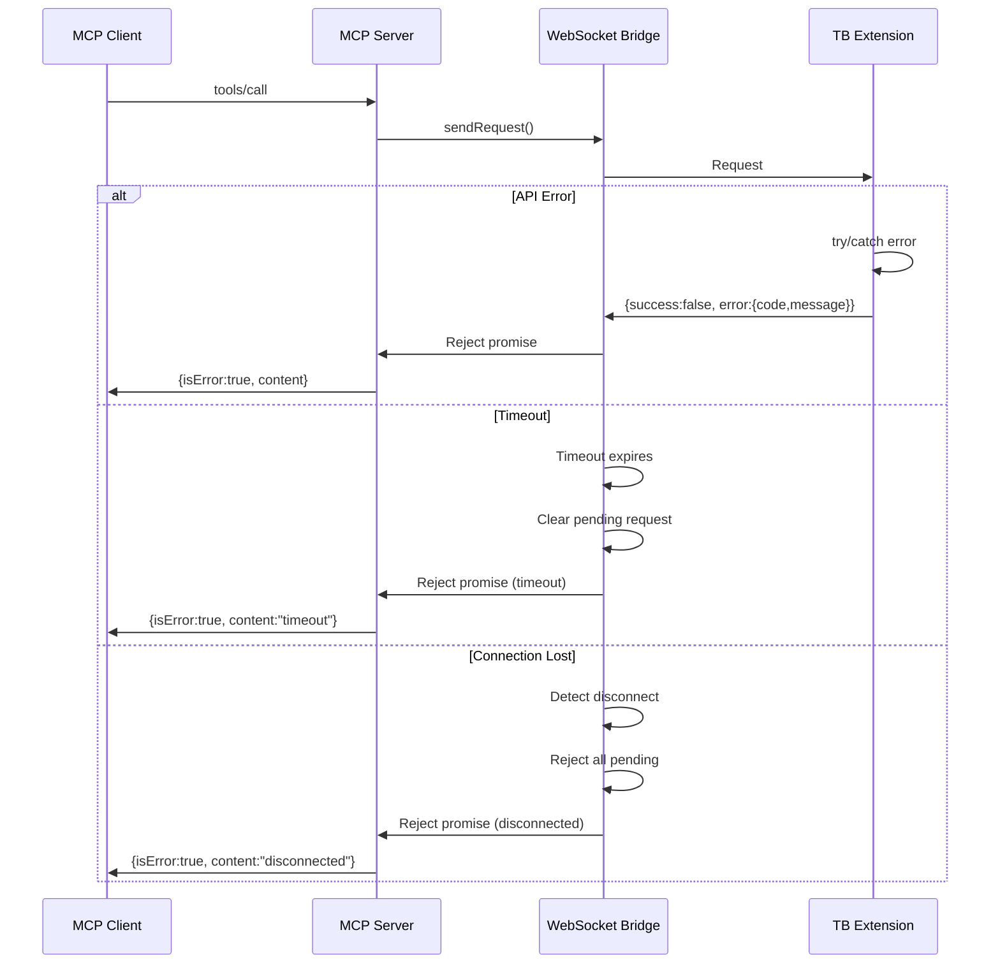

# Thunderbird MCP Server - Architecture Overview

## System Overview

The Thunderbird MCP Server is a bridge system that exposes Thunderbird email client functionality to AI models through the Model Context Protocol (MCP). The architecture implements a three-layer WebSocket-based design with clear separation of concerns between the MCP server, WebSocket bridge, and Thunderbird extension.

## High-Level Architecture



## Component Descriptions

### 1. MCP Client Layer
**Purpose**: AI assistants and applications that consume Thunderbird functionality

**Components**:
- **Claude Desktop**: Anthropic's desktop application with MCP support
- **GPT Assistants**: OpenAI assistants configured with MCP
- **Custom Clients**: Any application implementing the MCP client specification

**Communication**: JSON-RPC 2.0 over stdio (standard input/output)

### 2. MCP Server
**Purpose**: Protocol translation and orchestration layer

**Key Responsibilities**:
- Implement MCP server specification (JSON-RPC 2.0)
- Expose 47 tools across 7 functional domains
- Expose resources to MCP clients
- Validate input parameters using Zod schemas
- Route requests to appropriate handlers
- Manage WebSocket bridge lifecycle
- Handle errors and timeouts

**Technology Stack**:
- Runtime: Node.js 20+
- Language: TypeScript
- Framework: @modelcontextprotocol/sdk
- Transport: stdio (primary), HTTP+SSE (future)
- WebSocket: ws library for bidirectional communication

**Tool Distribution**:
- Messages: 9 tools (search, list, get, move, copy, delete, update, archive, list unread)
- Folders: 7 tools (list, get, create, rename, delete, move, mark read)
- Contacts: 9 tools (search, list, get, create, update, delete + 3 address book tools)
- Tags: 4 tools (list, create, update, delete)
- Accounts: 3 tools (list accounts, get account, list identities)
- Calendar: 9 tools (list calendars, get calendar, search/list/get/create/update/move/delete events)
- Tasks: 6 tools (list, get, create, update, delete, complete)

### 3. WebSocket Bridge
**Purpose**: Bidirectional communication layer between Node.js server and Thunderbird extension

**Key Features**:
- **Port**: Listens on localhost:9876
- **Protocol**: JSON-based message format with request/response correlation
- **Request Tracking**: Unique IDs for correlation (format: `req_{counter}_{timestamp}`)
- **Timeout Management**: Configurable timeout per request (default: 30s)
- **Connection Management**: Single client allowed, reject additional connections
- **Pending Requests**: Map-based tracking with automatic cleanup

**Message Structure**:
```typescript
interface WsMessage {
  id: string;                    // Unique message ID
  type: 'request' | 'response' | 'notification';
  action?: string;               // Action name for requests
  event?: string;                // Event name for notifications
  params?: Record<string, unknown>;  // Request parameters
  data?: unknown;                // Response data
  success?: boolean;             // Response status
  error?: {                      // Error details
    code: number;
    message: string;
    data?: unknown;
  };
  timestamp: string;             // ISO 8601 timestamp
}
```

**Reliability Features**:
- Promise-based request/response pattern
- Timeout handling with automatic cleanup
- Pending request queue management (max 100)
- Connection state tracking
- Error propagation to callers

### 4. Thunderbird Extension
**Purpose**: WebExtension that interfaces with Thunderbird APIs

**Key Responsibilities**:
- Maintain WebSocket connection to MCP server
- Implement auto-reconnect with exponential backoff
- Receive requests from MCP server via WebSocket
- Translate requests into Thunderbird API calls
- Handle Thunderbird API responses and errors
- Return formatted responses to MCP server
- Manage experimental Calendar API integration

**Technology**:
- Type: MailExtension (Manifest V3)
- Language: JavaScript (ES6+ modules)
- APIs: messenger.* namespace
- WebSocket: Browser native WebSocket API

**Connection Management**:
- Auto-reconnect on connection loss
- Maximum 10 reconnect attempts
- 3-second delay between attempts
- Connection state tracking
- Graceful degradation on failure

**Message ID Generation**: `ext_{timestamp}_{random}` for extension-initiated messages

### 5. Thunderbird Application
**Purpose**: Email client with local data storage

**Data Stores**:
- Mail database (mbox or maildir)
- Address books (SQLite)
- Calendar storage (ICS files or database)
- Configuration and preferences

## Communication Flow

### Request Lifecycle



### Auto-Reconnect Flow



### Error Handling Flow



## Data Flow Overview

### Tool Execution Flow
1. **Client Request**: AI client sends `tools/call` request via JSON-RPC 2.0
2. **Server Validation**: MCP server validates parameters against Zod schemas
3. **WebSocket Send**: Server sends request to extension via WebSocket bridge
4. **Request Tracking**: Bridge assigns unique ID and creates pending promise
5. **API Execution**: Extension calls appropriate Thunderbird API
6. **Response Correlation**: Extension returns response with matching ID
7. **Promise Resolution**: Bridge resolves pending promise with response data
8. **Response Pipeline**: Results flow back through server to client

### Resource Access Flow
1. **Client Request**: AI client sends `resources/read` request
2. **Server Resolution**: Server identifies resource URI pattern
3. **Data Retrieval**: Server requests data via WebSocket bridge
4. **Format Response**: Server formats data as MCP resource content
5. **Client Delivery**: Formatted resource returned to client

## Technology Stack Summary

| Layer | Technology | Purpose |
|-------|-----------|---------|
| **MCP Client** | Various (Claude, GPT, etc.) | AI assistants consuming MCP |
| **MCP Server** | Node.js 20+ / TypeScript | Protocol implementation |
| **SDK** | @modelcontextprotocol/sdk | MCP server framework |
| **Validation** | Zod | Schema validation |
| **Logging** | Winston | Structured logging |
| **WebSocket Server** | ws library | Bidirectional communication |
| **WebSocket Client** | Browser WebSocket API | Extension connection |
| **Extension** | Manifest V3 MailExtension | Thunderbird API access |
| **Extension Runtime** | JavaScript (ES6+ modules) | Extension logic |
| **Data Storage** | SQLite, mbox, ICS | Thunderbird native storage |

## Key Architectural Decisions

### Why WebSocket Instead of Native Messaging?
**Rationale**: WebSocket provides better reliability and simpler implementation

**Trade-offs**:
- ✅ Bidirectional communication
- ✅ Connection state awareness
- ✅ Auto-reconnect capability
- ✅ No platform-specific manifest configuration
- ✅ Better error handling and timeout management
- ✅ Simpler debugging (standard network tools)
- ⚠️ Requires localhost port availability (9876)
- ⚠️ Single client limitation (enforced by bridge)

### Why Three-Layer Architecture?
**Rationale**: Clear separation between protocol, transport, and API access

**Benefits**:
- Independent evolution of MCP server and extension
- Better testability and modularity
- MCP server can support multiple transports
- Extension remains lightweight and focused
- WebSocket bridge is reusable and isolated

### Why TypeScript for Server?
**Rationale**: Type safety and better tooling for complex protocol implementation

**Benefits**:
- Compile-time type checking
- Better IDE support and refactoring
- Zod integration for runtime validation
- Strong ecosystem for Node.js development

### Why Experimental Calendar API?
**Rationale**: Official calendar APIs not yet available in stable Thunderbird WebExtensions

**Status**: Using webext-experiments from mozilla/thunderbird
- Experimental but functional
- May require adjustments when official API releases
- Documented as experimental in all interfaces

## Security Model

### Permission-Based Access
- Extension declares required permissions in manifest
- User must approve permissions at installation
- Granular permissions per API domain (messages, contacts, calendar)

### Network Security
- WebSocket server binds to localhost only (127.0.0.1)
- No remote connections accepted
- Single client connection enforced
- Host permissions limited to localhost:9876

### Data Minimization
- Headers-only responses by default
- Full message bodies only on explicit request
- No password or OAuth token exposure
- S/MIME keys never accessible

### Validation Layers
1. **Client-side**: MCP SDK validates JSON-RPC structure
2. **Server-side**: Zod schemas validate tool parameters
3. **Bridge-side**: Message format validation
4. **Extension-side**: Thunderbird API validates operations
5. **Platform-side**: Thunderbird enforces permission boundaries

## Scalability Considerations

### Performance Characteristics
- **Latency**: ~10-50ms per operation (WebSocket overhead minimal)
- **Throughput**: Limited by Thunderbird API performance
- **Concurrency**: Single-threaded extension, pending request queue on server
- **Large datasets**: Pagination required for queries returning >100 items

### Optimization Strategies
- Batch operations where possible
- Implement result pagination
- Cache folder structures
- Minimize full message body retrieval
- Use resource subscriptions for live updates
- Request correlation prevents duplicate processing

## Extensibility Points

### Adding New Tools
1. Define Zod schema in `/server/src/schemas/`
2. Implement handler in `/server/src/tools/`
3. Add API wrapper in `/extension/api/` or `/extension/native-messaging/handler.js`
4. Register tool in `/server/src/tools/index.ts`
5. Add to appropriate tool category

### Adding New Resources
1. Define URI pattern in resource handlers
2. Implement data retrieval logic
3. Format as MCP resource content
4. Register resource provider in `/server/src/resources/index.ts`

### Custom Experimental APIs
1. Create experiment in `/extension/experiments/`
2. Define JSON schema for API
3. Implement parent API script
4. Register in manifest `experiment_apis`

## Monitoring and Observability

### Logging Strategy
- **Server**: Winston structured logging to file/console
- **Extension**: console.log with [MCP] prefix
- **WebSocket Bridge**: Request/response logging with IDs
- **Message Tracing**: Full request lifecycle tracking

### Error Tracking
- JSON-RPC error codes for all failure modes
- Stack traces in development mode
- Sanitized errors in production
- Request correlation via unique IDs
- Timeout tracking and reporting

### Connection Monitoring
- Connection state changes logged
- Reconnect attempts tracked
- Pending request count monitoring
- WebSocket ready state tracking

## Deployment Model

### Installation Steps
1. Install Thunderbird extension (XPI or AMO)
2. Install MCP server (npm global or binary)
3. Start MCP server (WebSocket bridge auto-starts on port 9876)
4. Add server to MCP client configuration
5. Extension auto-connects on startup

### Configuration Files
- **Extension**: `manifest.json` (bundled)
- **Server**: Environment variables (THUNDERBIRD_PORT, LOG_LEVEL)
- **WebSocket**: Port 9876 (configurable via env)
- **MCP Client**: Client-specific configuration (e.g., Claude Desktop config)

### Network Requirements
- Localhost port 9876 must be available
- No firewall configuration needed (localhost only)
- No external network access required

## Future Architecture Considerations

### Potential Enhancements
- HTTP+SSE transport for remote access
- TLS/SSL support for secure remote connections
- Multi-instance support (multiple Thunderbird profiles)
- Caching layer for frequently accessed data
- Event-driven resource subscriptions
- Bi-directional notifications for real-time updates

### Migration Paths
- Experimental Calendar API → Official API when available
- Single WebSocket port → Multi-port for profile isolation
- Request/response → Streaming for large datasets
- Local-only → Optional remote access with authentication
