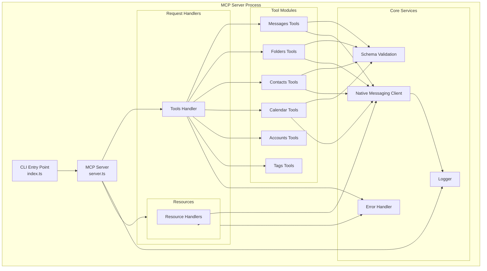
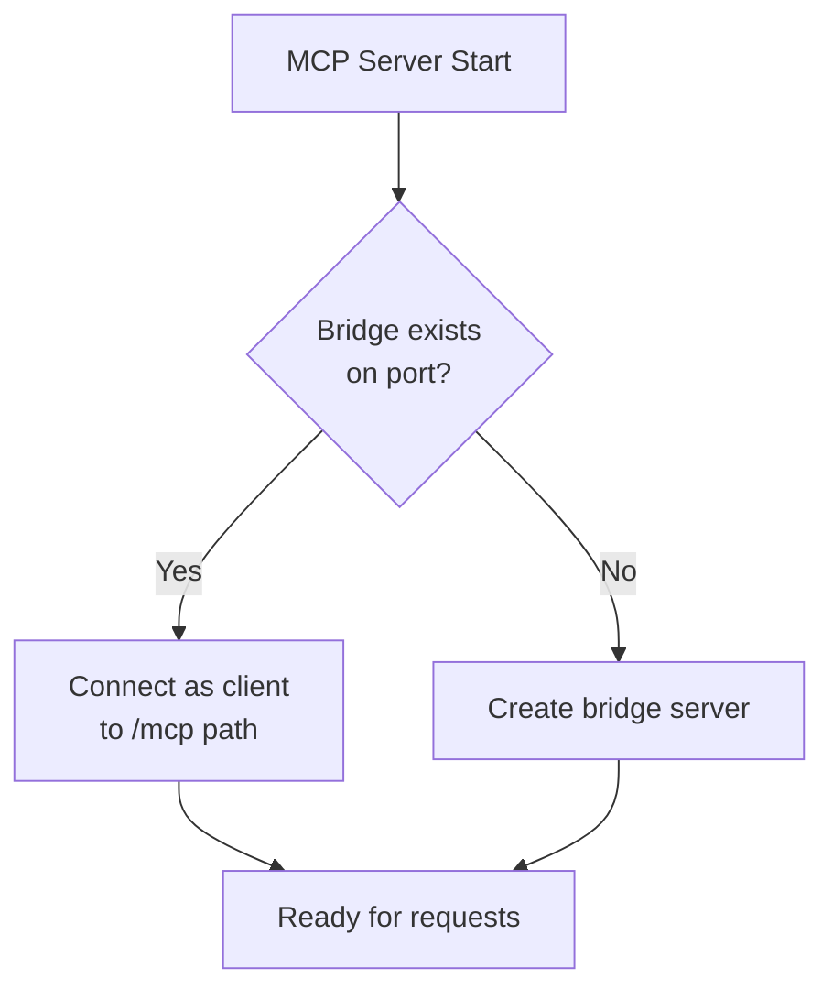

# MCP Server Architecture

## Overview

The MCP Server is a Node.js/TypeScript application that implements the Model Context Protocol specification. It acts as the protocol layer between MCP clients (AI assistants) and the Thunderbird extension, handling JSON-RPC 2.0 communication, request validation, and response formatting.

## Server Structure

```
server/
├── src/
│   ├── index.ts                 # Entry point and CLI
│   ├── server.ts                # MCP server initialization
│   ├── bridge-standalone.ts     # Standalone bridge for Docker
│   ├── tools/
│   │   ├── index.ts            # Tool registry and exports
│   │   ├── messages.ts         # Message tools handlers
│   │   ├── folders.ts          # Folder tools handlers
│   │   ├── contacts.ts         # Contact tools handlers
│   │   ├── calendar.ts         # Calendar tools handlers
│   │   ├── tasks.ts            # Task tools handlers
│   │   ├── accounts.ts         # Account tools handlers
│   │   └── tags.ts             # Tag tools handlers
│   ├── resources/
│   │   ├── index.ts            # Resource registry
│   │   └── handlers.ts         # Resource handler implementations
│   ├── websocket/
│   │   ├── bridge.ts           # WebSocket bridge (server + multi-client)
│   │   ├── bridge-client.ts    # Client mode for connecting to existing bridge
│   │   └── client-adapter.ts   # Adapter for Native Messaging compatibility
│   ├── schemas/
│   │   ├── messages.ts         # Message tool schemas
│   │   ├── folders.ts          # Folder tool schemas
│   │   ├── contacts.ts         # Contact tool schemas
│   │   ├── calendar.ts         # Calendar tool schemas
│   │   └── common.ts           # Shared schema definitions
│   └── utils/
│       ├── logger.ts           # Winston logging configuration
│       ├── errors.ts           # Error classes and mapping
│       └── validation.ts       # Zod validation helpers
├── package.json
├── tsconfig.json
└── native-host.json             # Native Messaging manifest (legacy)
```

## Component Architecture



## Entry Point and Initialization

### index.ts - CLI Entry Point

**Purpose**: Parse command-line arguments and start the MCP server

**Responsibilities**:

- Parse CLI arguments (transport type, host, port)
- Initialize logging configuration
- Set up signal handlers (SIGINT, SIGTERM)
- Start MCP server with appropriate transport
- Handle startup errors

**Implementation Pattern**:

```typescript
#!/usr/bin/env node
import { Server } from "@modelcontextprotocol/sdk/server/index.js";
import { StdioServerTransport } from "@modelcontextprotocol/sdk/server/stdio.js";
import { setupServer } from "./server.js";
import { logger } from "./utils/logger.js";

async function main() {
  try {
    logger.info("Starting Thunderbird MCP Server");

    // Create server instance
    const server = new Server(
      {
        name: "thunderbird-mcp",
        version: "1.0.0",
      },
      {
        capabilities: {
          tools: { listChanged: true },
          resources: { listChanged: true },
          prompts: { listChanged: false },
        },
      },
    );

    // Set up handlers
    await setupServer(server);

    // Connect transport (stdio by default)
    const transport = new StdioServerTransport();
    await server.connect(transport);

    logger.info("Server started successfully");

    // Graceful shutdown
    process.on("SIGINT", async () => {
      logger.info("Shutting down gracefully");
      await server.close();
      process.exit(0);
    });
  } catch (error) {
    logger.error("Fatal error:", error);
    process.exit(1);
  }
}

main();
```

### server.ts - Server Setup

**Purpose**: Configure MCP server with tools, resources, and prompts

**Responsibilities**:

- Register all tool handlers
- Register resource handlers
- Initialize Native Messaging client
- Set up error handling middleware
- Configure capabilities

**Implementation Pattern**:

```typescript
import { Server } from "@modelcontextprotocol/sdk/server/index.js";
import { NativeMessagingClient } from "./native-messaging/client.js";
import { registerMessageTools } from "./tools/messages.js";
import { registerFolderTools } from "./tools/folders.js";
import { registerContactTools } from "./tools/contacts.js";
import { registerResourceHandlers } from "./resources/index.js";
import { logger } from "./utils/logger.js";

export async function setupServer(server: Server) {
  // Initialize Native Messaging client
  const nmClient = new NativeMessagingClient();
  await nmClient.connect();

  // Register tool handlers
  registerMessageTools(server, nmClient);
  registerFolderTools(server, nmClient);
  registerContactTools(server, nmClient);
  registerCalendarTools(server, nmClient);
  registerAccountTools(server, nmClient);
  registerTagTools(server, nmClient);

  // Register resource handlers
  registerResourceHandlers(server, nmClient);

  logger.info("Server setup complete");
}
```

## Tool Handlers

Tool handlers implement the `tools/call` MCP method. Each handler validates input, calls the Native Messaging client, and formats the response.

### Tool Handler Pattern

```typescript
import { Server } from "@modelcontextprotocol/sdk/server/index.js";
import { z } from "zod";
import { NativeMessagingClient } from "../native-messaging/client.js";
import { ToolSchema } from "../schemas/messages.js";
import { validateInput } from "../utils/validation.js";
import { handleToolError } from "../utils/errors.js";

export function registerMessageTools(
  server: Server,
  nmClient: NativeMessagingClient,
) {
  // Search messages tool
  server.setRequestHandler("tools/call", async (request) => {
    if (request.params.name === "thunderbird_messages_search") {
      try {
        // Validate input
        const params = validateInput(
          ToolSchema.messagesSearch,
          request.params.arguments,
        );

        // Call extension via Native Messaging
        const result = await nmClient.send({
          method: "messages.search",
          params,
        });

        // Format MCP response
        return {
          content: [
            {
              type: "text",
              text: JSON.stringify(result, null, 2),
            },
          ],
        };
      } catch (error) {
        throw handleToolError(error);
      }
    }
  });
}
```

### Messages Tools (`tools/messages.ts`)

**Tools Implemented**:

- `thunderbird_messages_search` - Advanced message search
- `thunderbird_messages_list` - List messages in folder
- `thunderbird_messages_list_unread` - List unread messages
- `thunderbird_messages_get` - Get single message
- `thunderbird_messages_move` - Move messages
- `thunderbird_messages_copy` - Copy messages
- `thunderbird_messages_delete` - Delete messages
- `thunderbird_messages_update` - Update message properties
- `thunderbird_messages_archive` - Archive messages

**Common Operations**:

1. Validate parameters with Zod schema
2. Send request to extension via Native Messaging
3. Handle timeout (30s for searches, 10s for CRUD)
4. Format response as MCP content
5. Map errors to appropriate codes

### Folders Tools (`tools/folders.ts`)

**Tools Implemented**:

- `thunderbird_folders_list` - List folder hierarchy
- `thunderbird_folders_get` - Get folder details
- `thunderbird_folders_create` - Create folder
- `thunderbird_folders_rename` - Rename folder
- `thunderbird_folders_delete` - Delete folder
- `thunderbird_folders_move` - Move folder
- `thunderbird_folders_mark_read` - Mark all as read

### Contacts Tools (`tools/contacts.ts`)

**Tools Implemented**:

- `thunderbird_contacts_search` - Search contacts
- `thunderbird_contacts_list` - List contacts
- `thunderbird_contacts_get` - Get contact
- `thunderbird_contacts_create` - Create contact
- `thunderbird_contacts_update` - Update contact
- `thunderbird_contacts_delete` - Delete contact
- `thunderbird_addressbooks_list` - List address books
- `thunderbird_addressbooks_create` - Create address book
- `thunderbird_addressbooks_delete` - Delete address book

### Calendar Tools (`tools/calendar.ts`)

**Tools Implemented**:

- `thunderbird_calendars_list` - List calendars
- `thunderbird_calendars_get` - Get calendar details
- `thunderbird_events_search` - Search events
- `thunderbird_events_list` - List events
- `thunderbird_events_get` - Get event
- `thunderbird_events_create` - Create event
- `thunderbird_events_update` - Update event
- `thunderbird_events_move` - Move event
- `thunderbird_events_delete` - Delete event

### Tags Tools (`tools/tags.ts`)

**Tools Implemented**:

- `thunderbird_tags_list` - List all tags
- `thunderbird_tags_create` - Create tag
- `thunderbird_tags_update` - Update tag
- `thunderbird_tags_delete` - Delete tag

### Accounts Tools (`tools/accounts.ts`)

**Tools Implemented**:

- `thunderbird_accounts_list` - List all accounts
- `thunderbird_accounts_get` - Get account details
- `thunderbird_identities_list` - List identities

## Resource Handlers

Resource handlers implement the `resources/read` and `resources/list` MCP methods. They provide contextual data to AI clients.

### Resource Handler Pattern

```typescript
import { Server } from "@modelcontextprotocol/sdk/server/index.js";
import { NativeMessagingClient } from "../native-messaging/client.js";

export function registerResourceHandlers(
  server: Server,
  nmClient: NativeMessagingClient,
) {
  // List available resources
  server.setRequestHandler("resources/list", async () => {
    return {
      resources: [
        {
          uri: "thunderbird://accounts",
          name: "Account List",
          description: "All configured Thunderbird accounts",
          mimeType: "application/json",
        },
        {
          uri: "thunderbird://inbox/unread",
          name: "Unread Messages",
          description: "All unread messages across accounts",
          mimeType: "application/json",
        },
        // ... more resources
      ],
    };
  });

  // Read resource content
  server.setRequestHandler("resources/read", async (request) => {
    const uri = request.params.uri;

    if (uri === "thunderbird://accounts") {
      const accounts = await nmClient.send({
        method: "accounts.list",
        params: {},
      });

      return {
        contents: [
          {
            uri: uri,
            mimeType: "application/json",
            text: JSON.stringify(accounts, null, 2),
          },
        ],
      };
    }

    // Handle other resource URIs...
  });
}
```

### Resource URI Patterns

| URI Pattern                              | Description         | Data Format |
| ---------------------------------------- | ------------------- | ----------- |
| `thunderbird://accounts`                 | All accounts        | JSON array  |
| `thunderbird://folders/{accountId}`      | Folder tree         | JSON tree   |
| `thunderbird://inbox/unread`             | All unread messages | JSON array  |
| `thunderbird://inbox/unread/{accountId}` | Unread by account   | JSON array  |
| `thunderbird://contacts/recent`          | Recent contacts     | JSON array  |
| `thunderbird://calendar/today`           | Today's events      | JSON array  |
| `thunderbird://calendar/upcoming`        | Next 7 days         | JSON array  |
| `thunderbird://tasks/pending`            | Pending tasks       | JSON array  |

## WebSocket Bridge Architecture

### Bridge Modes

The server supports two modes for WebSocket communication:

**Server Mode** (Standard deployment):

```typescript
// Direct mode - server creates its own WebSocket bridge
const bridge = await initializeWebSocketBridgeServer(options);
```

**Client Mode** (Docker deployment):

```typescript
// Client mode - connects to existing bridge via /mcp path
const client = await tryConnectToExistingBridge(port);
if (client) {
  // Use client mode
  return client; // WebSocketBridgeClient instance
}
```

### Bridge Client (`bridge-client.ts`)

**Purpose**: Connect to an existing WebSocket bridge as a client (used in Docker multi-client architecture)

**Key Features**:

- Connects to `/mcp` WebSocket path
- Same interface as `WebSocketBridge` (implements `BridgeInterface`)
- Relays requests to Thunderbird through the bridge
- Supports multiple simultaneous MCP clients

**Implementation**:

```typescript
export class WebSocketBridgeClient
  extends EventEmitter
  implements BridgeInterface
{
  private ws: WebSocket | null = null;
  private pendingRequests: Map<string, PendingRequest> = new Map();

  async connect(): Promise<void> {
    return new Promise((resolve, reject) => {
      // Connect to /mcp path for MCP clients
      const url = `ws://127.0.0.1:${this.options.port}/mcp`;
      this.ws = new WebSocket(url);
      // ... connection handling
    });
  }

  async sendRequest(
    action: string,
    params: Record<string, unknown>,
  ): Promise<unknown> {
    // Same interface as WebSocketBridge
    // Requests are relayed through the bridge to Thunderbird
  }
}
```

### Bridge Standalone (`bridge-standalone.ts`)

**Purpose**: Run only the WebSocket bridge server for Docker container

**Usage**:

```bash
# Started by Docker container
node dist/bridge-standalone.js
```

**Features**:

- Creates WebSocket server on port 9876
- Handles `/thunderbird` path (single extension)
- Handles `/mcp` path (multiple MCP clients)
- Provides `/health` HTTP endpoint
- No MCP server logic - just the bridge

### Mode Detection Flow



## Native Messaging Client

### client.ts - Native Messaging Client

**Purpose**: Manage communication with Thunderbird extension via Native Messaging

**Responsibilities**:

- Spawn extension host process
- Serialize/deserialize messages
- Handle request/response correlation
- Manage timeouts
- Reconnect on failure

**Class Structure**:

```typescript
import { spawn, ChildProcess } from "child_process";
import { EventEmitter } from "events";
import { serializeMessage, deserializeMessage } from "./protocol.js";
import { logger } from "../utils/logger.js";

export class NativeMessagingClient extends EventEmitter {
  private process: ChildProcess | null = null;
  private pendingRequests: Map<string, PendingRequest> = new Map();
  private messageBuffer: Buffer = Buffer.alloc(0);

  async connect(): Promise<void> {
    // Spawn native messaging host
    this.process = spawn("thunderbird-mcp-host", [], {
      stdio: ["pipe", "pipe", "pipe"],
    });

    this.setupHandlers();
    logger.info("Native Messaging client connected");
  }

  async send(request: NMRequest, timeout: number = 10000): Promise<any> {
    const id = generateId();
    const message = { id, ...request };

    // Send serialized message
    const serialized = serializeMessage(message);
    this.process!.stdin.write(serialized);

    // Wait for response with timeout
    return new Promise((resolve, reject) => {
      const timeoutId = setTimeout(() => {
        this.pendingRequests.delete(id);
        reject(new Error("Request timeout"));
      }, timeout);

      this.pendingRequests.set(id, {
        resolve: (result) => {
          clearTimeout(timeoutId);
          resolve(result);
        },
        reject: (error) => {
          clearTimeout(timeoutId);
          reject(error);
        },
      });
    });
  }

  private setupHandlers(): void {
    // Handle stdout (responses)
    this.process!.stdout.on("data", (data) => {
      this.handleData(data);
    });

    // Handle stderr (errors)
    this.process!.stderr.on("data", (data) => {
      logger.error("Native host error:", data.toString());
    });

    // Handle process exit
    this.process!.on("exit", (code) => {
      logger.warn(`Native host exited with code ${code}`);
      this.handleDisconnect();
    });
  }

  private handleData(data: Buffer): void {
    this.messageBuffer = Buffer.concat([this.messageBuffer, data]);

    // Try to parse complete messages
    while (this.messageBuffer.length >= 4) {
      const message = deserializeMessage(this.messageBuffer);
      if (!message) break;

      this.handleMessage(message.data);
      this.messageBuffer = this.messageBuffer.slice(message.consumed);
    }
  }

  private handleMessage(message: any): void {
    const { id, result, error } = message;

    const pending = this.pendingRequests.get(id);
    if (!pending) return;

    this.pendingRequests.delete(id);

    if (error) {
      pending.reject(new Error(error.message));
    } else {
      pending.resolve(result);
    }
  }

  async disconnect(): Promise<void> {
    if (this.process) {
      this.process.kill();
      this.process = null;
    }
  }
}
```

### protocol.ts - Message Serialization

**Purpose**: Serialize and deserialize Native Messaging protocol messages

**Protocol Format**: 4-byte length prefix (native byte order) + JSON payload

```typescript
export function serializeMessage(message: any): Buffer {
  const json = JSON.stringify(message);
  const jsonBuffer = Buffer.from(json, "utf-8");
  const length = jsonBuffer.length;

  // Create buffer with 4-byte length prefix
  const buffer = Buffer.allocUnsafe(4 + length);
  buffer.writeUInt32LE(length, 0);
  jsonBuffer.copy(buffer, 4);

  return buffer;
}

export function deserializeMessage(
  buffer: Buffer,
): { data: any; consumed: number } | null {
  if (buffer.length < 4) return null;

  // Read length prefix
  const length = buffer.readUInt32LE(0);

  // Check if full message available
  if (buffer.length < 4 + length) return null;

  // Extract and parse JSON
  const jsonBuffer = buffer.slice(4, 4 + length);
  const json = jsonBuffer.toString("utf-8");
  const data = JSON.parse(json);

  return {
    data,
    consumed: 4 + length,
  };
}
```

## Schema Validation

### Schema Structure

**Common Schemas** (`schemas/common.ts`):

```typescript
import { z } from "zod";

export const MessageId = z.string().min(1);
export const FolderId = z.string().min(1);
export const ContactId = z.string().min(1);
export const CalendarId = z.string().min(1);

export const DateTimeString = z.string().datetime();
export const EmailAddress = z.string().email();

export const PaginationParams = z.object({
  limit: z.number().int().positive().max(1000).optional(),
  offset: z.number().int().nonnegative().optional(),
});
```

**Message Schemas** (`schemas/messages.ts`):

```typescript
import { z } from "zod";
import { MessageId, FolderId, EmailAddress, DateTimeString } from "./common.js";

export const MessagesSearchSchema = z.object({
  subject: z.string().optional(),
  from: EmailAddress.optional(),
  to: EmailAddress.optional(),
  body: z.string().optional(),
  tags: z.array(z.string()).optional(),
  unread: z.boolean().optional(),
  dateFrom: DateTimeString.optional(),
  dateTo: DateTimeString.optional(),
  folderId: FolderId.optional(),
  limit: z.number().int().positive().max(100).default(20),
});

export const MessagesUpdateSchema = z.object({
  messageId: MessageId,
  read: z.boolean().optional(),
  flagged: z.boolean().optional(),
  tags: z.array(z.string()).optional(),
});
```

### Validation Helper

```typescript
import { z } from "zod";

export function validateInput<T>(schema: z.ZodSchema<T>, input: unknown): T {
  try {
    return schema.parse(input);
  } catch (error) {
    if (error instanceof z.ZodError) {
      throw new ValidationError("Invalid parameters", error.errors);
    }
    throw error;
  }
}
```

## Error Handling

### Error Classes

```typescript
export class ThunderbirdError extends Error {
  constructor(
    message: string,
    public code: number,
    public data?: any,
  ) {
    super(message);
    this.name = "ThunderbirdError";
  }
}

export class ValidationError extends ThunderbirdError {
  constructor(
    message: string,
    public errors: any[],
  ) {
    super(message, -32602, { errors });
    this.name = "ValidationError";
  }
}

export class NotFoundError extends ThunderbirdError {
  constructor(resource: string) {
    super(`Resource not found: ${resource}`, -32003);
    this.name = "NotFoundError";
  }
}

export class PermissionError extends ThunderbirdError {
  constructor(operation: string) {
    super(`Permission denied: ${operation}`, -32002);
    this.name = "PermissionError";
  }
}

export class TimeoutError extends ThunderbirdError {
  constructor() {
    super("Operation timeout", -32004);
    this.name = "TimeoutError";
  }
}
```

### Error Mapping

```typescript
export function handleToolError(error: any): ThunderbirdError {
  if (error instanceof ThunderbirdError) {
    return error;
  }

  if (error.message?.includes("permission")) {
    return new PermissionError(error.message);
  }

  if (error.message?.includes("not found")) {
    return new NotFoundError(error.message);
  }

  if (error.message?.includes("timeout")) {
    return new TimeoutError();
  }

  // Generic internal error
  return new ThunderbirdError(error.message || "Internal error", -32603);
}
```

## Logging

### Logger Configuration

```typescript
import winston from "winston";

export const logger = winston.createLogger({
  level: process.env.LOG_LEVEL || "info",
  format: winston.format.combine(
    winston.format.timestamp(),
    winston.format.errors({ stack: true }),
    winston.format.json(),
  ),
  transports: [
    new winston.transports.File({
      filename: "thunderbird-mcp-error.log",
      level: "error",
    }),
    new winston.transports.File({
      filename: "thunderbird-mcp.log",
    }),
  ],
});

// Console logging in development
if (process.env.NODE_ENV !== "production") {
  logger.add(
    new winston.transports.Console({
      format: winston.format.combine(
        winston.format.colorize(),
        winston.format.simple(),
      ),
    }),
  );
}
```

### Logging Strategy

**Log Levels**:

- `error`: Errors that require attention
- `warn`: Unexpected but recoverable situations
- `info`: Important lifecycle events
- `debug`: Detailed debugging information

**Logged Events**:

- Server startup/shutdown
- Tool calls with parameters (sanitized)
- Native Messaging requests/responses
- Errors with stack traces
- Performance metrics

## Performance Optimization

### Caching

- No caching of message content (privacy)
- Cache folder structures (5 minute TTL)
- Cache account list (startup only)

### Connection Pooling

- Single Native Messaging connection
- Reuse connection for all requests
- Reconnect on failure

### Request Batching

- Support batch tool calls in future
- Reduce round-trips for bulk operations

## Testing

### Unit Tests

- Schema validation
- Error handling
- Message serialization
- Tool handler logic

### Integration Tests

- Native Messaging communication
- Full request/response cycle
- Timeout handling
- Error propagation

### Mocking

```typescript
class MockNativeMessagingClient {
  async send(request: any): Promise<any> {
    // Return mock data based on request
    if (request.method === "messages.search") {
      return { messages: [] };
    }
  }
}
```
