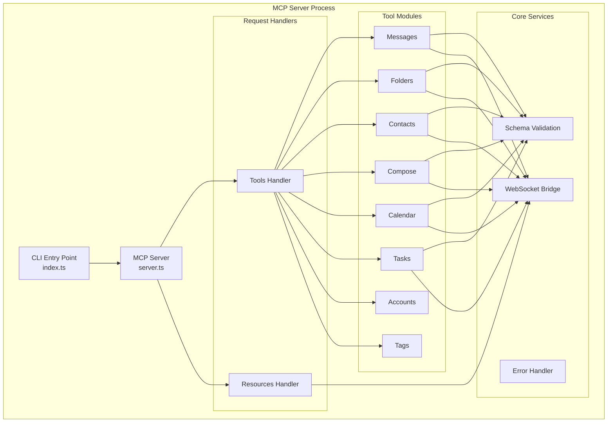

# MCP Server Architecture

## Overview

The MCP Server is a Node.js/TypeScript application implementing the Model Context Protocol specification. It bridges MCP clients (AI assistants) and the Thunderbird extension via WebSocket, handling JSON-RPC 2.0 communication, request validation, and response formatting.

## Server Structure

```
server/
├── src/
│   ├── index.ts                 # Entry point and CLI
│   ├── server.ts                # MCP server initialization
│   ├── bridge-standalone.ts     # Standalone bridge for Docker
│   ├── tools/
│   │   ├── index.ts            # Tool registry and exports
│   │   ├── messages.ts         # Message tools (10)
│   │   ├── folders.ts          # Folder tools (7)
│   │   ├── contacts.ts         # Contact tools (9)
│   │   ├── calendar.ts         # Calendar tools (9)
│   │   ├── tasks.ts            # Task tools (6)
│   │   ├── accounts.ts         # Account tools (3)
│   │   ├── tags.ts             # Tag tools (4)
│   │   └── compose.ts          # Compose tools (8)
│   ├── resources/
│   │   ├── index.ts            # Resource registry
│   │   └── handlers.ts         # Resource handler implementations
│   ├── websocket/
│   │   ├── bridge.ts           # WebSocket bridge (server + multi-client)
│   │   ├── bridge-client.ts    # Client mode for connecting to existing bridge
│   │   └── client-adapter.ts   # Adapter interface
│   ├── schemas/                # Zod validation schemas per domain
│   └── utils/
│       ├── logger.ts           # Winston logging configuration
│       ├── errors.ts           # Error classes and mapping
│       └── validation.ts       # Zod validation helpers
├── package.json
└── tsconfig.json
```

## Component Architecture



## Initialization

### index.ts - Entry Point

Parses CLI arguments, initializes logging, sets up signal handlers, and starts the MCP server with stdio transport.

### server.ts - Server Setup

Registers all tool and resource handlers, initializes the WebSocket bridge (server mode or client mode depending on whether a bridge already exists).

```typescript
export async function setupServer(server: Server) {
  // Initialize WebSocket bridge (auto-detects mode)
  const bridge = await initializeWebSocketBridge({ port });

  // Register tool handlers
  registerMessageTools(server, bridge);
  registerFolderTools(server, bridge);
  // ... all domains

  // Register resource handlers
  registerResourceHandlers(server, bridge);
}
```

## Tool Handlers

Each handler validates input with Zod, sends the request via WebSocket bridge, and formats the MCP response.

```typescript
server.setRequestHandler("tools/call", async (request) => {
  if (request.params.name === "thunderbird_messages_search") {
    try {
      const params = validateInput(MessagesSearchSchema, request.params.arguments);
      const result = await bridge.sendRequest("messages.search", params);
      return {
        content: [{ type: "text", text: JSON.stringify(result, null, 2) }],
      };
    } catch (error) {
      const jsonRpcError = nativeErrorToJsonRpc(error);
      return {
        content: [{ type: "text", text: `Error: ${jsonRpcError.message}` }],
        isError: true,
      };
    }
  }
});
```

### Tool Inventory (56 tools)

| Module | Tools | Count |
|--------|-------|-------|
| messages.ts | search, list, list_unread, list_recent, get, move, copy, delete, update, archive | 10 |
| folders.ts | list, get, create, rename, delete, move, mark_read | 7 |
| contacts.ts | search, list, get, create, update, delete + addressbooks (list, create, delete) | 9 |
| compose.ts | begin_new, begin_reply, begin_forward, get_details, set_details, save_draft, save_template, send | 8 |
| calendar.ts | calendars_list, calendars_get, events_search, events_list, events_get, events_create, events_update, events_move, events_delete | 9 |
| tasks.ts | list, get, create, update, delete, complete | 6 |
| accounts.ts | accounts_list, accounts_get, identities_list | 3 |
| tags.ts | list, create, update, delete | 4 |

## Resource Handlers

Resources expose contextual data to MCP clients via `resources/read` and `resources/list`.

| URI Pattern | Description |
|-------------|-------------|
| `thunderbird://accounts` | All accounts |
| `thunderbird://folders/{accountId}` | Folder tree |
| `thunderbird://inbox/unread` | All unread messages |
| `thunderbird://inbox/unread/{accountId}` | Unread by account |
| `thunderbird://contacts/recent` | Recent contacts |
| `thunderbird://calendar/today` | Today's events |
| `thunderbird://calendar/upcoming` | Next 7 days |
| `thunderbird://tasks/pending` | Pending tasks |

## WebSocket Bridge

The server communicates with the Thunderbird extension via WebSocket. See [websocket.md](websocket.md) for full protocol details.

**Two modes:**

- **Server mode** (standard): Creates WebSocket bridge on port 9876
- **Client mode** (Docker): Connects to existing bridge via `/mcp` path

```typescript
const client = await tryConnectToExistingBridge(port);
if (client) return client;           // Client mode
return new WebSocketBridge(options);  // Server mode
```

**Bridge standalone** (`bridge-standalone.ts`): Docker container entry point that runs only the WebSocket bridge server (no MCP logic), handling `/thunderbird`, `/mcp`, and `/health` endpoints.

## Schema Validation

All tool inputs are validated with Zod schemas before execution:

```typescript
// schemas/common.ts
export const MessageId = z.string().min(1);
export const FolderId = z.string().min(1);
export const PaginationParams = z.object({
  limit: z.number().int().positive().max(1000).optional(),
  offset: z.number().int().nonnegative().optional(),
});
```

## Error Handling

Errors are caught, classified, and returned as MCP error responses with `isError: true`:

| Error Class | JSON-RPC Code | Trigger |
|------------|---------------|---------|
| `ValidationError` | -32602 | Invalid parameters |
| `NotFoundError` | -32003 | Resource not found |
| `PermissionError` | -32002 | Permission denied |
| `TimeoutError` | -32004 | Operation timeout |
| `ThunderbirdError` | -32603 | Generic internal error |

## Logging

Winston logger with file + optional console output. **Never use `console.log`** (breaks MCP stdio).

| Level | Content |
|-------|---------|
| `error` | Errors requiring attention |
| `warn` | Unexpected but recoverable situations |
| `info` | Lifecycle events, non-sensitive metadata (IDs, counts) |
| `debug` | Detailed info including user data (search queries, subjects) |
