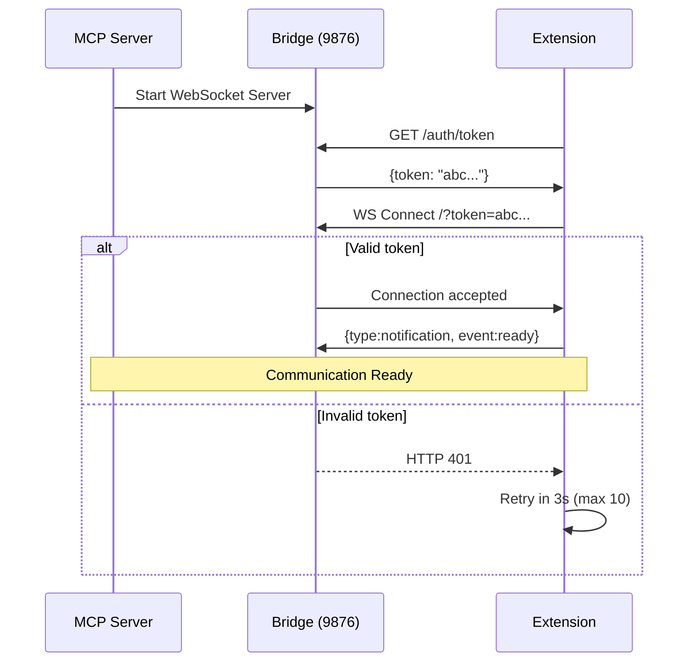

# WebSocket Bridge Architecture

## Overview

The WebSocket bridge provides bidirectional communication between the MCP server (Node.js) and the Thunderbird extension (browser context) on localhost:9876.

## Multi-Client Architecture

The bridge supports path-based routing for multiple connection types:

| Path | Client Type | Max Connections | Purpose |
|------|-------------|----------------|---------|
| `/` or `/thunderbird` | Thunderbird Extension | 1 | Handles API requests |
| `/mcp` | MCP Client Instances | Unlimited | Sends requests via bridge |
| `/health` | HTTP clients | - | Status JSON |
| `/auth/token` | HTTP clients | Rate-limited | Auth token (SEC-WS-001) |

```
┌──────────────────────────────────────────────────────────┐
│                    Docker Container                        │
│          bridge-standalone.ts (port 9876)                  │
│                                                            │
│  /thunderbird → Extension (1 client)                      │
│  /mcp → MCP instances (multi-client, via docker exec)     │
│  /health → {"status":"ok","thunderbird":true,"mcpClients":N} │
│  /auth/token → {"token":"a1b2c3..."} (rate-limited)       │
└──────────────────────────────────────────────────────────┘
```

### Bridge Modes

- **Server mode** (standard): MCP server creates its own WebSocket bridge
- **Client mode** (Docker): MCP server detects existing bridge, connects to `/mcp`

```typescript
const client = await tryConnectToExistingBridge(port);
if (client) return client;           // Client mode
return new WebSocketBridge(options);  // Server mode
```

## Protocol Specification

### Message Format

```typescript
interface WsMessage {
  id: string;                    // Unique ID (req_{counter}_{timestamp})
  type: "request" | "response" | "notification";
  action?: string;               // For requests (e.g., "messages.search")
  event?: string;                // For notifications (e.g., "ready")
  params?: Record<string, unknown>;
  data?: unknown;                // Response data
  success?: boolean;             // Response status
  error?: { code: number; message: string; data?: unknown };
  timestamp: string;             // ISO 8601
}
```

### Message Examples

**Request** (Server -> Extension):
```json
{
  "id": "req_1_1733410000000",
  "type": "request",
  "action": "messages.search",
  "params": { "subject": "invoice", "unread": true, "limit": 20 },
  "timestamp": "2025-12-05T10:00:00.000Z"
}
```

**Response** (Extension -> Server):
```json
{
  "id": "req_1_1733410000000",
  "type": "response",
  "success": true,
  "data": { "messages": [...] },
  "timestamp": "2025-12-05T10:00:00.150Z"
}
```

**Ready notification** (Extension -> Server):
```json
{
  "id": "ext_1733410000000_abc123",
  "type": "notification",
  "event": "ready",
  "data": { "version": "1.3.1", "capabilities": ["messages","folders","contacts","tags","accounts","calendar","tasks"] }
}
```

## Connection Flow



### Auto-Reconnect

- **Max attempts**: 10
- **Delay**: 3 seconds (constant)
- **Total retry window**: 30 seconds
- **Reset**: Counter resets on successful connection

### Keep-Alive (MV3 Event Pages)

Thunderbird suspends Event Pages after ~30-90s of inactivity. The extension uses 3 staggered `browser.alarms` (period: 30s each, offset by ~6/10/20s) ensuring at least one fires every ~10 seconds.

Each alarm calls `ensureWebSocketConnected()`:
1. Skip if reconnection already in progress
2. Reconnect if WebSocket not in `OPEN` state
3. Force-reconnect if no message received within 60s (stale detection)

## Security

### Token Authentication (SEC-WS-001)

- 32-byte random token generated at bridge startup (`crypto.randomBytes(32)`)
- Served via `GET /auth/token` (rate-limited: 10 req/min per IP)
- Required as `?token=xxx` query parameter on WebSocket upgrade
- Validated with `crypto.timingSafeEqual` (prevents timing attacks)
- Token rotates on every bridge restart

### Origin Validation (SEC-WS-003)

WebSocket upgrade requests checked against allowlist:
- Allowed: empty/null/undefined (CLI, docker exec)
- Allowed: localhost, 127.0.0.1, [::1] (any port)
- Allowed: `moz-extension://...`
- Rejected: all others (HTTP 403 + socket.destroy)

### Payload Limits (SEC-WS-002)

- Maximum WebSocket payload: **5 MiB** (close code 1009 on exceeded)
- Max pending requests: 100 (automatic cleanup on timeout)
- Per-request timeout: 30s default

### Error Security

- Stack traces never sent to clients (SEC-ERR-001, SEC-ERR-002)
- Sensitive user data logged at DEBUG level only (SEC-DATA-001, SEC-DATA-002)
- `nativeErrorToJsonRpc` returns message string only

## Performance

| Metric | Value |
|--------|-------|
| Connection handshake | ~5-10ms (one-time) |
| Message serialization | ~1-2ms |
| Network transfer (localhost) | ~1-5ms |
| **Total overhead per request** | **~10-20ms** |
| Max pending requests | 100 |
| Default timeout | 30s |

## Troubleshooting

| Issue | Checks |
|-------|--------|
| Connection refused | Server running? Port 9876 available? Extension has host permissions? |
| Reconnect failing | 10 attempts exhausted? Check browser console and server logs |
| Request timeout | Thunderbird API responsive? Check pending queue (max 100) |
| Port in use | `lsof -i :9876`, set `THUNDERBIRD_PORT` env var for alternate port |

```bash
# Test health
curl http://localhost:9876/health

# Monitor WebSocket
wscat -c ws://localhost:9876

# Check port
netstat -an | grep 9876
```
