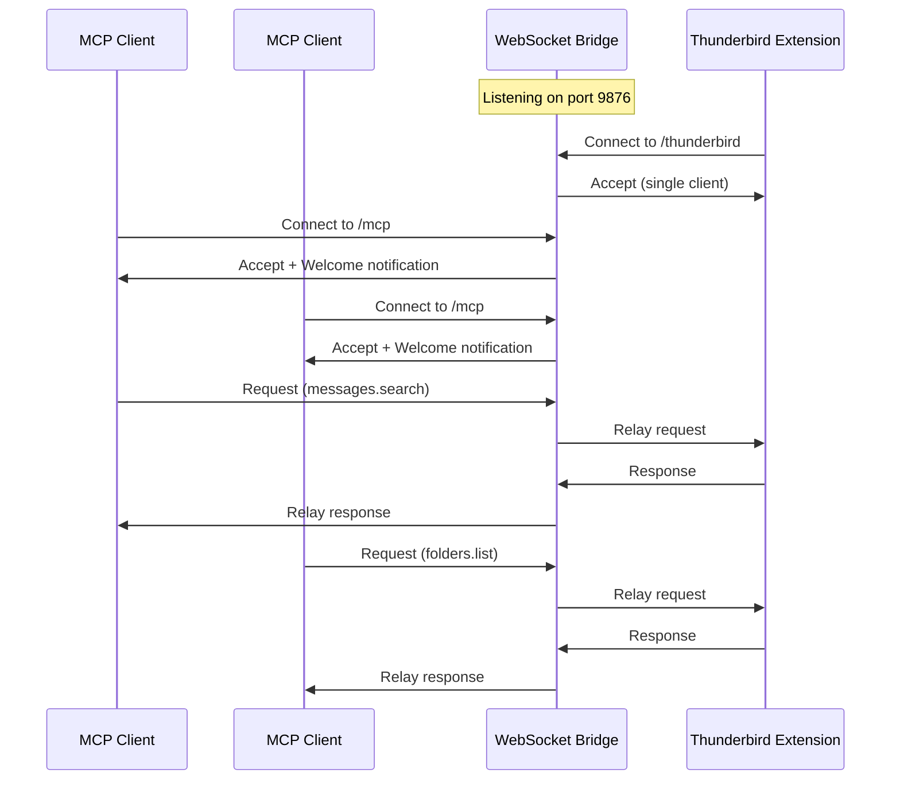
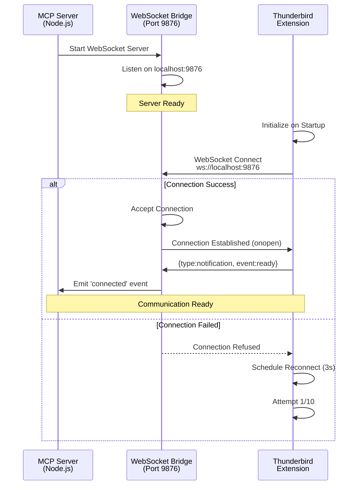
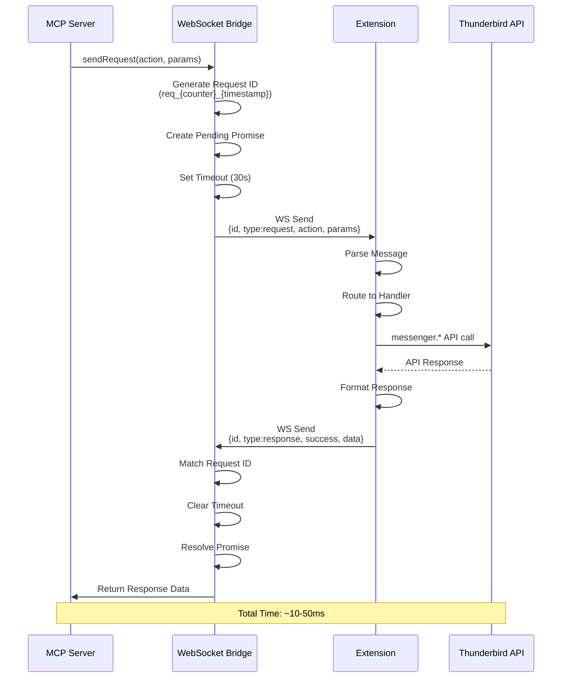
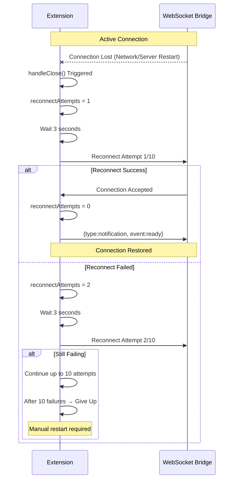
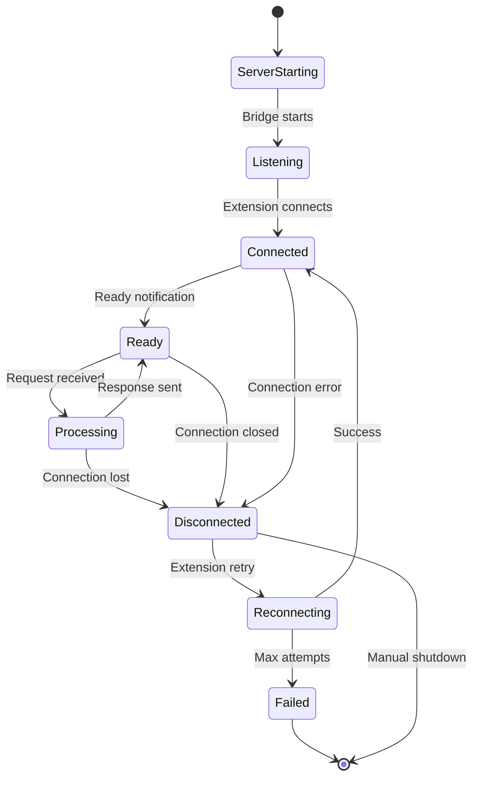

# WebSocket Bridge Architecture

## Overview

The WebSocket bridge provides bidirectional communication between the MCP server (Node.js process) and the Thunderbird extension (browser context). It replaces the traditional Native Messaging approach with a more robust, real-time WebSocket connection.

## Why WebSocket?

### Technical Rationale

**Problem**: Traditional Native Messaging has limitations

- Complex platform-specific manifest configuration
- No built-in connection state awareness
- Limited error handling and reconnection capabilities
- More complex debugging workflow

**Solution**: WebSocket bridge on localhost

- Bidirectional real-time communication
- Built-in connection state tracking
- Auto-reconnect with exponential backoff
- Standard debugging tools (browser devtools, network inspection)
- Simpler cross-platform deployment

### Trade-offs

**Advantages**:

- ✅ Bidirectional real-time communication
- ✅ Connection state awareness (onopen, onclose, onerror)
- ✅ Auto-reconnect capability built-in
- ✅ No platform-specific manifest configuration
- ✅ Better error handling and timeout management
- ✅ Simpler debugging (standard WebSocket tools)
- ✅ Promise-based request/response correlation
- ✅ Single localhost port (9876)

**Limitations**:

- ⚠️ Requires localhost port availability
- ⚠️ Single Thunderbird extension connection (by design)
- ⚠️ Security limited to localhost binding
- ⚠️ No encryption (localhost-only mitigates risk)

## Multi-Client Architecture (Docker)

Starting with version 1.2.0, the WebSocket bridge supports multiple MCP client connections while maintaining a single Thunderbird extension connection. This architecture enables Docker deployments where multiple MCP instances share a common bridge.

### Path-Based Routing

The bridge uses HTTP upgrade path routing to differentiate connection types:

| Path                  | Client Type           | Max Connections | Purpose                   |
| --------------------- | --------------------- | --------------- | ------------------------- |
| `/` or `/thunderbird` | Thunderbird Extension | 1               | Handles API requests      |
| `/mcp`                | MCP Client Instances  | Unlimited       | Sends requests via bridge |

### Architecture Diagram

```
┌──────────────────────────────────────────────────────────────────┐
│                       Docker Container                            │
│  ┌────────────────────────────────────────────────────────────┐  │
│  │           bridge-standalone.ts (port 9876)                  │  │
│  │                WebSocket Bridge Server                      │  │
│  │                                                             │  │
│  │   HTTP Server with WebSocket Upgrade Routing                │  │
│  │                                                             │  │
│  │   /thunderbird (ou /)        │         /mcp                │  │
│  │   └─ wssThunderbird          │         └─ wssMcp           │  │
│  │   └─ 1 connexion max         │         └─ multi-clients    │  │
│  └────────────────────────────────────────────────────────────┘  │
│              ▲                               ▲                    │
│              │                         ┌─────┴─────┐              │
│   Extension Thunderbird           docker exec   docker exec      │
│   (via host network)              (MCP #1)      (MCP #2)         │
└──────────────────────────────────────────────────────────────────┘

Endpoints:
  - ws://localhost:9876/          → Extension Thunderbird
  - ws://localhost:9876/mcp       → Clients MCP (multiples)
  - http://localhost:9876/health  → Status JSON
```

### Request Flow (Multi-Client)



### Bridge Client Mode

When the MCP server detects an existing bridge (typically in Docker), it connects as a client instead of creating a server:

```typescript
// Auto-detection in initializeWebSocketBridge()
const client = await tryConnectToExistingBridge(port);
if (client) {
  // Connect as client to /mcp path
  return client;
}
// No bridge found, create server
return new WebSocketBridge(options);
```

### Health Endpoint

The bridge exposes an HTTP health endpoint:

```bash
curl http://localhost:9876/health
```

Response:

```json
{
  "status": "ok",
  "thunderbird": true,
  "mcpClients": 2
}
```

## Protocol Specification

### Message Format

WebSocket bridge uses JSON messages with correlation IDs for request/response matching.

**Message Structure**:

```typescript
interface WsMessage {
  id: string; // Unique message ID
  type: "request" | "response" | "notification";
  action?: string; // Action name for requests
  event?: string; // Event name for notifications
  params?: Record<string, unknown>; // Request parameters
  data?: unknown; // Response data
  success?: boolean; // Response status
  error?: {
    // Error details
    code: number;
    message: string;
    data?: unknown;
  };
  timestamp: string; // ISO 8601 timestamp
}
```

### Message Direction

**Server → Extension (Request)**:

```json
{
  "id": "req_1_1733410000000",
  "type": "request",
  "action": "messages.search",
  "params": {
    "subject": "invoice",
    "unread": true,
    "limit": 20
  },
  "timestamp": "2025-12-05T10:00:00.000Z"
}
```

**Extension → Server (Success Response)**:

```json
{
  "id": "req_1_1733410000000",
  "type": "response",
  "success": true,
  "data": {
    "messages": [
      {
        "id": "msg-1",
        "subject": "Invoice #12345",
        "from": "billing@example.com",
        "date": "2025-03-15T10:30:00Z"
      }
    ]
  },
  "timestamp": "2025-12-05T10:00:00.150Z"
}
```

**Extension → Server (Error Response)**:

```json
{
  "id": "req_1_1733410000000",
  "type": "response",
  "success": false,
  "error": {
    "code": -32002,
    "message": "Permission denied",
    "data": {
      "operation": "messages.move",
      "reason": "messagesMove permission not granted"
    }
  },
  "timestamp": "2025-12-05T10:00:00.150Z"
}
```

**Extension → Server (Notification)**:

```json
{
  "id": "ext_1733410000000_abc123",
  "type": "notification",
  "event": "ready",
  "data": {
    "version": "1.0.0",
    "capabilities": [
      "messages",
      "folders",
      "contacts",
      "tags",
      "accounts",
      "calendar",
      "tasks"
    ]
  },
  "timestamp": "2025-12-05T10:00:00.000Z"
}
```

## Protocol Flow

### Connection Establishment



**Steps**:

1. **Server Starts Bridge**: MCP server initializes WebSocket bridge on port 9876
2. **Bridge Listens**: WebSocket server waits for connection on localhost:9876
3. **Extension Connects**: Extension attempts connection on startup
4. **Connection Established**: WebSocket handshake completes
5. **Ready Notification**: Extension sends ready notification with capabilities
6. **System Ready**: Both sides can now exchange messages

### Request/Response Cycle



### Auto-Reconnect Flow



**Reconnect Parameters**:

- Max attempts: 10
- Delay between attempts: 3 seconds (constant)
- Total retry window: 30 seconds
- Reset counter on successful connection

### Connection Lifecycle



**States**:

- **ServerStarting**: Bridge initializing
- **Listening**: Server waiting for connection
- **Connected**: WebSocket connection established
- **Ready**: Extension sent ready notification
- **Processing**: Request in flight
- **Disconnected**: Connection lost
- **Reconnecting**: Extension attempting reconnect
- **Failed**: Reconnect attempts exhausted

## Implementation

### Server-Side Bridge (TypeScript)

**websocket/bridge.ts**:

```typescript
import { WebSocketServer, WebSocket } from "ws";
import { EventEmitter } from "events";

export class WebSocketBridge extends EventEmitter {
  private wss: WebSocketServer | null = null;
  private client: WebSocket | null = null;
  private pendingRequests: Map<string, PendingRequest>;
  private requestCounter: number = 0;

  async start(): Promise<void> {
    this.wss = new WebSocketServer({ port: 9876 });

    this.wss.on("listening", () => {
      console.log("WebSocket bridge listening on port 9876");
    });

    this.wss.on("connection", (ws: WebSocket) => {
      this.handleConnection(ws);
    });
  }

  private handleConnection(ws: WebSocket): void {
    // Only allow one client
    if (this.client) {
      ws.close(1008, "Only one client allowed");
      return;
    }

    this.client = ws;
    this.emit("connected");

    ws.on("message", (data: Buffer) => {
      const message = JSON.parse(data.toString());
      this.handleMessage(message);
    });

    ws.on("close", () => {
      this.client = null;
      this.rejectAllPending("Connection closed");
      this.emit("disconnected");
    });
  }

  async sendRequest(
    action: string,
    params: Record<string, unknown>,
    timeout: number = 30000,
  ): Promise<WsMessage> {
    if (!this.client || this.client.readyState !== WebSocket.OPEN) {
      throw new Error("Not connected to Thunderbird extension");
    }

    const requestId = `req_${++this.requestCounter}_${Date.now()}`;

    const request: WsMessage = {
      id: requestId,
      type: "request",
      action,
      params,
      timestamp: new Date().toISOString(),
    };

    return new Promise((resolve, reject) => {
      const timeoutHandle = setTimeout(() => {
        this.pendingRequests.delete(requestId);
        reject(new Error(`Request timeout: ${action}`));
      }, timeout);

      this.pendingRequests.set(requestId, {
        resolve,
        reject,
        timeout: timeoutHandle,
        action,
      });

      this.client!.send(JSON.stringify(request));
    });
  }

  isConnected(): boolean {
    return this.client !== null && this.client.readyState === WebSocket.OPEN;
  }
}
```

### Extension-Side Client (JavaScript)

**extension/background.js**:

```javascript
let ws = null;
let reconnectAttempts = 0;
const MAX_RECONNECT_ATTEMPTS = 10;
const RECONNECT_DELAY = 3000;
const WS_PORT = 9876;

function connectWebSocket() {
  const wsUrl = `ws://localhost:${WS_PORT}`;

  ws = new WebSocket(wsUrl);

  ws.onopen = handleOpen;
  ws.onmessage = handleMessage;
  ws.onclose = handleClose;
  ws.onerror = handleError;
}

function handleOpen() {
  console.log("[MCP] WebSocket connected");
  reconnectAttempts = 0;

  // Send ready notification
  sendMessage({
    id: generateId(),
    type: "notification",
    event: "ready",
    data: {
      version: browser.runtime.getManifest().version,
      capabilities: [
        "messages",
        "folders",
        "contacts",
        "tags",
        "accounts",
        "calendar",
        "tasks",
      ],
    },
    timestamp: new Date().toISOString(),
  });
}

async function handleMessage(event) {
  const message = JSON.parse(event.data);

  if (message.type === "request") {
    await processRequest(message);
  }
}

async function processRequest(request) {
  try {
    const result = await handleNativeMessage(request);

    sendMessage({
      id: request.id,
      type: "response",
      success: true,
      data: result.data !== undefined ? result.data : result,
      timestamp: new Date().toISOString(),
    });
  } catch (error) {
    sendMessage({
      id: request.id,
      type: "response",
      success: false,
      error: {
        code: -32603,
        message: error.message,
        data: { stack: error.stack },
      },
      timestamp: new Date().toISOString(),
    });
  }
}

function handleClose(event) {
  console.log("[MCP] WebSocket closed:", event.code);
  ws = null;
  scheduleReconnect();
}

function scheduleReconnect() {
  if (reconnectAttempts >= MAX_RECONNECT_ATTEMPTS) {
    console.error("[MCP] Max reconnection attempts reached");
    return;
  }

  reconnectAttempts++;
  console.log(
    `[MCP] Reconnecting in ${RECONNECT_DELAY}ms (${reconnectAttempts}/${MAX_RECONNECT_ATTEMPTS})`,
  );

  setTimeout(connectWebSocket, RECONNECT_DELAY);
}

function sendMessage(message) {
  if (ws && ws.readyState === WebSocket.OPEN) {
    ws.send(JSON.stringify(message));
  }
}
```

## Manifest Configuration

### Extension Manifest

**manifest.json**:

```json
{
  "manifest_version": 3,
  "name": "Thunderbird MCP Server",
  "version": "1.0.0",
  "browser_specific_settings": {
    "gecko": {
      "id": "thunderbird-mcp@assistance-micro-design.com",
      "strict_min_version": "128.0"
    }
  },
  "permissions": [
    "messagesRead",
    "messagesMove",
    "accountsRead",
    "addressBooks"
  ],
  "host_permissions": ["ws://localhost:9876/*", "http://localhost:9876/*"],
  "content_security_policy": {
    "extension_pages": "script-src 'self'; object-src 'self'; connect-src 'self' ws://localhost:9876"
  }
}
```

**Key Configuration**:

- `host_permissions`: Allow WebSocket connection to localhost:9876
- `content_security_policy`: Allow WebSocket connections in CSP
- No platform-specific setup required
- No native messaging manifests needed

### Server Configuration

**Environment Variables**:

```bash
THUNDERBIRD_PORT=9876    # WebSocket port (default: 9876)
LOG_LEVEL=info           # Logging level
```

**No Additional Setup Required**:

- No registry entries (Windows)
- No manifest files in system directories
- No wrapper scripts
- Single port configuration

## Security Considerations

### Network Security

**Localhost Binding**:

- WebSocket server binds to 127.0.0.1 only
- No external network exposure
- Firewall configuration not required
- No TLS needed (localhost traffic)

**Single Client Enforcement**:

- Bridge rejects additional connections
- Close code 1008: "Only one client allowed"
- Prevents unauthorized access attempts

**Permission Model**:

- Extension requires explicit host permissions
- CSP enforces connection restrictions
- User must install extension explicitly

### Data Security

**Message Validation**:

- JSON parsing with error handling
- Request ID validation and correlation
- Timeout enforcement prevents resource exhaustion
- Pending request limit (100 max)

**Error Handling**:

- Stack traces sanitized in production
- Sensitive data never logged
- Error codes follow JSON-RPC standard

### Attack Surface

**Potential Risks**:

- Port availability conflicts
- Malicious local process attempting connection
- Message injection if port is hijacked
- Resource exhaustion via pending requests

**Mitigations**:

- Single client connection limit
- Request ID correlation prevents injection
- Timeout and pending request limits
- Localhost-only binding prevents remote attacks
- Extension permission model

## Troubleshooting

### Common Issues

**1. Connection Refused**:

- ✓ Check MCP server is running
- ✓ Verify port 9876 is available
- ✓ Check firewall allows localhost connections
- ✓ Verify extension has host permissions

**2. Auto-Reconnect Failing**:

- ✓ Check WebSocket server is restarted
- ✓ Verify 10 attempts not exhausted
- ✓ Review browser console for errors
- ✓ Check server logs for connection rejections

**3. Request Timeout**:

- ✓ Check server response time
- ✓ Verify Thunderbird API is responsive
- ✓ Review timeout configuration (default 30s)
- ✓ Check for pending request queue overflow

**4. Port Already in Use**:

- ✓ Check for other processes on port 9876
- ✓ Configure alternate port via THUNDERBIRD_PORT
- ✓ Restart both server and extension
- ✓ Update manifest host_permissions if port changed

### Debugging

**Server Side**:

```typescript
// Enable debug logging
process.env.LOG_LEVEL = "debug";

// Monitor connections
bridge.on("connected", () => console.log("Client connected"));
bridge.on("disconnected", () => console.log("Client disconnected"));
```

**Extension Side**:

```javascript
// Open Browser Console in Thunderbird
// Tools → Developer Tools → Browser Console

// Monitor WebSocket state
ws.addEventListener("open", () => console.log("WS Open"));
ws.addEventListener("close", (e) => console.log("WS Close:", e.code));
ws.addEventListener("error", (e) => console.error("WS Error:", e));
```

**Network Inspection**:

```bash
# Monitor WebSocket traffic
wscat -c ws://localhost:9876

# Check port availability
netstat -an | grep 9876

# Test connection
curl -i -N -H "Connection: Upgrade" -H "Upgrade: websocket" \
  -H "Sec-WebSocket-Version: 13" -H "Sec-WebSocket-Key: test" \
  http://localhost:9876
```

## Performance Characteristics

### Latency

**WebSocket Overhead**:

- Connection handshake: ~5-10ms (one-time)
- Message serialization: ~1-2ms
- Network transfer (localhost): ~1-5ms
- Total overhead: ~10-20ms per request

**Comparison to Native Messaging**:

- Native Messaging: ~20-50ms overhead (IPC + serialization)
- WebSocket: ~10-20ms overhead (network + serialization)
- Improvement: ~2x faster for simple operations

### Throughput

**Connection Capacity**:

- Single WebSocket connection
- Full-duplex bidirectional communication
- No theoretical bandwidth limit (localhost)
- Limited by Thunderbird API performance

**Pending Request Management**:

- Max 100 pending requests
- Automatic queue cleanup on timeout
- Per-request timeout enforcement (30s default)
- Prevents resource exhaustion

## Migration from Native Messaging

### Key Differences

| Aspect              | Native Messaging            | WebSocket Bridge          |
| ------------------- | --------------------------- | ------------------------- |
| **Setup**           | Platform-specific manifests | Environment variable only |
| **Connection**      | Process spawn + stdio       | Network socket            |
| **State Awareness** | Manual tracking             | Built-in onopen/onclose   |
| **Reconnect**       | Manual implementation       | Built-in with backoff     |
| **Debugging**       | Complex (IPC inspection)    | Standard network tools    |
| **Latency**         | ~20-50ms                    | ~10-20ms                  |
| **Security**        | Process isolation           | Localhost binding         |

### Compatibility

**Client Adapter Layer**:

- WebSocket bridge exposes same interface as Native Messaging client
- Tool handlers require no changes
- Drop-in replacement for existing code

**Code Changes Required**:

- ✅ Server: Replace Native Messaging client with WebSocket bridge
- ✅ Extension: Replace message port with WebSocket client
- ❌ Tool handlers: No changes needed (same interface)
- ❌ Schemas: No changes needed
- ❌ MCP protocol: No changes needed

## Future Enhancements

### TLS/SSL Support

**Rationale**: Enable secure remote access

**Implementation**:

```typescript
const server = https.createServer({
  cert: fs.readFileSync("cert.pem"),
  key: fs.readFileSync("key.pem"),
});
const wss = new WebSocketServer({ server });
```

### Authentication

**Rationale**: Multi-user or remote access scenarios

**Token-based Auth**:

```json
{
  "id": "req_1",
  "type": "request",
  "auth": "Bearer <token>",
  "action": "messages.search"
}
```

### Event Streaming

**Rationale**: Real-time notifications

**Server-to-Extension**:

```json
{
  "type": "notification",
  "event": "resource.updated",
  "data": {
    "uri": "thunderbird://inbox/unread"
  }
}
```

### Compression

**Rationale**: Reduce bandwidth for large payloads

**Per-Message Compression**:

```typescript
ws.send(JSON.stringify(message), { compress: true });
```

## References

- [WebSocket API (MDN)](https://developer.mozilla.org/en-US/docs/Web/API/WebSocket)
- [ws Library Documentation](https://github.com/websockets/ws)
- [Thunderbird WebExtension APIs](https://webextension-api.thunderbird.net/)
- [WebSocket Protocol RFC 6455](https://tools.ietf.org/html/rfc6455)
