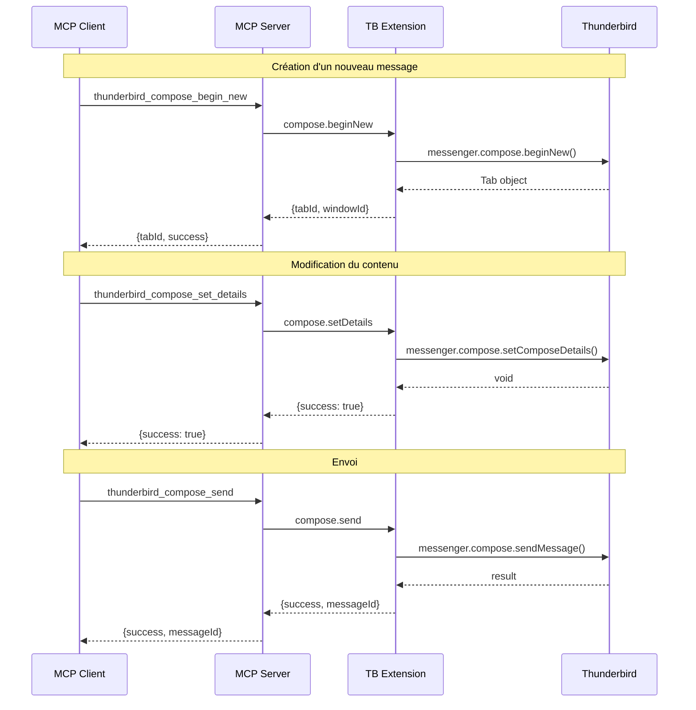

# Specification - Compose Tools (Email Creation & Sending)

## Metadonnees

- **Date**: 2026-02-01
- **Stack**: TypeScript 5.5+ | MCP SDK | WebExtension Manifest V3
- **Complexite**: Complex (>7 etapes, nouvelle API complete)
- **Auteur**: Claude (Plan Mode)

## Contexte

### Demande

Ajouter les tools :

- **Créer un nouveau message**
- **Rédiger un brouillon**
- **Envoyer un email**
- **Modifier le contenu**
- **Créer des templates**

### Objectif

Implementer une suite complete d'outils MCP pour la composition, modification et envoi d'emails via Thunderbird.

### Perimetre

**Inclus**:

- Creation de nouvelles fenetres de composition
- Sauvegarde en brouillon
- Sauvegarde en template
- Envoi d'emails
- Modification du contenu (destinataires, sujet, corps)
- Reponse et transfert de messages
- Gestion des pièces jointes (basique)

**Exclus**:

- Edition des attachments complexes (file upload depuis MCP)
- Signatures HTML avancees
- Planification d'envoi differe (non supporte par l'API)

## Criteres de Succes

- [ ] 8 nouveaux tools MCP fonctionnels
- [ ] Permission `compose` ajoutee au manifest
- [ ] Permission `compose.save` ajoutee au manifest
- [ ] Types TypeScript complets
- [ ] Validation Zod pour tous les inputs
- [ ] Tests unitaires pour chaque handler
- [ ] Documentation mise a jour

## Etat Actuel

### Architecture Existante

Le projet suit un pattern etabli pour les tools MCP:

```
┌─────────────────────────────────────────────────────────────────┐
│                    MCP Client (Claude, etc.)                    │
└─────────────────────┬───────────────────────────────────────────┘
                      │ JSON-RPC 2.0 (stdio)
                      ▼
┌─────────────────────────────────────────────────────────────────┐
│           server/src/tools/compose.ts (NEW)                     │
│  - composeTools[] (definitions)                                 │
│  - handleCompose*() handlers                                    │
│  - Zod schemas for validation                                   │
└─────────────────────┬───────────────────────────────────────────┘
                      │ WebSocket
                      ▼
┌─────────────────────────────────────────────────────────────────┐
│        extension/native-messaging/handler.js                    │
│  - handleComposeAPI() (NEW router)                              │
└─────────────────────┬───────────────────────────────────────────┘
                      │
                      ▼
┌─────────────────────────────────────────────────────────────────┐
│           extension/api/compose.js (NEW)                        │
│  - ComposeAPI.beginNew()                                        │
│  - ComposeAPI.saveDraft()                                       │
│  - ComposeAPI.sendMessage()                                     │
│  - etc.                                                         │
└─────────────────────┬───────────────────────────────────────────┘
                      │ messenger.compose.*
                      ▼
┌─────────────────────────────────────────────────────────────────┐
│              Thunderbird Compose API                            │
└─────────────────────────────────────────────────────────────────┘
```

### Patterns Identifies

1. **Tool Definition Pattern** (`server/src/tools/messages.ts`):

```typescript
export const toolName: Tool = {
  name: 'thunderbird_domain_action',
  description: 'Description',
  inputSchema: { type: 'object', properties: {...}, required: [...] }
};
```

2. **Handler Pattern** (`server/src/tools/messages.ts`):

```typescript
export async function handleAction(args: unknown): Promise<ToolCallResult> {
  const params = schema.parse(args);
  const client = getNativeClient();
  const response = await client.sendRequest(Actions.ACTION, params);
  // ... error handling and response formatting
}
```

3. **Extension API Pattern** (`extension/api/messages.js`):

```javascript
export const DomainAPI = {
  async action(params) {
    return await messenger.domain.method(params);
  },
};
```

4. **Handler Router Pattern** (`extension/native-messaging/handler.js`):

```javascript
case 'compose':
  return await handleComposeAPI(action, params);
```

### Code Reutilisable

- **Types existants** (`server/src/types/thunderbird.ts`):
  - `ComposeDetails` interface (lignes 413-442) - **REUTILISER**
  - `ComposeAttachment` interface (lignes 444-452) - **REUTILISER**

- **Error handling** (`server/src/utils/errors.ts`):
  - `nativeErrorToJsonRpc()` - **REUTILISER**

- **Client** (`server/src/websocket/client-adapter.ts`):
  - `getNativeClient()` - **REUTILISER**

## Architecture Proposee

### Nouveaux Tools MCP (8 tools)

| Tool Name                           | Description                        | API Thunderbird                          |
| ----------------------------------- | ---------------------------------- | ---------------------------------------- |
| `thunderbird_compose_begin_new`     | Ouvrir fenetre de composition vide | `compose.beginNew()`                     |
| `thunderbird_compose_begin_reply`   | Ouvrir fenetre de reponse          | `compose.beginReply()`                   |
| `thunderbird_compose_begin_forward` | Ouvrir fenetre de transfert        | `compose.beginForward()`                 |
| `thunderbird_compose_get_details`   | Obtenir details de composition     | `compose.getComposeDetails()`            |
| `thunderbird_compose_set_details`   | Modifier contenu de composition    | `compose.setComposeDetails()`            |
| `thunderbird_compose_save_draft`    | Sauvegarder en brouillon           | `compose.saveMessage({mode:'draft'})`    |
| `thunderbird_compose_save_template` | Sauvegarder en template            | `compose.saveMessage({mode:'template'})` |
| `thunderbird_compose_send`          | Envoyer l'email                    | `compose.sendMessage()`                  |

### Diagramme de Flux



### Composants

#### 1. Extension: `extension/api/compose.js` (NOUVEAU)

```javascript
/**
 * Compose API - Wrapper for messenger.compose.*
 * Provides email composition, drafts, templates, and sending operations
 */
export const ComposeAPI = {
  // Ouvrir nouvelle composition
  async beginNew(details) { ... },

  // Ouvrir reponse
  async beginReply(messageId, replyType) { ... },

  // Ouvrir transfert
  async beginForward(messageId, forwardType) { ... },

  // Obtenir details
  async getComposeDetails(tabId) { ... },

  // Modifier details
  async setComposeDetails(tabId, details) { ... },

  // Sauvegarder brouillon
  async saveDraft(tabId) { ... },

  // Sauvegarder template
  async saveTemplate(tabId) { ... },

  // Envoyer
  async sendMessage(tabId, options) { ... }
};
```

#### 2. Extension: `extension/manifest.json` (MODIFICATION)

```json
"permissions": [
  "messagesRead",
  "messagesMove",
  "messagesUpdate",
  "messagesTags",
  "messagesTagsList",
  "accountsRead",
  "accountsFolders",
  "addressBooks",
  "alarms",
  "compose",
  "compose.save"
]
```

#### 3. Extension: `extension/native-messaging/handler.js` (MODIFICATION)

Ajouter import et case dans dispatch:

```javascript
import { ComposeAPI } from '../api/compose.js';

// Dans dispatch():
case 'compose':
  return await handleComposeAPI(action, params);

// Nouvelle fonction:
async function handleComposeAPI(action, params) {
  switch (action) {
    case 'beginNew': ...
    case 'beginReply': ...
    case 'beginForward': ...
    case 'getDetails': ...
    case 'setDetails': ...
    case 'saveDraft': ...
    case 'saveTemplate': ...
    case 'send': ...
  }
}
```

#### 4. Server: `server/src/types/compose.ts` (NOUVEAU)

```typescript
// Reutiliser ComposeDetails de thunderbird.ts
// Ajouter nouveaux types specifiques

export interface ComposeBeginNewParams {
  to?: string[];
  cc?: string[];
  bcc?: string[];
  subject?: string;
  body?: string;
  isPlainText?: boolean;
  identityId?: string;
}

export interface ComposeBeginReplyParams {
  messageId: number;
  replyType: "replyToSender" | "replyToAll";
}

export interface ComposeBeginForwardParams {
  messageId: number;
  forwardType?: "forwardInline" | "forwardAsAttachment";
}

export interface ComposeSetDetailsParams {
  tabId: number;
  to?: string[];
  cc?: string[];
  bcc?: string[];
  subject?: string;
  body?: string;
}

export interface ComposeSendParams {
  tabId: number;
  mode?: "default" | "sendNow" | "sendLater";
}

export interface ComposeTab {
  tabId: number;
  windowId?: number;
}

export interface ComposeSaveResult {
  messageId: number;
  mode: "draft" | "template";
}
```

#### 5. Server: `server/src/tools/compose.ts` (NOUVEAU)

```typescript
// Imports
import { z } from 'zod';
import { logger } from '../utils/logger.js';
import { getNativeClient, MessageActions } from '../native-messaging/client.js';
import { nativeErrorToJsonRpc } from '../utils/errors.js';
import type { ToolCallResult } from '../types/mcp.js';

// Schemas Zod
export const composeBeginNewSchema = z.object({
  to: z.array(z.string()).optional(),
  cc: z.array(z.string()).optional(),
  bcc: z.array(z.string()).optional(),
  subject: z.string().optional(),
  body: z.string().optional(),
  isPlainText: z.boolean().optional().default(false),
  identityId: z.string().optional(),
});

export const composeBeginReplySchema = z.object({
  messageId: z.number(),
  replyType: z.enum(['replyToSender', 'replyToAll']).default('replyToSender'),
});

export const composeBeginForwardSchema = z.object({
  messageId: z.number(),
  forwardType: z.enum(['forwardInline', 'forwardAsAttachment']).optional(),
});

export const composeGetDetailsSchema = z.object({
  tabId: z.number(),
});

export const composeSetDetailsSchema = z.object({
  tabId: z.number(),
  to: z.array(z.string()).optional(),
  cc: z.array(z.string()).optional(),
  bcc: z.array(z.string()).optional(),
  subject: z.string().optional(),
  body: z.string().optional(),
});

export const composeSaveDraftSchema = z.object({
  tabId: z.number(),
});

export const composeSaveTemplateSchema = z.object({
  tabId: z.number(),
});

export const composeSendSchema = z.object({
  tabId: z.number(),
  mode: z.enum(['default', 'sendNow', 'sendLater']).optional().default('default'),
});

// Tool Definitions
export const composeTools = [
  {
    name: 'thunderbird_compose_begin_new',
    description: 'Open a new email composition window with optional pre-filled content',
    inputSchema: {
      type: 'object',
      properties: {
        to: { type: 'array', items: { type: 'string' }, description: 'Recipient email addresses' },
        cc: { type: 'array', items: { type: 'string' }, description: 'CC email addresses' },
        bcc: { type: 'array', items: { type: 'string' }, description: 'BCC email addresses' },
        subject: { type: 'string', description: 'Email subject' },
        body: { type: 'string', description: 'Email body content' },
        isPlainText: { type: 'boolean', description: 'If true, body is plain text; otherwise HTML' },
        identityId: { type: 'string', description: 'Identity ID to use for sending' },
      },
    },
  },
  {
    name: 'thunderbird_compose_begin_reply',
    description: 'Open a compose window to reply to an existing message',
    inputSchema: {
      type: 'object',
      properties: {
        messageId: { type: 'number', description: 'ID of the message to reply to' },
        replyType: { type: 'string', enum: ['replyToSender', 'replyToAll'], description: 'Reply type' },
      },
      required: ['messageId'],
    },
  },
  {
    name: 'thunderbird_compose_begin_forward',
    description: 'Open a compose window to forward an existing message',
    inputSchema: {
      type: 'object',
      properties: {
        messageId: { type: 'number', description: 'ID of the message to forward' },
        forwardType: { type: 'string', enum: ['forwardInline', 'forwardAsAttachment'], description: 'Forward type' },
      },
      required: ['messageId'],
    },
  },
  {
    name: 'thunderbird_compose_get_details',
    description: 'Get the current details of a compose window (recipients, subject, body)',
    inputSchema: {
      type: 'object',
      properties: {
        tabId: { type: 'number', description: 'ID of the compose tab' },
      },
      required: ['tabId'],
    },
  },
  {
    name: 'thunderbird_compose_set_details',
    description: 'Update the content of an existing compose window',
    inputSchema: {
      type: 'object',
      properties: {
        tabId: { type: 'number', description: 'ID of the compose tab' },
        to: { type: 'array', items: { type: 'string' }, description: 'New recipient addresses' },
        cc: { type: 'array', items: { type: 'string' }, description: 'New CC addresses' },
        bcc: { type: 'array', items: { type: 'string' }, description: 'New BCC addresses' },
        subject: { type: 'string', description: 'New subject line' },
        body: { type: 'string', description: 'New body content' },
      },
      required: ['tabId'],
    },
  },
  {
    name: 'thunderbird_compose_save_draft',
    description: 'Save the current composition as a draft',
    inputSchema: {
      type: 'object',
      properties: {
        tabId: { type: 'number', description: 'ID of the compose tab' },
      },
      required: ['tabId'],
    },
  },
  {
    name: 'thunderbird_compose_save_template',
    description: 'Save the current composition as a reusable template',
    inputSchema: {
      type: 'object',
      properties: {
        tabId: { type: 'number', description: 'ID of the compose tab' },
      },
      required: ['tabId'],
    },
  },
  {
    name: 'thunderbird_compose_send',
    description: 'Send the email currently being composed',
    inputSchema: {
      type: 'object',
      properties: {
        tabId: { type: 'number', description: 'ID of the compose tab' },
        mode: { type: 'string', enum: ['default', 'sendNow', 'sendLater'], description: 'Send mode' },
      },
      required: ['tabId'],
    },
  },
];

// Handlers (signatures - implementation in Phase 2)
export async function handleComposeBeginNew(args: unknown): Promise<ToolCallResult> { ... }
export async function handleComposeBeginReply(args: unknown): Promise<ToolCallResult> { ... }
export async function handleComposeBeginForward(args: unknown): Promise<ToolCallResult> { ... }
export async function handleComposeGetDetails(args: unknown): Promise<ToolCallResult> { ... }
export async function handleComposeSetDetails(args: unknown): Promise<ToolCallResult> { ... }
export async function handleComposeSaveDraft(args: unknown): Promise<ToolCallResult> { ... }
export async function handleComposeSaveTemplate(args: unknown): Promise<ToolCallResult> { ... }
export async function handleComposeSend(args: unknown): Promise<ToolCallResult> { ... }
```

#### 6. Server: `server/src/tools/index.ts` (MODIFICATION)

```typescript
// Ajouter imports
import {
  composeTools,
  handleComposeBeginNew,
  handleComposeBeginReply,
  handleComposeBeginForward,
  handleComposeGetDetails,
  handleComposeSetDetails,
  handleComposeSaveDraft,
  handleComposeSaveTemplate,
  handleComposeSend,
} from "./compose.js";

// Ajouter dans toolHandlers
export const toolHandlers: Record<string, ToolHandler> = {
  // ... existing handlers ...

  // Compose tools
  thunderbird_compose_begin_new: handleComposeBeginNew,
  thunderbird_compose_begin_reply: handleComposeBeginReply,
  thunderbird_compose_begin_forward: handleComposeBeginForward,
  thunderbird_compose_get_details: handleComposeGetDetails,
  thunderbird_compose_set_details: handleComposeSetDetails,
  thunderbird_compose_save_draft: handleComposeSaveDraft,
  thunderbird_compose_save_template: handleComposeSaveTemplate,
  thunderbird_compose_send: handleComposeSend,
};

// Ajouter dans allTools
export const allTools: any[] = [
  ...messageTools,
  ...folderTools,
  ...contactTools,
  ...tagTools,
  ...accountTools,
  ...calendarTools,
  ...taskTools,
  ...composeTools, // NEW
];

// Ajouter export
export { composeTools };
```

#### 7. Server: `server/src/native-messaging/client.ts` (MODIFICATION)

Ajouter les actions compose:

```typescript
export const ComposeActions = {
  COMPOSE_BEGIN_NEW: "compose.beginNew",
  COMPOSE_BEGIN_REPLY: "compose.beginReply",
  COMPOSE_BEGIN_FORWARD: "compose.beginForward",
  COMPOSE_GET_DETAILS: "compose.getDetails",
  COMPOSE_SET_DETAILS: "compose.setDetails",
  COMPOSE_SAVE_DRAFT: "compose.saveDraft",
  COMPOSE_SAVE_TEMPLATE: "compose.saveTemplate",
  COMPOSE_SEND: "compose.send",
} as const;
```

## Plan d'Implementation

### Phase 1: Types et Schemas (Effort: Faible)

**Objectif**: Definir contrats TypeScript et schemas Zod

**Taches**:

1. Creer `server/src/types/compose.ts` avec interfaces
2. Ajouter exports dans `server/src/types/index.ts`
3. Definir schemas Zod dans `server/src/tools/compose.ts`

**Validation**: `npm run build` (type check)

### Phase 2: Extension API (Effort: Moyen)

**Objectif**: Implementer wrapper API extension

**Taches**:

1. Creer `extension/api/compose.js`
2. Implementer `ComposeAPI` avec toutes les methodes
3. Ajouter permissions dans `extension/manifest.json`
4. Ajouter import et router dans `extension/native-messaging/handler.js`

**Validation**: Extension loads sans erreur, console check

### Phase 3: Server Tools (Effort: Moyen)

**Objectif**: Implementer handlers MCP server

**Taches**:

1. Creer `server/src/tools/compose.ts` complet
2. Implementer les 8 handlers
3. Ajouter actions dans `server/src/native-messaging/client.ts`
4. Enregistrer dans `server/src/tools/index.ts`

**Validation**: `npm run build && npm run lint`

### Phase 4: Integration (Effort: Faible)

**Objectif**: Verifier integration complete

**Taches**:

1. Rebuild extension (.xpi)
2. Reinstaller extension dans Thunderbird
3. Restart MCP server
4. Tester chaque tool manuellement

**Validation**: Tous les tools fonctionnent

### Phase 5: Tests (Effort: Moyen)

**Objectif**: Couverture de tests

**Taches**:

1. Creer `server/src/tools/__tests__/compose.test.ts`
2. Tests pour chaque schema Zod
3. Tests pour chaque handler (mocks)

**Validation**: `npm test`

### Phase 6: Documentation (Effort: Faible)

**Objectif**: Documenter les nouveaux tools

**Taches**:

1. JSDoc dans le code
2. Mettre a jour `docs/thunderbird-mcp-tools.md`
3. Mettre a jour README (tool count: 55)

**Validation**: Documentation review

## Estimation

| Phase          | Effort | Risque | Notes                         |
| -------------- | ------ | ------ | ----------------------------- |
| 1. Types       | Faible | Faible | Types partiellement existants |
| 2. Extension   | Moyen  | Moyen  | Nouvelle permission requise   |
| 3. Server      | Moyen  | Faible | Pattern bien etabli           |
| 4. Integration | Faible | Moyen  | Rebuild extension requis      |
| 5. Tests       | Moyen  | Faible | Pattern tests existant        |
| 6. Docs        | Faible | Faible | Templates existants           |

**Facteurs**:

- Pattern etabli: -30% effort
- Types existants: -10% effort
- Nouvelle permission: +10% risque
- 8 nouveaux tools: volume significatif

## Risques

| Risque                               | Probabilite | Impact   | Mitigation                         | Plan B                  |
| ------------------------------------ | ----------- | -------- | ---------------------------------- | ----------------------- |
| Permission `compose` non disponible  | Faible      | Critique | Verifier TB version                | Documenter version min  |
| Tab ID instable entre appels         | Moyenne     | Moyen    | Retourner tabId a chaque operation | Tracking local des tabs |
| `sendMessage` echoue silencieusement | Moyenne     | Moyen    | Verification `onAfterSend` event   | Polling status          |
| Templates folder non existant        | Faible      | Faible   | Verifier existence avant save      | Creer folder si absent  |

## Considerations de Securite

1. **Validation stricte des destinataires**: Verifier format email valide
2. **Sanitisation du body HTML**: Pas d'injection de scripts
3. **Logging sans contenu sensible**: Ne pas logger le body complet
4. **Rate limiting implicite**: Une fenetre compose a la fois par appel

## Prochaines Etapes

### Validation

- [ ] Architecture approuvee par utilisateur
- [ ] Risques acceptes
- [ ] Complexite acceptable

### Implementation

1. Executer `/implement` avec cette spec
2. Checkpoint apres chaque phase
3. Tests manuels apres Phase 4

---

## Appendice: API Thunderbird Reference

### messenger.compose.beginNew(details)

- Opens new compose window
- Returns: `Tab` object with `id`

### messenger.compose.beginReply(messageId, replyType)

- replyType: 'replyToSender' | 'replyToAll'
- Returns: `Tab` object

### messenger.compose.beginForward(messageId, forwardType)

- forwardType: 'forwardInline' | 'forwardAsAttachment'
- Returns: `Tab` object

### messenger.compose.getComposeDetails(tabId)

- Returns: `ComposeDetails` object

### messenger.compose.setComposeDetails(tabId, details)

- Returns: void

### messenger.compose.saveMessage(tabId, options)

- options.mode: 'draft' | 'template'
- Returns: `{ messages: [MessageHeader], mode: string }`

### messenger.compose.sendMessage(tabId, options)

- options.mode: 'default' | 'sendNow' | 'sendLater'
- Returns: `{ success: boolean }`

### Permissions Required

- `compose` - Basic compose operations
- `compose.save` - Save draft/template
- `messagesRead` - For reply/forward
